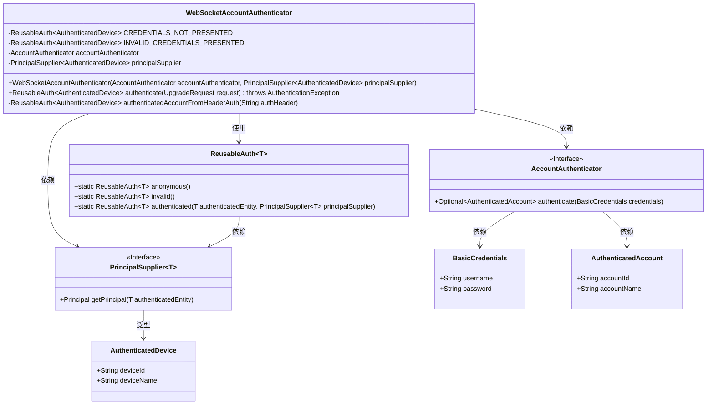
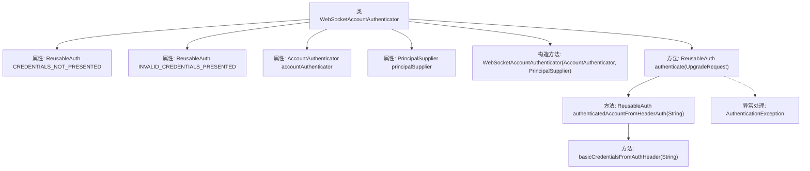

# 基础信息

|      |      |
|------|------|
| 名称 | WebSocketAccountAuthenticator |
| 编码语言 | .java |
| 代码路径 | Signal-Server/service/src/main/java/org/whispersystems/textsecuregcm/websocket/WebSocketAccountAuthenticator.java |
| 包名 | org.whispersystems.textsecuregcm.websocket |
| 依赖项 | ['org.whispersystems.textsecuregcm.util.HeaderUtils.basicCredentialsFromAuthHeader', 'com.google.common.net.HttpHeaders', 'javax.annotation.Nullable', 'org.eclipse.jetty.websocket.api.UpgradeRequest', 'org.whispersystems.textsecuregcm.auth.AccountAuthenticator', 'org.whispersystems.textsecuregcm.auth.AuthenticatedDevice', 'org.whispersystems.websocket.ReusableAuth', 'org.whispersystems.websocket.auth.AuthenticationException', 'org.whispersystems.websocket.auth.PrincipalSupplier', 'org.whispersystems.websocket.auth.WebSocketAuthenticator'] |
| 概述说明 | WebSocket账户认证器负责处理请求头认证并返回结果。 |

# 说明

WebSocket账户认证器是一个用于处理WebSocket请求头认证的组件。它主要负责接收并解析请求头中的认证信息，验证其有效性，并根据验证结果返回相应的认证状态。该认证器确保只有经过验证的用户能够建立WebSocket连接，从而保障系统的安全性和数据的完整性。其核心功能包括解析请求头、验证认证信息以及返回认证结果，确保整个认证过程高效且可靠。

# 类列表 Class Summary

| 名称   | 类型  | 说明 |
|-------|------|-------------|
| WebSocketAccountAuthenticator | class | WebSocket账户认证器，处理请求头认证，返回认证结果。 |

## 类 WebSocketAccountAuthenticator

|      |      |
|------|------|
| 访问范围 | public |
| 类型 | class |
| 名称 | WebSocketAccountAuthenticator |
| 说明 | WebSocket账户认证器，处理请求头认证，返回认证结果。 |

### UML类图

**描述：**
`WebSocketAccountAuthenticator` 是一个用于WebSocket认证的类，依赖于 `AccountAuthenticator` 和 `PrincipalSupplier` 接口。它通过 `authenticate` 方法处理认证请求，使用 `authenticatedAccountFromHeaderAuth` 方法从请求头中提取认证信息并进行验证。认证结果通过 `ReusableAuth` 类返回，支持匿名、无效和已验证三种状态。

### 内部方法调用关系图

这段代码定义了一个`WebSocketAccountAuthenticator`类，用于处理WebSocket连接的认证。类中包含两个静态属性`CREDENTIALS_NOT_PRESENTED`和`INVALID_CREDENTIALS_PRESENTED`，分别表示未提供凭证和无效凭证的情况。类的主要方法`authenticate`通过调用`authenticatedAccountFromHeaderAuth`来处理认证请求，后者会从请求头中提取认证信息并进行验证。如果认证失败，会抛出`AuthenticationException`异常。

### 字段列表 Field List

| 名称  | 类型  | 说明 |
|-------|-------|------|
| CREDENTIALS_NOT_PRESENTED = ReusableAuth.anonymous() | ReusableAuth<AuthenticatedDevice> | 静态常量CREDENTIALS_NOT_PRESENTED使用匿名认证。 |
| accountAuthenticator | AccountAuthenticator | 私有不可变的账户认证器实例。 |
| principalSupplier | PrincipalSupplier<AuthenticatedDevice> | 私有最终PrincipalSupplier类型变量，用于提供AuthenticatedDevice认证设备主体。 |
| INVALID_CREDENTIALS_PRESENTED = ReusableAuth.invalid() | ReusableAuth<AuthenticatedDevice> | 私有静态常量INVALID_CREDENTIALS_PRESENTED表示无效凭证的认证对象。 |

### 方法列表 Method List

| 名称  | 类型  | 说明 |
|-------|-------|------|
| authenticate | ReusableAuth<AuthenticatedDevice> | 方法通过请求头认证设备，异常时抛出认证错误。 |
| authenticatedAccountFromHeaderAuth | ReusableAuth<AuthenticatedDevice> | 根据请求头验证设备认证，返回认证结果或错误信息。 |

