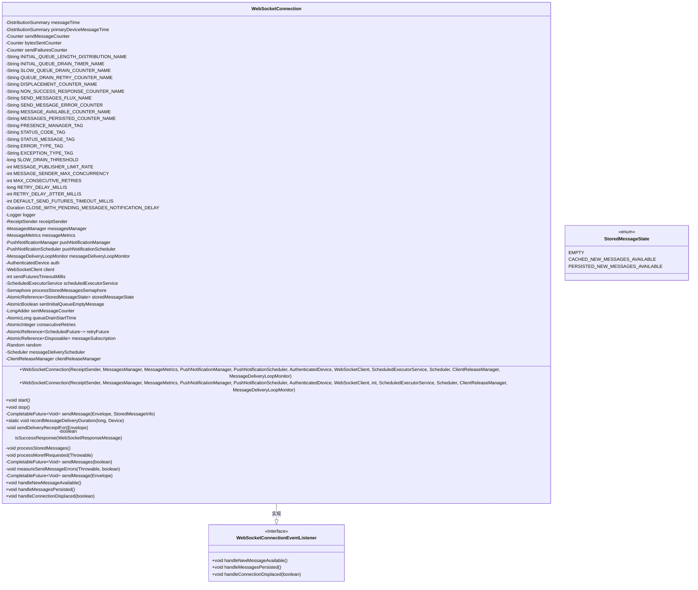

# 基础信息

|      |      |
|------|------|
| 名称 | WebSocketConnection |
| 编码语言 | .java |
| 代码路径 | Signal-Server/service/src/main/java/org/whispersystems/textsecuregcm/websocket/WebSocketConnection.java |
| 包名 | org.whispersystems.textsecuregcm.websocket |
| 依赖项 | ['com.codahale.metrics.MetricRegistry.name', 'com.google.common.annotations.VisibleForTesting', 'io.micrometer.core.instrument.Counter', 'io.micrometer.core.instrument.DistributionSummary', 'io.micrometer.core.instrument.Metrics', 'io.micrometer.core.instrument.Tag', 'io.micrometer.core.instrument.Tags', 'java.time.Duration', 'java.util.ArrayList', 'java.util.Collections', 'java.util.List', 'java.util.Optional', 'java.util.Random', 'java.util.UUID', 'java.util.concurrent.CompletableFuture', 'java.util.concurrent.ScheduledExecutorService', 'java.util.concurrent.ScheduledFuture', 'java.util.concurrent.Semaphore', 'java.util.concurrent.TimeUnit', 'java.util.concurrent.TimeoutException', 'java.util.concurrent.atomic.AtomicBoolean', 'java.util.concurrent.atomic.AtomicInteger', 'java.util.concurrent.atomic.AtomicLong', 'java.util.concurrent.atomic.AtomicReference', 'java.util.concurrent.atomic.LongAdder', 'org.apache.commons.lang3.StringUtils', 'org.eclipse.jetty.util.StaticException', 'org.reactivestreams.Publisher', 'org.slf4j.Logger', 'org.slf4j.LoggerFactory', 'org.whispersystems.textsecuregcm.auth.AuthenticatedDevice', 'org.whispersystems.textsecuregcm.controllers.MessageController', 'org.whispersystems.textsecuregcm.entities.MessageProtos.Envelope', 'org.whispersystems.textsecuregcm.identity.AciServiceIdentifier', 'org.whispersystems.textsecuregcm.identity.IdentityType', 'org.whispersystems.textsecuregcm.identity.ServiceIdentifier', 'org.whispersystems.textsecuregcm.limits.MessageDeliveryLoopMonitor', 'org.whispersystems.textsecuregcm.metrics.MessageMetrics', 'org.whispersystems.textsecuregcm.metrics.MetricsUtil', 'org.whispersystems.textsecuregcm.metrics.UserAgentTagUtil', 'org.whispersystems.textsecuregcm.push.WebSocketConnectionEventListener', 'org.whispersystems.textsecuregcm.push.PushNotificationManager', 'org.whispersystems.textsecuregcm.push.PushNotificationScheduler', 'org.whispersystems.textsecuregcm.push.ReceiptSender', 'org.whispersystems.textsecuregcm.storage.ClientReleaseManager', 'org.whispersystems.textsecuregcm.storage.Device', 'org.whispersystems.textsecuregcm.storage.MessagesManager', 'org.whispersystems.textsecuregcm.util.HeaderUtils', 'org.whispersystems.websocket.WebSocketClient', 'org.whispersystems.websocket.WebSocketResourceProvider', 'org.whispersystems.websocket.messages.WebSocketResponseMessage', 'reactor.core.Disposable', 'reactor.core.observability.micrometer.Micrometer', 'reactor.core.publisher.Flux', 'reactor.core.publisher.Mono', 'reactor.core.scheduler.Scheduler', 'javax.annotation.Nullable'] |
| 概述说明 | WebSocket类负责消息收发、队列管理及错误处理。 |

# 说明

WebSocket连接类是一个用于管理WebSocket通信的核心组件，主要负责消息的发送与接收操作。它通过内置的队列机制有效管理消息的传输顺序，确保数据的可靠传递。此外，该类还集成了错误处理功能，能够及时捕获并处理通信过程中可能出现的异常情况，保障连接的稳定性和可靠性。通过这一设计，WebSocket连接类为实时通信场景提供了高效且健壮的支持。

# 类列表 Class Summary

| 名称   | 类型  | 说明 |
|-------|------|-------------|
| WebSocketConnection | class | WebSocket连接类，处理消息发送、接收、队列管理及错误处理。 |

## 类 WebSocketConnection

|      |      |
|------|------|
| 访问范围 | public |
| 类型 | class |
| 名称 | WebSocketConnection |
| 说明 | WebSocket连接类，处理消息发送、接收、队列管理及错误处理。 |

### UML类图

这段代码定义了一个 `WebSocketConnection` 类，该类实现了 `WebSocketConnectionEventListener` 接口，用于处理 WebSocket 连接的消息传递、错误处理和状态管理。类中包含多个私有成员变量和方法，用于管理消息的发送、接收、错误处理以及连接状态的变化。`WebSocketConnection` 类通过 `start` 和 `stop` 方法控制连接的启动和关闭，并通过多个私有方法处理消息的发送和错误恢复。类中还定义了一个枚举 `StoredMessageState`，用于表示消息的存储状态。

### 内部方法调用关系图

该流程图展示了`WebSocketConnection`类的结构，包括其属性、枚举、构造方法和主要方法。类负责管理WebSocket连接，处理消息的发送、接收、存储和错误处理。通过多个计数器、计时器和标签，类能够监控和记录消息的传递状态和性能指标。

### 字段列表 Field List

| 名称  | 类型  | 说明 |
|-------|-------|------|
| messageTime = Metrics.summary(      name(MessageController.class, "messageDeliveryDuration")) | DistributionSummary | 定义静态变量messageTime用于记录消息传递时长的度量。 |
| DEFAULT_SEND_FUTURES_TIMEOUT_MILLIS = 5 * 60 * 1000 | int | 默认发送期货超时时间为5分钟。 |
| sentMessageCounter = new LongAdder() | LongAdder | 使用LongAdder统计发送消息数量。 |
| SEND_MESSAGE_ERROR_COUNTER = MetricsUtil.name(WebSocketConnection.class,      "sendMessageError") | String | WebSocketConnection类中定义发送消息错误计数器。 |
| pushNotificationScheduler | PushNotificationScheduler | 私有且不可变的推送通知调度器实例。 |
| SLOW_QUEUE_DRAIN_COUNTER_NAME = name(WebSocketConnection.class, "slowQueueDrain") | String | WebSocketConnection类中定义慢队列消耗计数器名称。 |
| auth | AuthenticatedDevice | 包含私有最终认证设备变量auth。 |
| MESSAGE_PUBLISHER_LIMIT_RATE = 100 | int | 测试可见的消息发布速率限制为100。 |
| ERROR_TYPE_TAG = "errorType" | String | 定义常量ERROR_TYPE_TAG，值为"errorType"。 |
| consecutiveRetries = new AtomicInteger() | AtomicInteger | 使用AtomicInteger记录连续重试次数。 |
| INITIAL_QUEUE_LENGTH_DISTRIBUTION_NAME = name(WebSocketConnection.class,      "initialQueueLength") | String | 定义WebSocketConnection类的初始队列长度分布名称常量。 |
| messageDeliveryScheduler | Scheduler | 私有消息调度器实例。 |
| messagesManager | MessagesManager | 私有消息管理器实例。 |
| scheduledExecutorService | ScheduledExecutorService | 私有且不可变的定时任务执行服务实例。 |
| MAX_CONSECUTIVE_RETRIES = 5 | int | 测试可见的最大连续重试次数为5。 |
| messageMetrics | MessageMetrics | 私有且不可变的MessageMetrics对象。 |
| messageSubscription = new AtomicReference<>() | AtomicReference<Disposable> | 使用AtomicReference管理Disposable的消息订阅实例。 |
| NON_SUCCESS_RESPONSE_COUNTER_NAME = name(WebSocketConnection.class,      "clientNonSuccessResponse") | String | 定义非成功响应计数器名称为WebSocketConnection类的clientNonSuccessResponse。 |
| clientReleaseManager | ClientReleaseManager | 私有且不可变的ClientReleaseManager实例。 |
| processStoredMessagesSemaphore = new Semaphore(1) | Semaphore | 私有信号量初始化为1，用于控制存储消息的并发处理。 |
| MESSAGE_AVAILABLE_COUNTER_NAME = name(WebSocketConnection.class, "messagesAvailable") | String | 定义WebSocket连接中可用消息计数器的常量名称。 |
| SLOW_DRAIN_THRESHOLD = 10_000 | long | 定义慢速排空阈值为10000的静态常量。 |
| MESSAGES_PERSISTED_COUNTER_NAME = name(WebSocketConnection.class, "messagesPersisted") | String | WebSocketConnection类中定义的消息持久化计数器名称。 |
| random = new Random() | Random | 定义并初始化一个私有的随机数生成器实例。 |
| client | WebSocketClient | 私有且不可变的WebSocket客户端实例。 |
| receiptSender | ReceiptSender | 私有不可变的收据发送器实例。 |
| QUEUE_DRAIN_RETRY_COUNTER_NAME = name(WebSocketConnection.class, "queueDrainRetry") | String | WebSocketConnection类中定义了队列重试计数器queueDrainRetry。 |
| SEND_MESSAGES_FLUX_NAME = MetricsUtil.name(WebSocketConnection.class,      "sendMessages") | String | WebSocketConnection类中定义发送消息的度量名称。 |
| pushNotificationManager | PushNotificationManager | 私有推送通知管理器实例。 |
| STATUS_CODE_TAG = "status" | String | 定义私有静态常量STATUS_CODE_TAG，值为"status"。 |
| logger = LoggerFactory.getLogger(WebSocketConnection.class) | Logger | WebSocketConnection类中定义了私有的静态日志记录器。 |
| RETRY_DELAY_JITTER_MILLIS = 500 | int | 重试延迟抖动设置为500毫秒。 |
| storedMessageState = new AtomicReference<>(      StoredMessageState.PERSISTED_NEW_MESSAGES_AVAILABLE) | AtomicReference<StoredMessageState> | 私有原子引用存储消息状态，初始值为新消息可用。 |
| DISPLACEMENT_COUNTER_NAME = name(WebSocketConnection.class, "displacement") | String | 定义私有静态常量DISPLACEMENT_COUNTER_NAME，用于WebSocketConnection类的位移计数器名称。 |
| messageDeliveryLoopMonitor | MessageDeliveryLoopMonitor | 私有且不可变的MessageDeliveryLoopMonitor实例。 |
| bytesSentCounter = Metrics.counter(name(WebSocketConnection.class, "bytesSent")) | Counter | 定义静态计数器bytesSentCounter，用于统计WebSocket连接发送的字节数。 |
| STATUS_MESSAGE_TAG = "message" | String | 定义常量STATUS_MESSAGE_TAG，值为"message"。 |
| retryFuture = new AtomicReference<>() | AtomicReference<ScheduledFuture<?>> | 使用AtomicReference存储ScheduledFuture对象，用于重试操作。 |
| INITIAL_QUEUE_DRAIN_TIMER_NAME = name(WebSocketConnection.class, "drainInitialQueue") | String | WebSocketConnection类中定义初始队列排空计时器名称。 |
| PRESENCE_MANAGER_TAG = "presenceManager" | String | 定义了一个私有静态常量字符串PRESENCE_MANAGER_TAG。 |
| sendFuturesTimeoutMillis | int | 私有整型变量，表示发送期货超时毫秒数。 |
| sendFailuresCounter = Metrics.counter(name(WebSocketConnection.class, "sendFailures")) | Counter | 定义私有静态计数器sendFailuresCounter，用于统计WebSocket发送失败次数。 |
| sendMessageCounter = Metrics.counter(name(WebSocketConnection.class, "sendMessage")) | Counter | WebSocket连接中发送消息的计数器定义。 |
| EXCEPTION_TYPE_TAG = "exceptionType" | String | 定义常量字符串"exceptionType"用于异常类型标识。 |
| queueDrainStartTime = new AtomicLong() | AtomicLong | 定义了一个用于记录队列开始处理时间的原子长整型变量。 |
| MESSAGE_SENDER_MAX_CONCURRENCY = 256 | int | 测试可见的静态常量，最大并发数为256。 |
| primaryDeviceMessageTime = Metrics.summary(      name(MessageController.class, "primaryDeviceMessageDeliveryDuration")) | DistributionSummary | 定义了一个静态常量，用于记录主设备消息传递时长的统计信息。 |
| RETRY_DELAY_MILLIS = 1_000 | long | 定义了一个静态长整型常量，重试延迟为1000毫秒。 |
| CLOSE_WITH_PENDING_MESSAGES_NOTIFICATION_DELAY = Duration.ofMinutes(1) | Duration | 私有静态常量，关闭带待处理消息通知延迟为1分钟。 |
| sentInitialQueueEmptyMessage = new AtomicBoolean(false) | AtomicBoolean | 私有原子布尔变量，初始值为false，用于标记是否发送初始队列空消息。 |

### 方法列表 Method List

| 名称  | 类型  | 说明 |
|-------|-------|------|
| recordMessageDeliveryDuration | void | 记录消息传递时长，主设备单独统计。 |
| handleMessagesPersisted | void | 方法增加消息持久化计数器，更新存储状态并处理消息。 |
| handleConnectionDisplaced | void | 处理连接中断，记录指标并根据中断原因关闭客户端。 |
| isSuccessResponse | boolean | 判断WebSocket响应是否成功：非空且状态码在200至299之间。 |
| sendMessages | CompletableFuture<Void> | 方法发送消息，处理错误并监控发送状态。 |
| sendMessage | CompletableFuture<Void> | 根据条件发送或删除消息，返回CompletableFuture结果。 |
| processStoredMessages | void | 处理存储消息，更新状态并释放信号量，必要时发送空队列消息。 |
| handleNewMessageAvailable | void | 方法处理新消息，更新计数器并缓存消息状态，最后处理存储消息。 |
| sendDeliveryReceiptFor | void | 发送消息回执，处理异常并记录日志。 |
| start | void | 启动消息处理，包括通知管理、队列计时和存储消息处理。 |
| measureSendMessageErrors | void | 方法测量发送消息错误，根据异常类型分类并记录错误计数器。 |
| processMoreIfRequested | void | 处理请求异常：检查消息状态，重试超限则关闭客户端，记录日志并延迟重试。 |
| stop | void | 停止操作：取消重试任务，释放订阅，关闭客户端，若有未处理消息则延迟通知。 |
| sendMessage | CompletableFuture<Void> | 该方法发送消息，处理成功和失败情况，并记录相关指标和日志。 |

