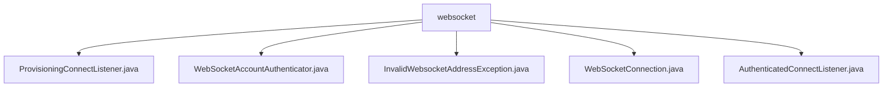

# 基础信息

|      |      |
|------|------|
| 名称 | websocket |
| 编码语言 | .java |
| 代码路径 | Signal-Server/service/src/main/java/org/whispersystems/textsecuregcm/websocket |
| 包名 | Signal-Server.service.src.main.java.org.whispersystems.textsecuregcm.websocket |
| 概述说明 | ProvisioningConnectListener管理WebSocket连接，处理消息传递和异常。WebSocketAccountAuthenticator验证请求头认证信息。InvalidWebsocketAddressException处理无效地址异常。WebSocketConnection管理消息发送接收和错误处理。AuthenticatedConnectListener处理认证设备间通信和通知推送。 |

# 说明

## 概述
该代码模块主要围绕WebSocket连接的建立、维护、认证和消息传递展开，旨在确保客户端与服务器之间的通信安全、稳定和高效。模块通过多个组件协同工作，处理WebSocket连接的各个关键环节，包括连接管理、认证、异常处理以及消息的发送与接收。这些组件共同构建了一个健壮的实时通信系统，适用于需要高可靠性和安全性的业务场景。

## 主要业务场景
1. **WebSocket连接的建立与维护**：`ProvisioningConnectListener`负责处理WebSocket连接的初始化和维护，通过监控连接状态和超时机制，确保连接在异常情况下能够被有效管理，保障系统的稳定性和可靠性。
2. **WebSocket请求头的认证**：`WebSocketAccountAuthenticator`负责解析和验证WebSocket请求头中的认证信息，确保只有经过验证的用户能够建立连接，从而保障系统的安全性和数据的完整性。
3. **无效WebSocket地址的异常处理**：`InvalidWebsocketAddressException`专门用于捕获和处理无效WebSocket地址的异常情况，确保在遇到无效地址时能够及时抛出异常并进行相应处理。
4. **WebSocket消息的发送与接收**：`WebSocketConnection`是管理WebSocket通信的核心组件，通过内置的队列机制确保消息的可靠传递，并集成错误处理功能，保障连接的稳定性和可靠性。
5. **认证设备间的通信与通知推送**：`AuthenticatedConnectListener`负责处理经过认证的WebSocket连接，确保在连接期间高效地处理设备间的通信和通知推送，进一步提升系统的实时性和响应能力。

这些业务场景共同支撑了一个高可用、高安全的WebSocket通信系统，适用于需要实时通信和数据安全的应用场景。

### 包内部结构视图

该流程图展示了 `Signal-Server` 项目中 `websocket` 文件夹下的文件层级关系。`websocket` 作为根节点，包含了五个子节点，分别是 `ProvisioningConnectListener.java`、`WebSocketAccountAuthenticator.java`、`InvalidWebsocketAddressException.java`、`WebSocketConnection.java` 和 `AuthenticatedConnectListener.java`。这些文件均位于 `websocket` 文件夹内，且没有进一步的子文件夹结构。

# 文件列表 File List

| 名称   | 类型  | 说明 |
|-------|------|-------------|
| [InvalidWebsocketAddressException.java](InvalidWebsocketAddressException.md) | file | InvalidWebsocketAddressException类继承Exception，处理无效WebSocket地址异常。 |
| [ProvisioningConnectListener.java](ProvisioningConnectListener.md) | file | ProvisioningConnectListener管理WebSocket连接、超时及消息传递。 |
| [AuthenticatedConnectListener.java](AuthenticatedConnectListener.md) | file | AuthenticatedConnectListener负责WebSocket连接、认证设备消息传递及推送通知管理。 |
| [WebSocketConnection.java](WebSocketConnection.md) | file | WebSocket类负责消息收发、队列管理及错误处理。 |
| [WebSocketAccountAuthenticator.java](WebSocketAccountAuthenticator.md) | file | WebSocket账户认证器负责处理请求头认证并返回结果。 |

