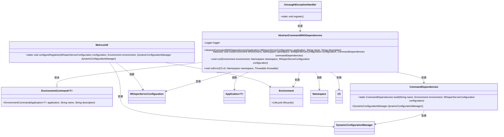

# 基础信息

|      |      |
|------|------|
| 名称 | AbstractCommandWithDependencies |
| 编码语言 | .java |
| 代码路径 | Signal-Server/service/src/main/java/org/whispersystems/textsecuregcm/workers/AbstractCommandWithDependencies.java |
| 包名 | org.whispersystems.textsecuregcm.workers |
| 依赖项 | ['io.dropwizard.core.Application', 'io.dropwizard.core.cli.Cli', 'io.dropwizard.core.cli.EnvironmentCommand', 'io.dropwizard.core.setup.Environment', 'net.sourceforge.argparse4j.inf.Namespace', 'org.slf4j.Logger', 'org.slf4j.LoggerFactory', 'org.whispersystems.textsecuregcm.WhisperServerConfiguration', 'org.whispersystems.textsecuregcm.metrics.MetricsUtil', 'org.whispersystems.textsecuregcm.util.logging.UncaughtExceptionHandler'] |
| 概述说明 | 抽象命令类管理依赖项启停，处理异常。 |

# 说明

抽象命令类负责管理依赖项的启动与停止操作，同时处理可能出现的异常情况。它通过抽象化的方式，确保依赖项的初始化和终止过程得到统一管理，并在异常发生时进行适当的处理，以维护系统的稳定性和可靠性。

# 类列表 Class Summary

| 名称   | 类型  | 说明 |
|-------|------|-------------|
| AbstractCommandWithDependencies | class | 抽象命令类，管理依赖项启动与停止，处理异常。 |

## 类 AbstractCommandWithDependencies

|      |      |
|------|------|
| 访问范围 | public abstract |
| 类型 | class |
| 名称 | AbstractCommandWithDependencies |
| 说明 | 抽象命令类，管理依赖项启动与停止，处理异常。 |

### UML类图

### 描述
`AbstractCommandWithDependencies` 是一个抽象类，继承自 `EnvironmentCommand<WhisperServerConfiguration>`，用于处理带有依赖项的命令执行。它包含一个 `Logger` 实例用于日志记录，并提供了构造方法、抽象方法 `run` 用于执行命令，以及重写的 `run` 方法用于管理命令的生命周期。此外，它还实现了 `onError` 方法用于处理未捕获的异常。该类依赖于多个其他类，如 `CommandDependencies`、`WhisperServerConfiguration`、`Environment` 等，用于构建和执行命令。

### 内部方法调用关系图

```mermaid
graph TD
    A["类AbstractCommandWithDependencies"]
    B["属性: Logger logger"]
    C["构造方法: AbstractCommandWithDependencies(Application<WhisperServerConfiguration> application, String name, String description)"]
    D["抽象方法: run(Environment environment, Namespace namespace, WhisperServerConfiguration configuration, CommandDependencies commandDependencies)"]
    E["重写方法: run(Environment environment, Namespace namespace, WhisperServerConfiguration configuration)"]
    F["重写方法: onError(Cli cli, Namespace namespace, Throwable throwable)"]
    G["步骤: UncaughtExceptionHandler.register()"]
    H["步骤: CommandDependencies.build(getName(), environment, configuration)"]
    I["步骤: MetricsUtil.configureRegistries(configuration, environment, commandDependencies.dynamicConfigurationManager())"]
    J["步骤: logger.info('Starting command dependencies')"]
    K["步骤: environment.lifecycle().getManagedObjects().forEach(managedObject -> managedObject.start())"]
    L["步骤: run(environment, namespace, configuration, commandDependencies)"]
    M["步骤: logger.info('Stopping command dependencies')"]
    N["步骤: environment.lifecycle().getManagedObjects().forEach(managedObject -> managedObject.stop())"]
    O["步骤: logger.error('Unhandled error', throwable)"]

    A --> B
    A --> C
    A --> D
    A --> E
    A --> F
    E --> G
    E --> H
    E --> I
    E --> J
    E --> K
    E --> L
    E --> M
    E --> N
    F --> O
```

这段代码定义了一个抽象类 `AbstractCommandWithDependencies`，用于处理命令执行时的依赖管理。类中包含一个构造方法和多个重写方法，主要用于初始化、运行和停止命令的依赖对象。流程图中展示了类的内部结构和方法调用关系，包括依赖对象的启动、运行和停止过程，以及错误处理逻辑。代码通过日志记录关键步骤，确保在异常情况下能够及时发现和处理问题。

### 字段列表 Field List

| 名称  | 类型  | 说明 |
|-------|-------|------|
| logger = LoggerFactory.getLogger(getClass()) | Logger | 私有日志记录器实例化，用于类内日志记录。 |

### 方法列表 Method List

| 名称  | 类型  | 说明 |
|-------|-------|------|
| onError | void | 重写方法处理未捕获异常并记录错误日志。 |
| run | void | 注册异常处理器，启动并管理依赖对象，执行命令后停止依赖对象。 |
| run | void | 受保护抽象方法run，接受环境、命名空间、配置和依赖参数，可能抛出异常。 |

