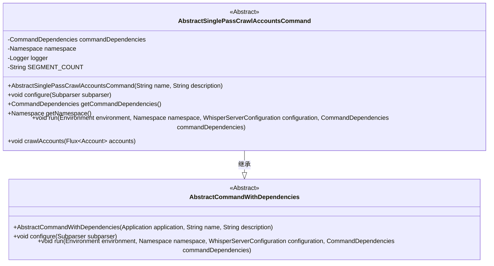
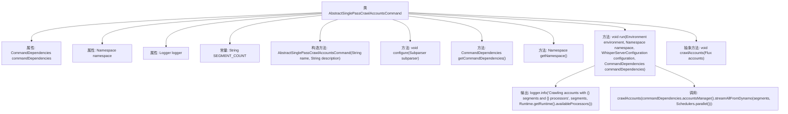

# 基础信息

|      |      |
|------|------|
| 名称 | AbstractSinglePassCrawlAccountsCommand |
| 编码语言 | .java |
| 代码路径 | Signal-Server/service/src/main/java/org/whispersystems/textsecuregcm/workers/AbstractSinglePassCrawlAccountsCommand.java |
| 包名 | org.whispersystems.textsecuregcm.workers |
| 依赖项 | ['io.dropwizard.core.Application', 'io.dropwizard.core.cli.Cli', 'io.dropwizard.core.cli.EnvironmentCommand', 'io.dropwizard.core.setup.Environment', 'java.util.Objects', 'net.sourceforge.argparse4j.inf.Namespace', 'net.sourceforge.argparse4j.inf.Subparser', 'org.slf4j.Logger', 'org.slf4j.LoggerFactory', 'org.whispersystems.textsecuregcm.WhisperServerConfiguration', 'org.whispersystems.textsecuregcm.storage.Account', 'org.whispersystems.textsecuregcm.util.logging.UncaughtExceptionHandler', 'reactor.core.publisher.Flux', 'reactor.core.scheduler.Schedulers'] |
| 概述说明 | 抽象类实现单次爬取账户，涵盖配置、依赖管理和爬取逻辑。 |

# 说明

该抽象类用于实现单次爬取账户的命令，主要包含三个核心功能：配置管理、依赖管理以及账户爬取逻辑。配置管理负责处理爬取过程中的各项参数设置，确保爬取任务按需执行。依赖管理用于管理和加载爬取过程中所需的外部资源或工具，确保系统稳定运行。账户爬取逻辑则是核心功能，负责具体的账户数据抓取和处理流程，确保数据准确性和完整性。该抽象类为单次爬取任务提供了结构化的实现框架。

# 类列表 Class Summary

| 名称   | 类型  | 说明 |
|-------|------|-------------|
| AbstractSinglePassCrawlAccountsCommand | class | 抽象类实现单次爬取账户命令，包含配置、依赖管理和账户爬取逻辑。 |

## 类 AbstractSinglePassCrawlAccountsCommand

|      |      |
|------|------|
| 访问范围 | public abstract |
| 类型 | class |
| 名称 | AbstractSinglePassCrawlAccountsCommand |
| 说明 | 抽象类实现单次爬取账户命令，包含配置、依赖管理和账户爬取逻辑。 |

### UML类图

**描述：**  
`AbstractSinglePassCrawlAccountsCommand` 是一个抽象类，继承自 `AbstractCommandWithDependencies`，用于处理单次爬取账户的命令。它包含了配置命令行参数、获取依赖项、执行爬取逻辑的方法。该类通过 `crawlAccounts` 方法抽象出具体的爬取逻辑，子类需要实现该方法。类中还包含了对日志记录和命令行参数解析的支持。

### 内部方法调用关系图

这段代码定义了一个抽象类 `AbstractSinglePassCrawlAccountsCommand`，用于处理账户爬取任务。它包含了一些属性和方法，如 `configure` 用于配置命令行参数，`run` 方法用于执行爬取任务，并调用抽象方法 `crawlAccounts` 处理账户数据。代码还使用了日志记录来输出爬取任务的相关信息。

### 字段列表 Field List

| 名称  | 类型  | 说明 |
|-------|-------|------|
| namespace | Namespace | 定义私有命名空间变量。 |
| commandDependencies | CommandDependencies | 私有变量commandDependencies存储命令依赖。 |
| logger = LoggerFactory.getLogger(getClass()) | Logger | 定义私有日志记录器实例。 |
| SEGMENT_COUNT = "segments" | String | 定义字符串常量SEGMENT_COUNT，值为"segments"。 |

### 方法列表 Method List

| 名称  | 类型  | 说明 |
|-------|-------|------|
| crawlAccounts | void | 保护抽象方法，用于异步爬取账户数据。 |
| getNamespace | Namespace | 获取受保护的命名空间实例。 |
| getCommandDependencies | CommandDependencies | 获取命令依赖项的方法。 |
| run | void | 重写run方法，初始化变量，获取段数，记录日志并爬取账户。 |
| configure | void | 重写配置方法，添加可选参数“--segments”，默认值为1。 |

