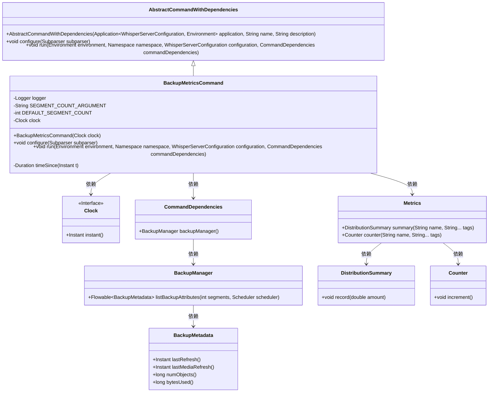
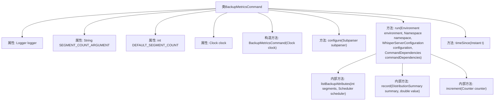

# 基础信息

|      |      |
|------|------|
| 名称 | BackupMetricsCommand |
| 编码语言 | .java |
| 代码路径 | Signal-Server/service/src/main/java/org/whispersystems/textsecuregcm/workers/BackupMetricsCommand.java |
| 包名 | org.whispersystems.textsecuregcm.workers |
| 依赖项 | ['io.dropwizard.core.Application', 'io.dropwizard.core.setup.Environment', 'io.micrometer.core.instrument.DistributionSummary', 'io.micrometer.core.instrument.Metrics', 'net.sourceforge.argparse4j.inf.Namespace', 'net.sourceforge.argparse4j.inf.Subparser', 'org.signal.libsignal.zkgroup.backups.BackupLevel', 'org.slf4j.Logger', 'org.slf4j.LoggerFactory', 'org.whispersystems.textsecuregcm.WhisperServerConfiguration', 'org.whispersystems.textsecuregcm.backup.BackupManager', 'reactor.core.scheduler.Schedulers', 'java.time.Clock', 'java.time.Duration', 'java.time.Instant', 'java.util.Objects', 'org.whispersystems.textsecuregcm.metrics.MetricsUtil.name'] |
| 概述说明 | BackupMetricsCommand类备份指标报告，支持分段扫描和记录。 |

# 说明

BackupMetricsCommand类的主要功能是备份指标报告，具备分段扫描和指标记录的能力。该类的设计旨在高效处理大规模数据，通过分段扫描确保数据处理的灵活性和可扩展性，同时记录关键指标以便后续分析和监控。这一功能适用于需要定期备份和监控指标数据的场景，确保数据的完整性和可追溯性。

# 类列表 Class Summary

| 名称   | 类型  | 说明 |
|-------|------|-------------|
| BackupMetricsCommand | class | BackupMetricsCommand类用于备份指标报告，支持分段扫描和指标记录。 |

## 类 BackupMetricsCommand

|      |      |
|------|------|
| 访问范围 | public |
| 类型 | class |
| 名称 | BackupMetricsCommand |
| 说明 | BackupMetricsCommand类用于备份指标报告，支持分段扫描和指标记录。 |

### UML类图

### 描述
`BackupMetricsCommand` 是一个继承自 `AbstractCommandWithDependencies` 的命令类，用于报告备份相关的指标。它依赖于 `Clock` 接口来获取当前时间，并通过 `CommandDependencies` 获取 `BackupManager` 来管理备份操作。该类通过 `Metrics` 类记录备份的分布摘要和计数器信息，并处理备份元数据以生成相应的指标。`BackupManager` 负责列出备份属性，而 `BackupMetadata` 则包含备份的详细信息，如上次刷新时间、对象数量和使用的字节数。

### 内部方法调用关系图

该流程图描述了`BackupMetricsCommand`类的结构及其内部方法调用关系。类中包含构造方法、配置方法、运行方法以及时间计算方法。运行方法中调用了`listBackupAttributes`方法来列出备份属性，并根据备份元数据记录不同层级的对象数量和字节使用情况。最后，流程图展示了类中各个方法之间的调用关系，清晰地展示了代码的执行流程。

### 字段列表 Field List

| 名称  | 类型  | 说明 |
|-------|-------|------|
| logger = LoggerFactory.getLogger(getClass()) | Logger | 私有日志记录器实例，用于获取当前类的日志对象。 |
| clock | Clock | 私有且不可变的时钟对象。 |
| DEFAULT_SEGMENT_COUNT = 1 | int | 定义默认段数为1的静态常量。 |
| SEGMENT_COUNT_ARGUMENT = "segments" | String | 定义了一个私有静态常量字符串，用于表示分段计数参数。 |

### 方法列表 Method List

| 名称  | 类型  | 说明 |
|-------|-------|------|
| configure | void | 该方法配置命令行参数，支持可选设置DynamoDB扫描的段数。 |
| run | void | 方法执行备份爬取，记录对象数、字节使用及刷新时间，并统计过期备份数量。 |
| timeSince | Duration | 计算当前时间与给定时间的时间差，若为负则返回零。 |

