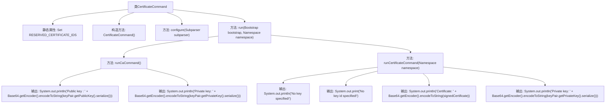

# 基础信息

|      |      |
|------|------|
| 名称 | CertificateCommand |
| 编码语言 | .java |
| 代码路径 | Signal-Server/service/src/main/java/org/whispersystems/textsecuregcm/workers/CertificateCommand.java |
| 包名 | org.whispersystems.textsecuregcm.workers |
| 依赖项 | ['com.google.common.base.MoreObjects', 'com.google.protobuf.ByteString', 'io.dropwizard.core.cli.Command', 'io.dropwizard.core.setup.Bootstrap', 'java.security.InvalidKeyException', 'java.util.Base64', 'java.util.Set', 'net.sourceforge.argparse4j.impl.Arguments', 'net.sourceforge.argparse4j.inf.Namespace', 'net.sourceforge.argparse4j.inf.Subparser', 'org.signal.libsignal.protocol.ecc.Curve', 'org.signal.libsignal.protocol.ecc.ECKeyPair', 'org.signal.libsignal.protocol.ecc.ECPrivateKey', 'org.whispersystems.textsecuregcm.entities.MessageProtos'] |
| 概述说明 | CertificateCommand类生成服务器证书，支持CA参数、签名、密钥ID校验及错误处理。 |

# 说明

CertificateCommand类是一个用于生成服务器证书的工具，支持生成CA参数和进行证书签名操作。该类还包含密钥ID的校验功能，确保密钥的唯一性和正确性。此外，CertificateCommand类具备错误处理机制，能够在生成证书过程中检测并处理可能出现的错误，确保操作的稳定性和安全性。

# 类列表 Class Summary

| 名称   | 类型  | 说明 |
|-------|------|-------------|
| CertificateCommand | class | CertificateCommand类用于生成服务器证书，支持CA参数生成和证书签名，包含密钥ID校验和错误处理。 |

## 类 CertificateCommand

|      |      |
|------|------|
| 访问范围 | public |
| 类型 | class |
| 名称 | CertificateCommand |
| 说明 | CertificateCommand类用于生成服务器证书，支持CA参数生成和证书签名，包含密钥ID校验和错误处理。 |

### UML类图

```mermaid
classDiagram
    class CertificateCommand {
        -Set~Integer~ RESERVED_CERTIFICATE_IDS
        +CertificateCommand()
        +void configure(Subparser subparser)
        +void run(Bootstrap~?~ bootstrap, Namespace namespace) throws Exception
        -void runCaCommand()
        -void runCertificateCommand(Namespace namespace) throws InvalidKeyException, org.signal.libsignal.protocol.InvalidKeyException
    }

    class Command {
        <<Interface>>
        +void configure(Subparser subparser)
        +void run(Bootstrap~?~ bootstrap, Namespace namespace) throws Exception
    }

    class Subparser {
        +Subparser addArgument(String... args)
    }

    class Namespace {
        +Boolean getBoolean(String key)
        +String getString(String key)
        +Integer getInt(String key)
    }

    class ECKeyPair {
        +byte[] getPublicKey()
        +byte[] getPrivateKey()
    }

    class Curve {
        +ECKeyPair generateKeyPair()
        +ECPrivateKey decodePrivatePoint(byte[] bytes)
        +byte[] calculateSignature(ECPrivateKey key, byte[] data) throws org.signal.libsignal.protocol.InvalidKeyException
    }

    class MessageProtos.ServerCertificate {
        +Builder newBuilder()
    }

    class ByteString {
        +ByteString copyFrom(byte[] bytes)
    }

    CertificateCommand --> Command : 继承
    CertificateCommand --> Subparser : 依赖
    CertificateCommand --> Namespace : 依赖
    CertificateCommand --> ECKeyPair : 依赖
    CertificateCommand --> Curve : 依赖
    CertificateCommand --> MessageProtos.ServerCertificate : 依赖
    CertificateCommand --> ByteString : 依赖
```

### 描述
`CertificateCommand`类继承自`Command`接口，用于生成服务器证书。它包含一个静态的保留证书ID集合`RESERVED_CERTIFICATE_IDS`，并通过`configure`方法配置命令行参数。`run`方法根据参数执行生成CA证书或服务器证书的逻辑。`runCaCommand`生成CA密钥对，`runCertificateCommand`生成服务器证书并签名。该类依赖于`Subparser`、`Namespace`、`ECKeyPair`、`Curve`、`MessageProtos.ServerCertificate`和`ByteString`等类来实现其功能。

### 内部方法调用关系图

这段代码定义了一个名为 `CertificateCommand` 的类，用于生成服务器证书。类中包含一个静态的 `RESERVED_CERTIFICATE_IDS` 集合，用于存储保留的证书ID。`configure` 方法用于配置命令行参数，`run` 方法根据传入的参数决定是执行 `runCaCommand` 还是 `runCertificateCommand`。`runCaCommand` 生成并输出CA的公钥和私钥，`runCertificateCommand` 则生成并输出服务器证书和私钥。代码中还包含了对输入参数的验证和异常处理。

### 字段列表 Field List

| 名称  | 类型  | 说明 |
|-------|-------|------|
| RESERVED_CERTIFICATE_IDS = Set.of(      0xdeadc357 // Reserved for testing; see https://github.com/signalapp/libsignal-client/pull/118  ) | Set<Integer> | 保留证书ID集合，包含测试专用ID 0xdeadc357。 |

### 方法列表 Method List

| 名称  | 类型  | 说明 |
|-------|-------|------|
| runCaCommand | void | 生成并输出公钥和私钥的Base64编码。 |
| run | void | 根据命名空间参数选择执行CA命令或证书命令。 |
| runCertificateCommand | void | 检查密钥和ID，生成证书并签名，输出证书和私钥。 |
| configure | void | 配置子解析器，支持生成CA参数、指定CA私钥和创建密钥ID。 |

