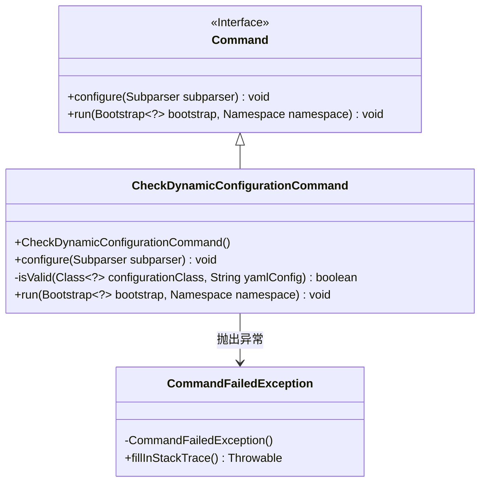
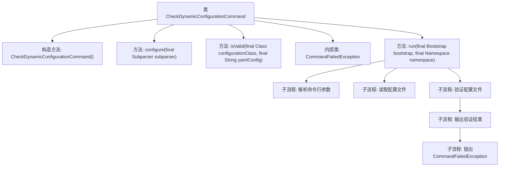

# 基础信息

|      |      |
|------|------|
| 名称 | CheckDynamicConfigurationCommand |
| 编码语言 | .java |
| 代码路径 | Signal-Server/service/src/main/java/org/whispersystems/textsecuregcm/workers/CheckDynamicConfigurationCommand.java |
| 包名 | org.whispersystems.textsecuregcm.workers |
| 依赖项 | ['io.dropwizard.core.cli.Command', 'io.dropwizard.core.setup.Bootstrap', 'java.nio.file.Files', 'java.nio.file.Path', 'java.util.ArrayList', 'java.util.List', 'net.sourceforge.argparse4j.inf.Namespace', 'net.sourceforge.argparse4j.inf.Subparser', 'org.whispersystems.textsecuregcm.configuration.dynamic.DynamicConfiguration', 'org.whispersystems.textsecuregcm.storage.DynamicConfigurationManager'] |
| 概述说明 | 检查动态配置文件有效性并输出结果。 |

# 说明

该命令类用于检查动态配置文件的有效性，通过验证文件内容是否符合预期格式和规范，确保配置文件的正确性和可用性。执行过程中，系统会读取配置文件并进行解析，检测潜在的错误或异常情况。验证完成后，命令类会输出检查结果，包括文件是否有效、发现的错误类型及其位置等详细信息，帮助用户快速定位和解决问题，确保配置文件的准确性和系统稳定性。

# 类列表 Class Summary

| 名称   | 类型  | 说明 |
|-------|------|-------------|
| CheckDynamicConfigurationCommand | class | 检查动态配置文件的命令类，验证文件有效性并输出结果。 |

## 类 CheckDynamicConfigurationCommand

|      |      |
|------|------|
| 访问范围 | public |
| 类型 | class |
| 名称 | CheckDynamicConfigurationCommand |
| 说明 | 检查动态配置文件的命令类，验证文件有效性并输出结果。 |

### UML类图

这段代码定义了一个`CheckDynamicConfigurationCommand`类，继承自`Command`接口。该类用于检查动态配置文件的合法性。`CheckDynamicConfigurationCommand`类通过`configure`方法配置命令行参数，并通过`run`方法执行检查逻辑。如果配置文件无效，会抛出`CommandFailedException`异常。`CommandFailedException`是一个自定义异常类，用于在检查失败时退出命令并返回非零退出码。

### 内部方法调用关系图

这段代码定义了一个名为 `CheckDynamicConfigurationCommand` 的类，用于检查动态配置文件的合法性。类中包含构造方法、配置命令行参数的方法、验证配置文件的方法以及一个内部异常类。`run` 方法是核心逻辑，负责解析命令行参数、读取配置文件、验证配置文件的合法性，并根据验证结果输出信息或抛出异常。整个流程通过多个子流程逐步完成配置文件的验证和结果处理。

### 字段列表 Field List

| 名称  | 类型  | 说明 |
|-------|-------|------|

### 方法列表 Method List

| 名称  | 类型  | 说明 |
|-------|-------|------|
| configure | void | 配置子解析器，添加必选文件参数和可选类参数。 |
| isValid | boolean | 检查YAML配置是否有效并解析为指定类。 |
| run | void | 该方法读取指定路径的YAML配置文件，验证配置类有效性，若无效则抛出异常。 |

