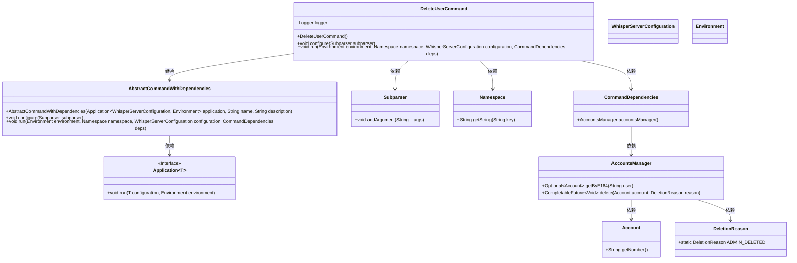
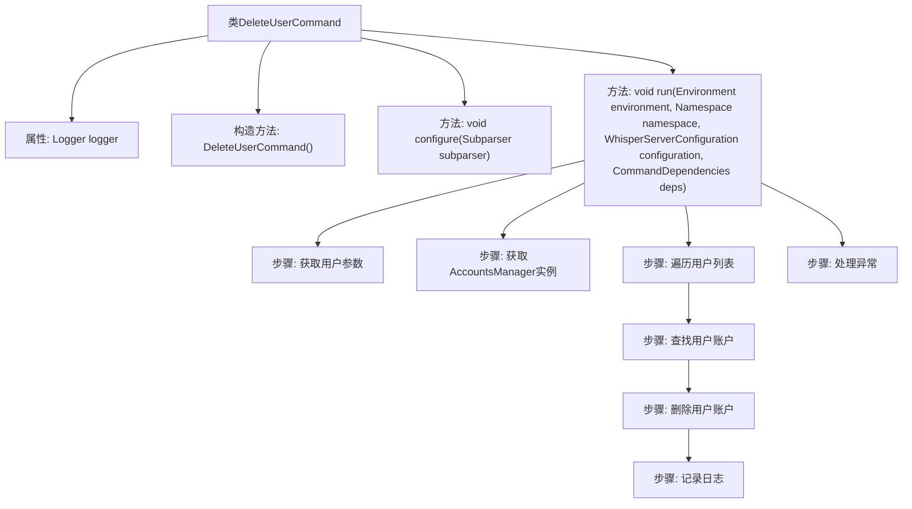

# 基础信息

|      |      |
|------|------|
| 名称 | DeleteUserCommand |
| 编码语言 | .java |
| 代码路径 | Signal-Server/service/src/main/java/org/whispersystems/textsecuregcm/workers/DeleteUserCommand.java |
| 包名 | org.whispersystems.textsecuregcm.workers |
| 依赖项 | ['io.dropwizard.core.Application', 'io.dropwizard.core.setup.Environment', 'java.util.Optional', 'net.sourceforge.argparse4j.inf.Namespace', 'net.sourceforge.argparse4j.inf.Subparser', 'org.slf4j.Logger', 'org.slf4j.LoggerFactory', 'org.whispersystems.textsecuregcm.WhisperServerConfiguration', 'org.whispersystems.textsecuregcm.storage.Account', 'org.whispersystems.textsecuregcm.storage.AccountsManager', 'org.whispersystems.textsecuregcm.storage.AccountsManager.DeletionReason'] |
| 概述说明 | 删除用户命令类支持多用户删除，记录日志并处理异常。 |

# 说明

删除用户命令类具备多用户删除功能，能够在执行删除操作时记录相关日志，并有效处理可能出现的异常情况，确保操作的安全性和可追溯性。

# 类列表 Class Summary

| 名称   | 类型  | 说明 |
|-------|------|-------------|
| DeleteUserCommand | class | 删除用户命令类，支持多用户删除，记录日志，处理异常。 |

## 类 DeleteUserCommand

|      |      |
|------|------|
| 访问范围 | public |
| 类型 | class |
| 名称 | DeleteUserCommand |
| 说明 | 删除用户命令类，支持多用户删除，记录日志，处理异常。 |

### UML类图

这段代码定义了一个 `DeleteUserCommand` 类，继承自 `AbstractCommandWithDependencies`，用于删除用户。`DeleteUserCommand` 类通过 `configure` 方法配置命令行参数，并通过 `run` 方法执行删除操作。`run` 方法从命令行参数中获取用户信息，使用 `AccountsManager` 查找并删除用户账户。代码中还涉及 `Application`、`WhisperServerConfiguration`、`Environment`、`Subparser`、`Namespace`、`CommandDependencies`、`AccountsManager`、`Account` 和 `DeletionReason` 等类，共同协作完成删除用户的功能。

### 内部方法调用关系图

这段代码定义了一个名为 `DeleteUserCommand` 的类，继承自 `AbstractCommandWithDependencies`。该类主要用于删除用户账户，包含日志记录、参数配置、用户账户删除等功能。代码通过 `configure` 方法配置命令行参数，`run` 方法执行删除操作，并处理异常情况。流程图展示了从类定义到方法执行、参数处理、账户删除及异常处理的完整流程。

### 字段列表 Field List

| 名称  | 类型  | 说明 |
|-------|-------|------|
| logger = LoggerFactory.getLogger(DeleteUserCommand.class) | Logger | 定义私有日志记录器，用于DeleteUserCommand类的日志输出。 |

### 方法列表 Method List

| 名称  | 类型  | 说明 |
|-------|-------|------|
| configure | void | 配置命令行解析器，添加必选参数"-u"指定用户。 |
| run | void | 该方法根据用户列表删除账户，记录删除结果或异常。 |

