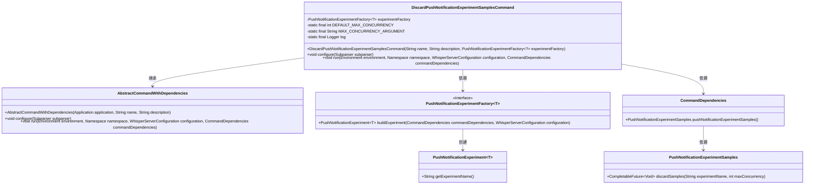

# 基础信息

|      |      |
|------|------|
| 名称 | DiscardPushNotificationExperimentSamplesCommand |
| 编码语言 | .java |
| 代码路径 | Signal-Server/service/src/main/java/org/whispersystems/textsecuregcm/workers/DiscardPushNotificationExperimentSamplesCommand.java |
| 包名 | org.whispersystems.textsecuregcm.workers |
| 依赖项 | ['com.google.common.annotations.VisibleForTesting', 'io.dropwizard.core.Application', 'io.dropwizard.core.setup.Environment', 'net.sourceforge.argparse4j.inf.Namespace', 'net.sourceforge.argparse4j.inf.Subparser', 'org.slf4j.Logger', 'org.slf4j.LoggerFactory', 'org.whispersystems.textsecuregcm.WhisperServerConfiguration', 'org.whispersystems.textsecuregcm.experiment.PushNotificationExperiment'] |
| 概述说明 | 废弃推送通知实验样本类，支持配置最大并发数。 |

# 说明

该类用于废弃推送通知实验样本，并支持配置最大并发数。其主要功能是处理实验样本的废弃操作，确保在推送通知过程中能够有效管理并发任务。通过配置最大并发数，可以控制同时处理的样本数量，从而优化系统性能和资源利用率。该类设计简洁，专注于实验样本的废弃处理，适用于需要高效管理推送通知实验样本的场景。

# 类列表 Class Summary

| 名称   | 类型  | 说明 |
|-------|------|-------------|
| DiscardPushNotificationExperimentSamplesCommand | class | 类用于废弃推送通知实验样本，支持最大并发数配置。 |

## 类 DiscardPushNotificationExperimentSamplesCommand

|      |      |
|------|------|
| 访问范围 | public |
| 类型 | class |
| 名称 | DiscardPushNotificationExperimentSamplesCommand |
| 说明 | 类用于废弃推送通知实验样本，支持最大并发数配置。 |

### UML类图

这段代码定义了一个`DiscardPushNotificationExperimentSamplesCommand`类，继承自`AbstractCommandWithDependencies`，用于丢弃推送通知实验样本。它依赖于`PushNotificationExperimentFactory`来构建实验对象，并通过`CommandDependencies`获取实验样本操作实例。类图展示了类之间的继承和依赖关系，以及接口与实现类的层级关系。

### 内部方法调用关系图

```mermaid
graph TD
    A["类DiscardPushNotificationExperimentSamplesCommand"]
    B["属性: PushNotificationExperimentFactory<?> experimentFactory"]
    C["属性: static final int DEFAULT_MAX_CONCURRENCY = 16"]
    D["属性: static final String MAX_CONCURRENCY_ARGUMENT = 'max-concurrency'"]
    E["属性: static final Logger log"]
    F["构造方法: DiscardPushNotificationExperimentSamplesCommand(String name, String description, PushNotificationExperimentFactory<?> experimentFactory)"]
    G["方法: void configure(Subparser subparser)"]
    H["方法: void run(Environment environment, Namespace namespace, WhisperServerConfiguration configuration, CommandDependencies commandDependencies)"]
    I["调用: super.configure(subparser)"]
    J["调用: subparser.addArgument('--max-concurrency')"]
    K["调用: experimentFactory.buildExperiment(commandDependencies, configuration)"]
    L["调用: namespace.getInt(MAX_CONCURRENCY_ARGUMENT)"]
    M["调用: commandDependencies.pushNotificationExperimentSamples().discardSamples(experiment.getExperimentName(), maxConcurrency).join()"]

    A --> B
    A --> C
    A --> D
    A --> E
    A --> F
    A --> G
    A --> H
    G --> I
    G --> J
    H --> K
    H --> L
    H --> M
```

这段代码定义了一个名为 `DiscardPushNotificationExperimentSamplesCommand` 的类，继承自 `AbstractCommandWithDependencies`。该类用于处理与推送通知实验样本丢弃相关的命令。代码中包含了构造方法、配置方法和运行方法。构造方法初始化了实验工厂对象，配置方法添加了最大并发数的命令行参数，运行方法则根据配置和依赖项执行样本丢弃操作。整个流程涉及命令行参数解析、实验对象的构建以及样本丢弃操作的执行。

### 字段列表 Field List

| 名称  | 类型  | 说明 |
|-------|-------|------|
| experimentFactory | PushNotificationExperimentFactory<?> | 私有推送通知实验工厂变量声明。 |
| DEFAULT_MAX_CONCURRENCY = 16 | int | 默认最大并发数为16。 |
| log = LoggerFactory.getLogger(DiscardPushNotificationExperimentSamplesCommand.class) | Logger | 记录器初始化用于推送通知实验样本命令类。 |
| MAX_CONCURRENCY_ARGUMENT = "max-concurrency" | String | 测试可见的静态字符串常量MAX_CONCURRENCY_ARGUMENT。 |

### 方法列表 Method List

| 名称  | 类型  | 说明 |
|-------|-------|------|
| configure | void | 重写configure方法，添加max-concurrency参数，设置默认值及帮助信息。 |
| run | void | 重写run方法，构建实验并丢弃样本，最大并发数由命名空间获取。 |

