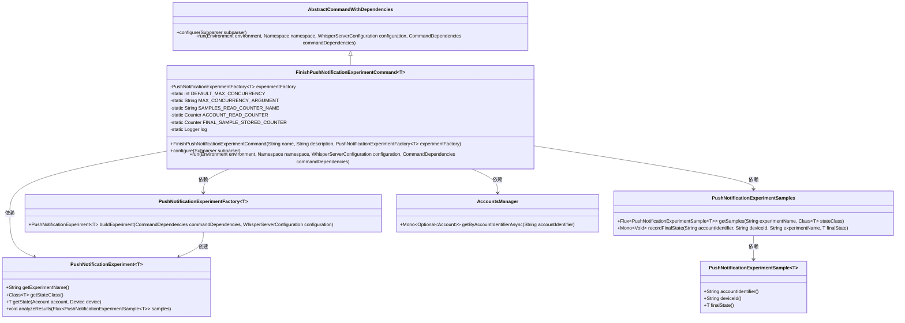

# 基础信息

|      |      |
|------|------|
| 名称 | FinishPushNotificationExperimentCommand |
| 编码语言 | .java |
| 代码路径 | Signal-Server/service/src/main/java/org/whispersystems/textsecuregcm/workers/FinishPushNotificationExperimentCommand.java |
| 包名 | org.whispersystems.textsecuregcm.workers |
| 依赖项 | ['com.fasterxml.jackson.core.JsonProcessingException', 'com.google.common.annotations.VisibleForTesting', 'io.dropwizard.core.Application', 'io.dropwizard.core.setup.Environment', 'io.micrometer.core.instrument.Counter', 'io.micrometer.core.instrument.Metrics', 'net.sourceforge.argparse4j.inf.Namespace', 'net.sourceforge.argparse4j.inf.Subparser', 'org.slf4j.Logger', 'org.slf4j.LoggerFactory', 'org.whispersystems.textsecuregcm.WhisperServerConfiguration', 'org.whispersystems.textsecuregcm.experiment.PushNotificationExperiment', 'org.whispersystems.textsecuregcm.experiment.PushNotificationExperimentSample', 'org.whispersystems.textsecuregcm.experiment.PushNotificationExperimentSamples', 'org.whispersystems.textsecuregcm.metrics.MetricsUtil', 'org.whispersystems.textsecuregcm.storage.AccountsManager', 'reactor.core.publisher.Flux', 'reactor.core.publisher.Mono', 'reactor.util.retry.Retry', 'software.amazon.awssdk.services.dynamodb.model.ConditionalCheckFailedException', 'java.time.Duration'] |
| 概述说明 | FinishPushNotificationExperimentCommand类完成推送实验，支持并发与状态记录。 |

# 说明

FinishPushNotificationExperimentCommand类是一个用于完成推送通知实验的工具，具备并发控制和状态记录功能。它能够有效管理实验过程中的并发操作，确保实验的顺利进行，并实时记录实验状态，便于后续分析和追踪。该类的设计旨在提升推送通知实验的效率和可靠性。

# 类列表 Class Summary

| 名称   | 类型  | 说明 |
|-------|------|-------------|
| FinishPushNotificationExperimentCommand | class | FinishPushNotificationExperimentCommand类用于完成推送通知实验，支持并发控制与状态记录。 |


## 类 FinishPushNotificationExperimentCommand

|      |      |
|------|------|
| 访问范围 | public |
| 类型 | class |
| 名称 | FinishPushNotificationExperimentCommand |
| 说明 | FinishPushNotificationExperimentCommand类用于完成推送通知实验，支持并发控制与状态记录。 |


### UML类图



### 描述
`FinishPushNotificationExperimentCommand` 是一个泛型类，继承自 `AbstractCommandWithDependencies`，用于完成推送通知实验的命令。它依赖于 `PushNotificationExperimentFactory` 来构建实验对象，并通过 `PushNotificationExperimentSamples` 和 `AccountsManager` 读取和处理实验样本数据。该类还配置了最大并发数，并记录了实验样本的读取和存储状态。最终，实验对象会分析处理后的样本结果。


### 内部方法调用关系图

```mermaid
graph TD
    A["类FinishPushNotificationExperimentCommand<T>"]
    B["属性: PushNotificationExperimentFactory<T> experimentFactory"]
    C["属性: int DEFAULT_MAX_CONCURRENCY = 16"]
    D["属性: String MAX_CONCURRENCY_ARGUMENT = 'max-concurrency'"]
    E["属性: String SAMPLES_READ_COUNTER_NAME"]
    F["属性: Counter ACCOUNT_READ_COUNTER"]
    G["属性: Counter FINAL_SAMPLE_STORED_COUNTER"]
    H["属性: Logger log"]
    I["构造方法: FinishPushNotificationExperimentCommand(String name, String description, PushNotificationExperimentFactory<T> experimentFactory)"]
    J["方法: void configure(Subparser subparser)"]
    K["方法: void run(Environment environment, Namespace namespace, WhisperServerConfiguration configuration, CommandDependencies commandDependencies)"]
    L["步骤: super.configure(subparser)"]
    M["步骤: subparser.addArgument('--max-concurrency')"]
    N["步骤: experimentFactory.buildExperiment(commandDependencies, configuration)"]
    O["步骤: namespace.getInt(MAX_CONCURRENCY_ARGUMENT)"]
    P["步骤: log.info('Finishing \"{}\" with max concurrency: {}', experiment.getExperimentName(), maxConcurrency)"]
    Q["步骤: commandDependencies.accountsManager()"]
    R["步骤: commandDependencies.pushNotificationExperimentSamples()"]
    S["步骤: pushNotificationExperimentSamples.getSamples(experiment.getExperimentName(), experiment.getStateClass())"]
    T["步骤: Metrics.counter(SAMPLES_READ_COUNTER_NAME, 'final', String.valueOf(sample.finalState() != null)).increment()"]
    U["步骤: sample.finalState() == null ? Mono.fromFuture(() -> accountsManager.getByAccountIdentifierAsync(sample.accountIdentifier())) : Mono.just(sample)"]
    V["步骤: experiment.analyzeResults(finishedSamples)"]

    A --> B
    A --> C
    A --> D
    A --> E
    A --> F
    A --> G
    A --> H
    A --> I
    A --> J
    A --> K
    J --> L
    J --> M
    K --> N
    K --> O
    K --> P
    K --> Q
    K --> R
    K --> S
    S --> T
    S --> U
    K --> V
```

这段代码定义了一个名为 `FinishPushNotificationExperimentCommand` 的类，用于处理推送通知实验的完成操作。类中包含多个属性和方法，主要功能是通过配置和运行实验来处理实验样本，并记录最终状态。代码通过调用 `experimentFactory.buildExperiment` 构建实验对象，并使用 `pushNotificationExperimentSamples.getSamples` 获取样本数据。在处理样本时，代码会根据样本的最终状态决定是否记录最终状态，并在完成后调用 `experiment.analyzeResults` 分析结果。整个过程涉及多个步骤，包括日志记录、计数器更新和异步操作处理。

### 字段列表 Field List

| 名称  | 类型  | 说明 |
|-------|-------|------|
| DEFAULT_MAX_CONCURRENCY = 16 | int | 默认最大并发数为16。 |
| experimentFactory | PushNotificationExperimentFactory<T> | 私有且不可变的推送通知实验工厂实例。 |
| log = LoggerFactory.getLogger(FinishPushNotificationExperimentCommand.class) | Logger | 日志记录器用于FinishPushNotificationExperimentCommand类。 |
| SAMPLES_READ_COUNTER_NAME =      MetricsUtil.name(FinishPushNotificationExperimentCommand.class, "samplesRead") | String | 定义了一个静态字符串常量，用于记录读取样本的计数器名称。 |
| MAX_CONCURRENCY_ARGUMENT = "max-concurrency" | String | 测试可见的静态常量MAX_CONCURRENCY_ARGUMENT值为"max-concurrency"。 |
| FINAL_SAMPLE_STORED_COUNTER =      Metrics.counter(MetricsUtil.name(FinishPushNotificationExperimentCommand.class, "finalSampleStored")) | Counter | 定义了一个名为FINAL_SAMPLE_STORED_COUNTER的静态计数器，用于存储最终样本的指标。 |
| ACCOUNT_READ_COUNTER =      Metrics.counter(MetricsUtil.name(FinishPushNotificationExperimentCommand.class, "accountRead")) | Counter | 定义一个名为ACCOUNT_READ_COUNTER的静态计数器，用于统计FinishPushNotificationExperimentCommand类的accountRead操作。 |

### 方法列表 Method List

| 名称  | 类型  | 说明 |
|-------|-------|------|
| run | void | 方法运行实验，获取样本，记录最终状态并分析结果。 |
| configure | void | 重写配置方法，添加最大并发数参数，默认值为预设值。 |


