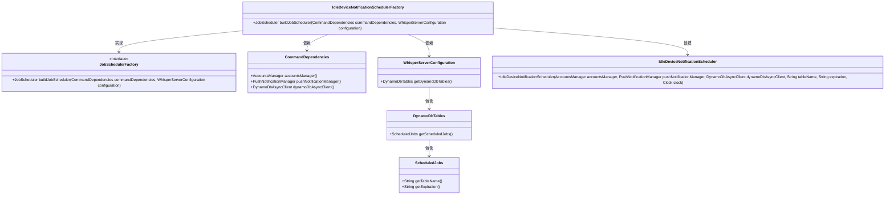
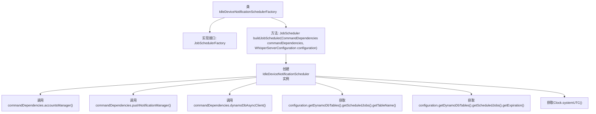

# 基础信息

|      |      |
|------|------|
| 名称 | IdleDeviceNotificationSchedulerFactory |
| 编码语言 | .java |
| 代码路径 | Signal-Server/service/src/main/java/org/whispersystems/textsecuregcm/workers/IdleDeviceNotificationSchedulerFactory.java |
| 包名 | org.whispersystems.textsecuregcm.workers |
| 依赖项 | ['org.whispersystems.textsecuregcm.WhisperServerConfiguration', 'org.whispersystems.textsecuregcm.push.IdleDeviceNotificationScheduler', 'org.whispersystems.textsecuregcm.scheduler.JobScheduler', 'java.time.Clock'] |
| 概述说明 | IdleDeviceNotificationSchedulerFactory实现JobSchedulerFactory接口，构建IdleDeviceNotificationScheduler实例。 |

# 说明

IdleDeviceNotificationSchedulerFactory实现了JobSchedulerFactory接口，其主要功能是构建IdleDeviceNotificationScheduler实例。该工厂类负责创建和管理与空闲设备通知相关的调度器，确保在设备空闲时能够及时触发相应的通知任务。通过实现标准接口，该工厂类能够与其他调度器组件无缝集成，提供统一的调度管理机制。

# 类列表 Class Summary

| 名称   | 类型  | 说明 |
|-------|------|-------------|
| IdleDeviceNotificationSchedulerFactory | class | IdleDeviceNotificationSchedulerFactory实现JobSchedulerFactory接口，用于构建IdleDeviceNotificationScheduler实例。 |

## 类 IdleDeviceNotificationSchedulerFactory

|      |      |
|------|------|
| 访问范围 | public |
| 类型 | class |
| 名称 | IdleDeviceNotificationSchedulerFactory |
| 说明 | IdleDeviceNotificationSchedulerFactory实现JobSchedulerFactory接口，用于构建IdleDeviceNotificationScheduler实例。 |

### UML类图

### 描述：
`IdleDeviceNotificationSchedulerFactory` 类实现了 `JobSchedulerFactory` 接口，负责创建 `IdleDeviceNotificationScheduler` 实例。它依赖于 `CommandDependencies` 和 `WhisperServerConfiguration` 来获取必要的依赖项和配置信息。`WhisperServerConfiguration` 包含 `DynamoDbTables`，后者进一步包含 `ScheduledJobs`，用于获取表名和过期时间。最终，`IdleDeviceNotificationScheduler` 通过这些参数进行初始化。

### 内部方法调用关系图

这段代码展示了`IdleDeviceNotificationSchedulerFactory`类的实现，该类实现了`JobSchedulerFactory`接口。`buildJobScheduler`方法通过调用`commandDependencies`和`configuration`对象的多个方法，构建并返回一个`IdleDeviceNotificationScheduler`实例。该实例的创建依赖于多个参数，包括账户管理器、推送通知管理器、DynamoDB客户端、表名、过期时间以及系统时钟。流程图清晰地展示了各个方法调用的顺序和依赖关系。

### 字段列表 Field List

| 名称  | 类型  | 说明 |
|-------|-------|------|

### 方法列表 Method List

| 名称  | 类型  | 说明 |
|-------|-------|------|
| buildJobScheduler | JobScheduler | 构建IdleDeviceNotificationScheduler，依赖账户管理、推送通知、DynamoDB客户端及配置参数。 |

