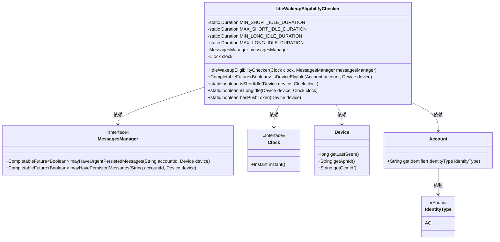
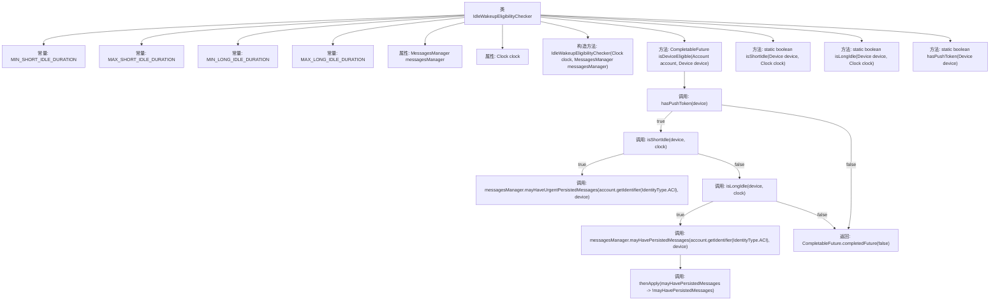

# 基础信息

|      |      |
|------|------|
| 名称 | IdleWakeupEligibilityChecker |
| 编码语言 | .java |
| 代码路径 | Signal-Server/service/src/main/java/org/whispersystems/textsecuregcm/workers/IdleWakeupEligibilityChecker.java |
| 包名 | org.whispersystems.textsecuregcm.workers |
| 依赖项 | ['com.google.common.annotations.VisibleForTesting', 'java.time.Clock', 'java.time.Duration', 'java.time.Instant', 'java.util.concurrent.CompletableFuture', 'org.apache.commons.lang3.StringUtils', 'org.whispersystems.textsecuregcm.identity.IdentityType', 'org.whispersystems.textsecuregcm.storage.Account', 'org.whispersystems.textsecuregcm.storage.Device', 'org.whispersystems.textsecuregcm.storage.MessagesManager', 'reactor.core.publisher.Mono'] |
| 概述说明 | 检查设备推送通知适配性，区分短时和长时闲置。 |

# 说明

该功能旨在检查设备是否适合接收推送通知，并根据设备的闲置状态进行区分。具体来说，它会判断设备是处于短时闲置还是长时闲置状态，以便根据不同的闲置时长决定是否发送推送通知。这一机制有助于优化推送通知的发送策略，确保通知在合适的时机送达，避免对用户造成不必要的打扰。通过区分闲置时长，系统可以更精准地控制推送频率，提升用户体验和通知的有效性。

# 类列表 Class Summary

| 名称   | 类型  | 说明 |
|-------|------|-------------|
| IdleWakeupEligibilityChecker | class | 检查设备是否适合接收推送通知，区分短时和长时闲置设备。 |

## 类 IdleWakeupEligibilityChecker

|      |      |
|------|------|
| 访问范围 | public |
| 类型 | class |
| 名称 | IdleWakeupEligibilityChecker |
| 说明 | 检查设备是否适合接收推送通知，区分短时和长时闲置设备。 |

### UML类图

类图描述：
`IdleWakeupEligibilityChecker`类用于检查设备是否适合接收推送通知，依赖于`MessagesManager`和`Clock`接口。它通过判断设备的空闲时间是否在短空闲或长空闲范围内，来决定是否发送通知。`Device`类提供了设备的相关信息，如最后在线时间和推送令牌。`Account`类用于获取账户标识符，`IdentityType`枚举定义了账户标识符的类型。

### 内部方法调用关系图

这段代码实现了一个设备唤醒资格检查器，用于判断设备是否可以从推送通知中受益。代码通过检查设备的空闲时间和是否有推送令牌来决定是否发送通知。流程图展示了从设备检查到最终返回结果的完整流程，包括多个条件判断和方法调用。

### 字段列表 Field List

| 名称  | 类型  | 说明 |
|-------|-------|------|
| MIN_SHORT_IDLE_DURATION = Duration.ofDays(3) | Duration | 测试可见的最小短空闲时长为3天。 |
| MAX_LONG_IDLE_DURATION = Duration.ofDays(75) | Duration | 测试用最大空闲时长设置为75天。 |
| MIN_LONG_IDLE_DURATION = Duration.ofDays(60) | Duration | 测试可见的最小长空闲时长为60天。 |
| messagesManager | MessagesManager | 私有消息管理器实例变量。 |
| clock | Clock | 声明一个私有的不可变的Clock类型变量clock。 |
| MAX_SHORT_IDLE_DURATION = Duration.ofDays(30) | Duration | 测试可见的静态常量MAX_SHORT_IDLE_DURATION设置为30天。 |

### 方法列表 Method List

| 名称  | 类型  | 说明 |
|-------|-------|------|
| isLongIdle | boolean | 检查设备空闲时长是否在指定范围内。 |
| isShortIdle | boolean | 检查设备空闲时间是否在指定范围内。 |
| hasPushToken | boolean | 测试用方法，检查设备是否有推送令牌。 |
| isDeviceEligible | CompletableFuture<Boolean> | 检查设备是否有推送令牌，根据设备空闲状态判断是否有紧急或持久消息，返回布尔值。 |

