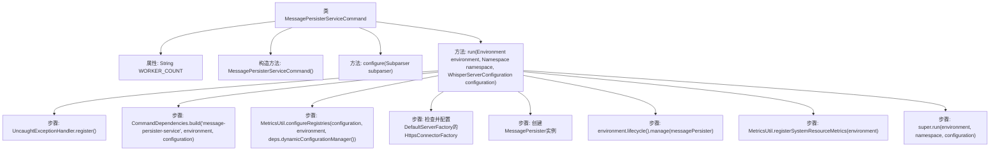

# 基础信息

|      |      |
|------|------|
| 名称 | MessagePersisterServiceCommand |
| 编码语言 | .java |
| 代码路径 | Signal-Server/service/src/main/java/org/whispersystems/textsecuregcm/workers/MessagePersisterServiceCommand.java |
| 包名 | org.whispersystems.textsecuregcm.workers |
| 依赖项 | ['io.dropwizard.core.Application', 'io.dropwizard.core.cli.ServerCommand', 'io.dropwizard.core.server.DefaultServerFactory', 'io.dropwizard.core.setup.Environment', 'io.dropwizard.jetty.HttpsConnectorFactory', 'java.time.Duration', 'net.sourceforge.argparse4j.inf.Namespace', 'net.sourceforge.argparse4j.inf.Subparser', 'org.whispersystems.textsecuregcm.WhisperServerConfiguration', 'org.whispersystems.textsecuregcm.metrics.MetricsUtil', 'org.whispersystems.textsecuregcm.storage.MessagePersister', 'org.whispersystems.textsecuregcm.util.logging.UncaughtExceptionHandler'] |
| 概述说明 | MessagePersisterServiceCommand类用于多线程持久化未送达消息。 |

# 说明

MessagePersisterServiceCommand类是一个用于持久化未送达消息的工具，专门设计用于支持多线程工作环境。其主要功能是确保消息在未能成功送达时能够被安全地保存，以便后续处理或重新发送。该类的设计考虑了多线程并发操作的场景，能够高效地处理多个消息持久化任务，保证系统的稳定性和可靠性。通过这一机制，系统能够在消息传递失败时避免数据丢失，并确保消息的最终可达性。

# 类列表 Class Summary

| 名称   | 类型  | 说明 |
|-------|------|-------------|
| MessagePersisterServiceCommand | class | MessagePersisterServiceCommand类用于持久化未送达消息，支持多线程工作。 |

## 类 MessagePersisterServiceCommand

|      |      |
|------|------|
| 访问范围 | public |
| 类型 | class |
| 名称 | MessagePersisterServiceCommand |
| 说明 | MessagePersisterServiceCommand类用于持久化未送达消息，支持多线程工作。 |

### UML类图

```mermaid
classDiagram
    class ServerCommand~T~ {
        +ServerCommand(Application~T~ application, String name, String description)
        +void configure(Subparser subparser)
        +void run(Environment environment, Namespace namespace, T configuration) throws Exception
    }

    class MessagePersisterServiceCommand {
        -String WORKER_COUNT
        +MessagePersisterServiceCommand()
        +void configure(Subparser subparser)
        +void run(Environment environment, Namespace namespace, WhisperServerConfiguration configuration) throws Exception
    }

    class Application~T~ {
        <<Interface>>
        +void run(T configuration, Environment environment)
    }

    class WhisperServerConfiguration {
        +ServerFactory getServerFactory()
        +MessageCacheConfiguration getMessageCacheConfiguration()
        +TlsKeyStoreConfiguration getTlsKeyStoreConfiguration()
    }

    class DefaultServerFactory {
        +List~ConnectorFactory~ getApplicationConnectors()
    }

    class HttpsConnectorFactory {
        +void setKeyStorePassword(String password)
    }

    class MessagePersister {
        +MessagePersister(MessagesCache messagesCache, MessagesManager messagesManager, AccountsManager accountsManager, DynamicConfigurationManager dynamicConfigurationManager, Duration persistDelay, int workerCount)
    }

    class CommandDependencies {
        +static CommandDependencies build(String serviceName, Environment environment, WhisperServerConfiguration configuration)
        +MessagesCache messagesCache()
        +MessagesManager messagesManager()
        +AccountsManager accountsManager()
        +DynamicConfigurationManager dynamicConfigurationManager()
    }

    class MetricsUtil {
        +static void configureRegistries(WhisperServerConfiguration configuration, Environment environment, DynamicConfigurationManager dynamicConfigurationManager)
        +static void registerSystemResourceMetrics(Environment environment)
    }

    class UncaughtExceptionHandler {
        +static void register()
    }

    ServerCommand~T~ <|-- MessagePersisterServiceCommand
    MessagePersisterServiceCommand --> Application~T~ : 依赖
    MessagePersisterServiceCommand --> WhisperServerConfiguration : 依赖
    WhisperServerConfiguration --> DefaultServerFactory : 依赖
    DefaultServerFactory --> HttpsConnectorFactory : 依赖
    MessagePersisterServiceCommand --> CommandDependencies : 依赖
    MessagePersisterServiceCommand --> MessagePersister : 依赖
    MessagePersisterServiceCommand --> MetricsUtil : 依赖
    MessagePersisterServiceCommand --> UncaughtExceptionHandler : 依赖
```

### 描述
`MessagePersisterServiceCommand` 是一个继承自 `ServerCommand` 的命令类，用于启动一个持久化服务，将未送达的消息从 Redis 持久化到 Dynamo DB。它通过 `Application` 接口运行，并依赖于 `WhisperServerConfiguration` 来获取服务器配置。类中还使用了 `CommandDependencies` 来构建依赖项，并通过 `MessagePersister` 进行消息的持久化操作。此外，类中还涉及到 `MetricsUtil` 和 `UncaughtExceptionHandler` 来处理系统资源度量和未捕获的异常。

### 内部方法调用关系图

该流程图描述了`MessagePersisterServiceCommand`类的主要结构和执行流程。类包含一个静态属性`WORKER_COUNT`，一个构造方法和两个主要方法`configure`和`run`。`run`方法中包含了多个步骤，从注册未捕获异常处理器到创建并管理`MessagePersister`实例，最后调用父类的`run`方法完成整个流程。

### 字段列表 Field List

| 名称  | 类型  | 说明 |
|-------|-------|------|
| WORKER_COUNT = "workers" | String | 定义私有静态常量WORKER_COUNT，值为"workers"。 |

### 方法列表 Method List

| 名称  | 类型  | 说明 |
|-------|-------|------|
| configure | void | 配置子解析器，添加必需的工作线程数参数。 |
| run | void | 注册异常处理器，配置依赖和指标，设置HTTPS密钥，管理消息持久化，注册系统资源指标。 |

