# 基础信息

|      |      |
|------|------|
| 名称 | NotifyIdleDevicesCommand |
| 编码语言 | .java |
| 代码路径 | Signal-Server/service/src/main/java/org/whispersystems/textsecuregcm/workers/NotifyIdleDevicesCommand.java |
| 包名 | org.whispersystems.textsecuregcm.workers |
| 依赖项 | ['com.google.common.annotations.VisibleForTesting', 'io.micrometer.core.instrument.Counter', 'io.micrometer.core.instrument.Metrics', 'net.sourceforge.argparse4j.inf.Subparser', 'org.slf4j.Logger', 'org.slf4j.LoggerFactory', 'org.whispersystems.textsecuregcm.configuration.DynamoDbTables', 'org.whispersystems.textsecuregcm.identity.IdentityType', 'org.whispersystems.textsecuregcm.metrics.MetricsUtil', 'org.whispersystems.textsecuregcm.push.IdleDeviceNotificationScheduler', 'org.whispersystems.textsecuregcm.storage.Account', 'org.whispersystems.textsecuregcm.storage.Device', 'org.whispersystems.textsecuregcm.storage.MessagesManager', 'reactor.core.publisher.Flux', 'reactor.core.publisher.Mono', 'reactor.util.function.Tuples', 'reactor.util.retry.Retry', 'java.time.Clock', 'java.time.Duration', 'java.time.LocalTime'] |
| 概述说明 | NotifyIdleDevicesCommand类用于调度空闲设备推送通知，支持并发和模拟运行。 |

# 说明

NotifyIdleDevicesCommand类的主要功能是调度空闲设备的推送通知。该类支持并发控制，确保在多个设备同时空闲时能够有效地管理通知的发送。此外，该类还支持模拟运行，允许开发者在实际推送之前进行测试和验证，以确保通知机制的准确性和可靠性。

# 类列表 Class Summary

| 名称   | 类型  | 说明 |
|-------|------|-------------|
| NotifyIdleDevicesCommand | class | NotifyIdleDevicesCommand类用于调度空闲设备的推送通知，支持并发控制和模拟运行。 |


## 类 NotifyIdleDevicesCommand

|      |      |
|------|------|
| 访问范围 | public |
| 类型 | class |
| 名称 | NotifyIdleDevicesCommand |
| 说明 | NotifyIdleDevicesCommand类用于调度空闲设备的推送通知，支持并发控制和模拟运行。 |


### UML类图

```mermaid
classDiagram
    class NotifyIdleDevicesCommand {
        -static final int DEFAULT_MAX_CONCURRENCY
        -static final String MAX_CONCURRENCY_ARGUMENT
        -static final String DRY_RUN_ARGUMENT
        -static final LocalTime PREFERRED_NOTIFICATION_TIME
        -static final Counter DEVICE_INSPECTED_COUNTER
        -static final String SCHEDULED_NOTIFICATION_COUNTER_NAME
        -static final String DRY_RUN_TAG_NAME
        -static final Logger log
        +NotifyIdleDevicesCommand()
        +void configure(Subparser subparser)
        +void crawlAccounts(Flux~Account~ accounts)
        +Clock getClock()
        +IdleDeviceNotificationScheduler buildIdleDeviceNotificationScheduler()
    }

    class AbstractSinglePassCrawlAccountsCommand {
        +void configure(Subparser subparser)
        +void crawlAccounts(Flux~Account~ accounts)
    }

    class MessagesManager {
        <<Interface>>
    }

    class IdleDeviceNotificationScheduler {
        +IdleDeviceNotificationScheduler(AccountsManager accountsManager, PushNotificationManager pushNotificationManager, DynamoDbAsyncClient dynamoDbAsyncClient, String tableName, Duration expiration, Clock clock)
    }

    class IdleWakeupEligibilityChecker {
        +IdleWakeupEligibilityChecker(Clock clock, MessagesManager messagesManager)
    }

    class Clock {
        <<Interface>>
    }

    class Subparser {
        <<Interface>>
    }

    class Account {
        +List~Device~ getDevices()
        +String getIdentifier(IdentityType identityType)
    }

    class Device {
        +String getId()
    }

    class Metrics {
        +static Counter counter(String name, String... tags)
    }

    class Logger {
        <<Interface>>
    }

    class Flux~T~ {
        +Flux~R~ flatMap(Function~T, Publisher~R~~ mapper)
        +Flux~T~ doOnNext(Consumer~T~ onNext)
        +Mono~T~ then()
        +void block()
    }

    class Mono~T~ {
        +Mono~R~ map(Function~T, R~ mapper)
        +Mono~T~ onErrorResume(Function~Throwable, Mono~T~~ fallback)
        +Mono~T~ retryWhen(Retry retry)
        +Mono~T~ doOnSuccess(Consumer~T~ onSuccess)
    }

    class Retry {
        +static Retry backoff(int maxAttempts, Duration firstBackoff)
    }

    class Tuples {
        +static ~T1, T2~ of(T1 t1, T2 t2)
    }

    class DynamoDbAsyncClient {
        <<Interface>>
    }

    class PushNotificationManager {
        <<Interface>>
    }

    class AccountsManager {
        <<Interface>>
    }

    class DynamoDbTables {
        class TableWithExpiration {
            +String getTableName()
            +Duration getExpiration()
        }
    }

    AbstractSinglePassCrawlAccountsCommand <|-- NotifyIdleDevicesCommand
    NotifyIdleDevicesCommand --> MessagesManager : 依赖
    NotifyIdleDevicesCommand --> IdleDeviceNotificationScheduler : 依赖
    NotifyIdleDevicesCommand --> Clock : 依赖
    NotifyIdleDevicesCommand --> IdleWakeupEligibilityChecker : 依赖
    NotifyIdleDevicesCommand --> Subparser : 依赖
    NotifyIdleDevicesCommand --> Account : 依赖
    NotifyIdleDevicesCommand --> Device : 依赖
    NotifyIdleDevicesCommand --> Metrics : 依赖
    NotifyIdleDevicesCommand --> Logger : 依赖
    NotifyIdleDevicesCommand --> Flux~Account~ : 依赖
    NotifyIdleDevicesCommand --> Mono~Void~ : 依赖
    NotifyIdleDevicesCommand --> Retry : 依赖
    NotifyIdleDevicesCommand --> Tuples : 依赖
    NotifyIdleDevicesCommand --> DynamoDbAsyncClient : 依赖
    NotifyIdleDevicesCommand --> PushNotificationManager : 依赖
    NotifyIdleDevicesCommand --> AccountsManager : 依赖
    NotifyIdleDevicesCommand --> DynamoDbTables.TableWithExpiration : 依赖
```

这段代码定义了一个 `NotifyIdleDevicesCommand` 类，它继承自 `AbstractSinglePassCrawlAccountsCommand`，用于调度空闲设备的推送通知。该类通过配置命令行参数来控制最大并发数和是否执行“干运行”（即不实际发送通知），并依赖于多个外部组件如 `MessagesManager`、`IdleDeviceNotificationScheduler`、`Clock` 等来执行设备检查、通知调度等操作。代码中使用了 `Flux` 和 `Mono` 来处理异步流操作，并通过 `Metrics` 和 `Logger` 进行监控和日志记录。


### 内部方法调用关系图

```mermaid
graph TD
    A["类NotifyIdleDevicesCommand"]
    B["属性: int DEFAULT_MAX_CONCURRENCY"]
    C["属性: String MAX_CONCURRENCY_ARGUMENT"]
    D["属性: String DRY_RUN_ARGUMENT"]
    E["属性: LocalTime PREFERRED_NOTIFICATION_TIME"]
    F["属性: Counter DEVICE_INSPECTED_COUNTER"]
    G["属性: String SCHEDULED_NOTIFICATION_COUNTER_NAME"]
    H["属性: String DRY_RUN_TAG_NAME"]
    I["属性: Logger log"]
    J["构造方法: NotifyIdleDevicesCommand()"]
    K["方法: void configure(Subparser subparser)"]
    L["方法: void crawlAccounts(Flux<Account> accounts)"]
    M["方法: Clock getClock()"]
    N["方法: IdleDeviceNotificationScheduler buildIdleDeviceNotificationScheduler()"]

    A --> B
    A --> C
    A --> D
    A --> E
    A --> F
    A --> G
    A --> H
    A --> I
    A --> J
    A --> K
    A --> L
    A --> M
    A --> N
```



这段代码定义了一个名为 `NotifyIdleDevicesCommand` 的类，用于通知空闲设备。类中包含多个属性和方法，主要用于配置命令参数、检查设备空闲状态、调度通知等。代码通过 `configure` 方法配置命令行参数，`crawlAccounts` 方法遍历账户和设备，检查设备是否空闲并调度通知。`getClock` 和 `buildIdleDeviceNotificationScheduler` 方法分别用于获取系统时钟和构建通知调度器。

### 字段列表 Field List

| 名称  | 类型  | 说明 |
|-------|-------|------|
| DEFAULT_MAX_CONCURRENCY = 16 | int | 默认最大并发数为16。 |
| PREFERRED_NOTIFICATION_TIME = LocalTime.of(14, 0) | LocalTime | 测试用常量，设置通知时间为14:00。 |
| SCHEDULED_NOTIFICATION_COUNTER_NAME =      MetricsUtil.name(NotifyIdleDevicesCommand.class, "scheduleNotification") | String | NotifyIdleDevicesCommand类中定义了一个名为scheduleNotification的计数器。 |
| MAX_CONCURRENCY_ARGUMENT = "max-concurrency" | String | 测试可见的静态常量MAX_CONCURRENCY_ARGUMENT值为"max-concurrency"。 |
| DRY_RUN_ARGUMENT = "dry-run" | String | 测试用静态常量DRY_RUN_ARGUMENT值为"dry-run"。 |
| DRY_RUN_TAG_NAME = "dryRun" | String | 代码定义了一个名为DRY_RUN_TAG_NAME的私有静态常量字符串，值为"dryRun"。 |
| log = LoggerFactory.getLogger(NotifyIdleDevicesCommand.class) | Logger | NotifyIdleDevicesCommand类中定义了静态日志对象log。 |
| DEVICE_INSPECTED_COUNTER =      Metrics.counter(MetricsUtil.name(NotifyIdleDevicesCommand.class, "deviceInspected")) | Counter | NotifyIdleDevicesCommand类中定义了一个静态计数器DEVICE_INSPECTED_COUNTER。 |

### 方法列表 Method List

| 名称  | 类型  | 说明 |
|-------|-------|------|
| getClock | Clock | 提供受保护的`getClock`方法，返回系统UTC时钟，用于测试。 |
| crawlAccounts | void | 爬取账户并检查设备空闲状态，根据条件调度通知。 |
| buildIdleDeviceNotificationScheduler | IdleDeviceNotificationScheduler | 构建空闲设备通知调度器，依赖账户管理器、推送管理器、DynamoDB客户端及表配置。 |
| configure | void | 配置DynamoDB操作的最大并发数和是否进行空运行。 |


