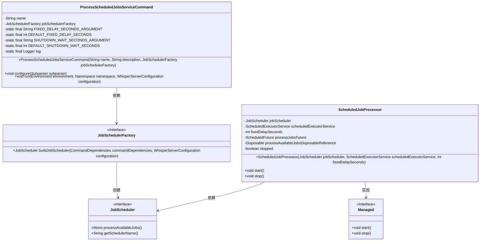

# 基础信息

|      |      |
|------|------|
| 名称 | ProcessScheduledJobsServiceCommand |
| 编码语言 | .java |
| 代码路径 | Signal-Server/service/src/main/java/org/whispersystems/textsecuregcm/workers/ProcessScheduledJobsServiceCommand.java |
| 包名 | org.whispersystems.textsecuregcm.workers |
| 依赖项 | ['com.google.common.annotations.VisibleForTesting', 'io.dropwizard.core.Application', 'io.dropwizard.core.cli.ServerCommand', 'io.dropwizard.core.server.DefaultServerFactory', 'io.dropwizard.core.setup.Environment', 'io.dropwizard.jetty.HttpsConnectorFactory', 'io.dropwizard.lifecycle.Managed', 'io.dropwizard.util.Duration', 'java.util.concurrent.CountDownLatch', 'java.util.concurrent.ScheduledExecutorService', 'java.util.concurrent.ScheduledFuture', 'java.util.concurrent.TimeUnit', 'net.sourceforge.argparse4j.inf.Namespace', 'net.sourceforge.argparse4j.inf.Subparser', 'org.slf4j.Logger', 'org.slf4j.LoggerFactory', 'org.whispersystems.textsecuregcm.WhisperServerConfiguration', 'org.whispersystems.textsecuregcm.metrics.MetricsUtil', 'org.whispersystems.textsecuregcm.scheduler.JobScheduler', 'org.whispersystems.textsecuregcm.util.logging.UncaughtExceptionHandler', 'reactor.core.Disposable', 'reactor.core.Disposables'] |
| 概述说明 | Java服务类支持定时任务处理，可配置固定延迟和关闭等待。 |

# 说明

该Java服务类专门用于处理定时任务，具备灵活的任务调度功能。它支持固定延迟配置，允许任务在指定时间间隔后重复执行，确保任务按计划进行。此外，该类还提供关闭等待配置，确保在服务关闭时，正在执行的任务能够完成，避免任务中断或数据丢失。这种设计提高了任务的可靠性和系统的稳定性，适用于需要精确控制和管理的定时任务场景。

# 类列表 Class Summary

| 名称   | 类型  | 说明 |
|-------|------|-------------|
| ProcessScheduledJobsServiceCommand | class | 处理定时任务的Java服务类，支持固定延迟和关闭等待配置。 |

## 类 ProcessScheduledJobsServiceCommand

|      |      |
|------|------|
| 访问范围 | public |
| 类型 | class |
| 名称 | ProcessScheduledJobsServiceCommand |
| 说明 | 处理定时任务的Java服务类，支持固定延迟和关闭等待配置。 |

### UML类图

**描述**：`ProcessScheduledJobsServiceCommand` 类是一个服务器命令，用于处理定时任务。它依赖于 `JobSchedulerFactory` 来创建 `JobScheduler`，并通过 `ScheduledJobProcessor` 来管理和执行定时任务。`ScheduledJobProcessor` 实现了 `Managed` 接口，提供了任务的启动和停止功能。`JobScheduler` 接口定义了处理可用任务的方法，`JobSchedulerFactory` 则负责创建 `JobScheduler` 实例。

### 内部方法调用关系图

```mermaid
graph TD
    A["类ProcessScheduledJobsServiceCommand"]
    B["属性: String name"]
    C["属性: JobSchedulerFactory jobSchedulerFactory"]
    D["常量: FIXED_DELAY_SECONDS_ARGUMENT"]
    E["常量: DEFAULT_FIXED_DELAY_SECONDS"]
    F["常量: SHUTDOWN_WAIT_SECONDS_ARGUMENT"]
    G["常量: DEFAULT_SHUTDOWN_WAIT_SECONDS"]
    H["日志: log"]
    I["内部类: ScheduledJobProcessor"]
    J["属性: JobScheduler jobScheduler"]
    K["属性: ScheduledExecutorService scheduledExecutorService"]
    L["属性: int fixedDelaySeconds"]
    M["属性: ScheduledFuture<?> processJobsFuture"]
    N["属性: Disposable processAvailableJobsDisposableReference"]
    O["属性: boolean stopped"]
    P["方法: ScheduledJobProcessor(JobScheduler, ScheduledExecutorService, int)"]
    Q["方法: start()"]
    R["方法: stop()"]
    S["方法: ProcessScheduledJobsServiceCommand(String, String, JobSchedulerFactory)"]
    T["方法: configure(Subparser)"]
    U["方法: run(Environment, Namespace, WhisperServerConfiguration)"]
    V["方法: MetricsUtil.configureRegistries"]
    W["方法: environment.lifecycle().scheduledExecutorService"]
    X["方法: jobSchedulerFactory.buildJobScheduler"]
    Y["方法: environment.lifecycle().manage"]
    Z["方法: MetricsUtil.registerSystemResourceMetrics"]

    A --> B
    A --> C
    A --> D
    A --> E
    A --> F
    A --> G
    A --> H
    A --> I
    I --> J
    I --> K
    I --> L
    I --> M
    I --> N
    I --> O
    I --> P
    I --> Q
    I --> R
    A --> S
    A --> T
    A --> U
    U --> V
    U --> W
    U --> X
    U --> Y
    U --> Z
```

这段代码定义了一个名为 `ProcessScheduledJobsServiceCommand` 的类，用于处理定时任务的调度和执行。该类包含一个内部类 `ScheduledJobProcessor`，负责实际的任务调度和处理逻辑。`ProcessScheduledJobsServiceCommand` 类通过 `run` 方法初始化任务调度器，并配置相关的定时任务参数。代码中还涉及到日志记录、异常处理、配置解析和资源管理等操作。整体流程从命令行参数解析开始，最终通过 `ScheduledJobProcessor` 类实现定时任务的启动和停止。

### 字段列表 Field List

| 名称  | 类型  | 说明 |
|-------|-------|------|
| name | String | 声明一个私有的不可变字符串变量name。 |
| DEFAULT_FIXED_DELAY_SECONDS = 60 | int | 默认固定延迟时间为60秒。 |
| jobSchedulerFactory | JobSchedulerFactory | 私有JobSchedulerFactory实例。 |
| DEFAULT_SHUTDOWN_WAIT_SECONDS = 60 | int | 默认关闭等待时间为60秒。 |
| log = LoggerFactory.getLogger(ProcessScheduledJobsServiceCommand.class) | Logger | 定义日志记录器，用于ProcessScheduledJobsServiceCommand类。 |
| FIXED_DELAY_SECONDS_ARGUMENT = "fixedDelay" | String | 定义了静态常量FIXED_DELAY_SECONDS_ARGUMENT，值为"fixedDelay"。 |
| SHUTDOWN_WAIT_SECONDS_ARGUMENT = "shutdownWait" | String | 定义私有静态常量字符串SHUTDOWN_WAIT_SECONDS_ARGUMENT为"shutdownWait"。 |

### 方法列表 Method List

| 名称  | 类型  | 说明 |
|-------|-------|------|
| configure | void | 配置子解析器，添加固定延迟和关机等待参数，设置默认值及帮助信息。 |
| run | void | 注册异常处理器，构建命令依赖，配置延迟和关闭时间，设置TLS密钥库密码，管理调度任务和系统资源。 |

