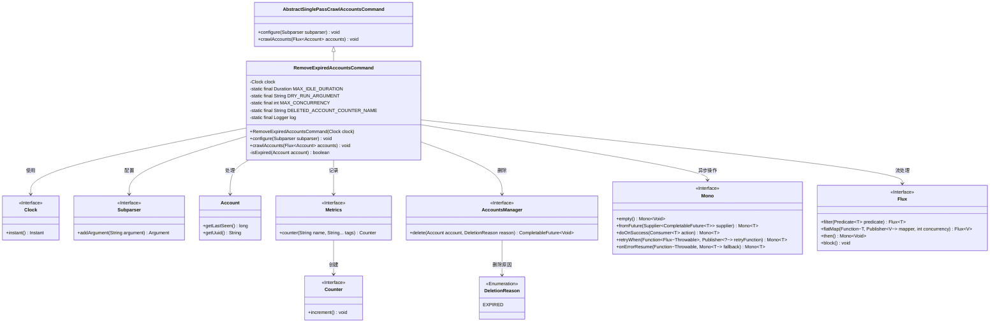
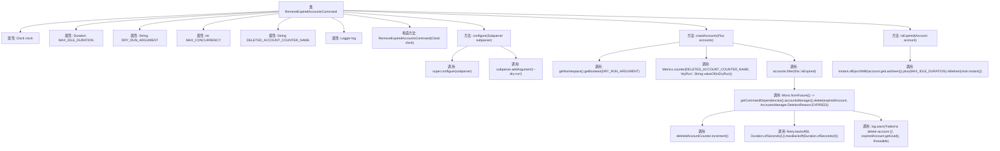

# 基础信息

|      |      |
|------|------|
| 名称 | RemoveExpiredAccountsCommand |
| 编码语言 | .java |
| 代码路径 | Signal-Server/service/src/main/java/org/whispersystems/textsecuregcm/workers/RemoveExpiredAccountsCommand.java |
| 包名 | org.whispersystems.textsecuregcm.workers |
| 依赖项 | ['org.whispersystems.textsecuregcm.metrics.MetricsUtil.name', 'com.google.common.annotations.VisibleForTesting', 'io.micrometer.core.instrument.Counter', 'io.micrometer.core.instrument.Metrics', 'java.time.Clock', 'java.time.Duration', 'java.time.Instant', 'net.sourceforge.argparse4j.inf.Subparser', 'org.slf4j.Logger', 'org.slf4j.LoggerFactory', 'org.whispersystems.textsecuregcm.storage.Account', 'org.whispersystems.textsecuregcm.storage.AccountsManager', 'reactor.core.publisher.Mono', 'reactor.core.publisher.Flux', 'reactor.util.retry.Retry'] |
| 概述说明 | 删除120天未活动账户，支持并发和模拟运行。 |

# 说明

该功能旨在自动删除超过120天未活动的账户，确保系统资源的有效利用和数据的安全性。该功能支持并发处理，能够同时处理多个账户的删除操作，提高执行效率。此外，还支持模拟运行模式，允许在正式执行前进行测试和验证，确保操作的正确性和可靠性，避免误删或系统异常。这一功能适用于需要定期清理不活跃账户的系统，帮助维护账户数据的时效性和准确性。

# 类列表 Class Summary

| 名称   | 类型  | 说明 |
|-------|------|-------------|
| RemoveExpiredAccountsCommand | class | 删除超过120天未活动的账户，支持并发和模拟运行。 |

## 类 RemoveExpiredAccountsCommand

|      |      |
|------|------|
| 访问范围 | public |
| 类型 | class |
| 名称 | RemoveExpiredAccountsCommand |
| 说明 | 删除超过120天未活动的账户，支持并发和模拟运行。 |

### UML类图

### 描述
`RemoveExpiredAccountsCommand` 是一个继承自 `AbstractSinglePassCrawlAccountsCommand` 的命令类，用于删除长时间未活动的账户。它通过 `Clock` 获取当前时间，使用 `Subparser` 配置命令行参数，并通过 `Flux` 和 `Mono` 进行异步流处理。`AccountsManager` 负责实际删除账户，`Metrics` 用于记录删除的账户数量。代码中还包含了重试机制和错误处理逻辑，确保在删除失败时能够进行重试或记录错误日志。

### 内部方法调用关系图

这段代码定义了一个`RemoveExpiredAccountsCommand`类，用于删除长时间未活动的账户。类中包含配置命令行参数、过滤过期账户、删除账户等逻辑。流程图展示了类的属性、方法及其调用关系，重点描述了`crawlAccounts`方法中处理账户删除的流程，包括过滤、删除、重试和错误处理等步骤。

### 字段列表 Field List

| 名称  | 类型  | 说明 |
|-------|-------|------|
| MAX_IDLE_DURATION = Duration.ofDays(120) | Duration | 测试用最大空闲时长设为120天。 |
| clock | Clock | 私有且不可变的时钟实例。 |
| MAX_CONCURRENCY = 16 | int | 定义了最大并发数为16的私有静态常量。 |
| DELETED_ACCOUNT_COUNTER_NAME =      name(RemoveExpiredAccountsCommand.class, "deletedAccounts") | String | 删除账户计数器命名为“deletedAccounts”。 |
| log = LoggerFactory.getLogger(RemoveExpiredAccountsCommand.class) | Logger | 定义私有静态日志记录器，用于RemoveExpiredAccountsCommand类。 |
| DRY_RUN_ARGUMENT = "dry-run" | String | 测试可见的静态字符串常量，用于表示“dry-run”参数。 |

### 方法列表 Method List

| 名称  | 类型  | 说明 |
|-------|-------|------|
| isExpired | boolean | 检查账户是否过期，通过比较上次访问时间加最大空闲时长与当前时间。 |
| crawlAccounts | void | 该方法用于批量删除过期账户，支持模拟运行和重试机制。 |
| configure | void | 重写配置方法，添加可选参数--dry-run，默认值为true。 |

