# 基础信息

|      |      |
|------|------|
| 名称 | RemoveExpiredBackupsCommand |
| 编码语言 | .java |
| 代码路径 | Signal-Server/service/src/main/java/org/whispersystems/textsecuregcm/workers/RemoveExpiredBackupsCommand.java |
| 包名 | org.whispersystems.textsecuregcm.workers |
| 依赖项 | ['io.dropwizard.core.Application', 'io.dropwizard.core.setup.Environment', 'io.micrometer.core.instrument.Metrics', 'java.time.Clock', 'java.time.Duration', 'java.util.HexFormat', 'java.util.Objects', 'net.sourceforge.argparse4j.inf.Namespace', 'net.sourceforge.argparse4j.inf.Subparser', 'org.slf4j.Logger', 'org.slf4j.LoggerFactory', 'org.whispersystems.textsecuregcm.WhisperServerConfiguration', 'org.whispersystems.textsecuregcm.backup.BackupManager', 'org.whispersystems.textsecuregcm.backup.ExpiredBackup', 'org.whispersystems.textsecuregcm.metrics.MetricsUtil', 'reactor.core.publisher.Mono', 'reactor.core.scheduler.Schedulers', 'reactor.util.retry.Retry'] |
| 概述说明 | 删除过期备份命令类，支持分段扫描、并发控制、宽限期和模拟运行。 |

# 说明

删除过期备份命令类具备分段扫描、并发控制、宽限期和模拟运行参数等功能。分段扫描允许逐步处理备份数据，提高效率；并发控制确保多任务执行时的资源协调；宽限期为备份保留提供额外时间，防止误删；模拟运行参数允许用户在不实际删除的情况下测试命令效果，确保操作安全。

# 类列表 Class Summary

| 名称   | 类型  | 说明 |
|-------|------|-------------|
| RemoveExpiredBackupsCommand | class | 删除过期备份命令类，支持分段扫描、并发控制、宽限期和模拟运行参数。 |

## 类 RemoveExpiredBackupsCommand

|      |      |
|------|------|
| 访问范围 | public |
| 类型 | class |
| 名称 | RemoveExpiredBackupsCommand |
| 说明 | 删除过期备份命令类，支持分段扫描、并发控制、宽限期和模拟运行参数。 |

### UML类图

```mermaid
classDiagram
    class RemoveExpiredBackupsCommand {
        -Logger logger
        -static String SEGMENT_COUNT_ARGUMENT
        -static String DRY_RUN_ARGUMENT
        -static String MAX_CONCURRENCY_ARGUMENT
        -static String GRACE_PERIOD_ARGUMENT
        -static Duration DEFAULT_GRACE_PERIOD
        -static int DEFAULT_SEGMENT_COUNT
        -static int DEFAULT_CONCURRENCY
        -static String EXPIRED_BACKUPS_COUNTER_NAME
        -Clock clock
        +RemoveExpiredBackupsCommand(Clock clock)
        +void configure(Subparser subparser)
        +void run(Environment environment, Namespace namespace, WhisperServerConfiguration configuration, CommandDependencies commandDependencies)
        -Mono~Boolean~ removeExpiredBackup(BackupManager backupManager, ExpiredBackup expiredBackup, boolean dryRun)
    }
    class AbstractCommandWithDependencies {
        +void configure(Subparser subparser)
    }
    class Clock {
        <<Interface>>
    }
    class BackupManager {
        <<Interface>>
        +Mono~ExpiredBackup~ getExpiredBackups(int segments, Scheduler scheduler, Instant instant)
        +CompletionStage~Void~ expireBackup(ExpiredBackup expiredBackup)
    }
    class ExpiredBackup {
        +String expirationType()
        +byte[] hashedBackupId()
    }
    class Subparser {
        <<Interface>>
        +void addArgument(String argument)
    }
    class Environment {
    }
    class Namespace {
    }
    class WhisperServerConfiguration {
    }
    class CommandDependencies {
        +BackupManager backupManager()
    }
    class Mono~T~ {
        +Mono~T~ retryWhen(Retry retry)
        +Mono~T~ doOnSuccess(Consumer~? super T~ consumer)
        +Mono~T~ onErrorResume(Function~? super Throwable, ? extends Mono~? extends T~~ function)
    }
    class Retry {
        +static Retry backoff(int maxAttempts, Duration firstBackoff)
    }
    class Metrics {
        +static Counter counter(String name, String... tags)
    }
    class Counter {
        +void increment()
    }
    class Scheduler {
        <<Interface>>
    }
    class CompletionStage~T~ {
        <<Interface>>
    }
    class HexFormat {
        +static HexFormat of()
        +String formatHex(byte[] bytes)
    }
    RemoveExpiredBackupsCommand --> AbstractCommandWithDependencies : 继承
    RemoveExpiredBackupsCommand --> Clock : 依赖
    RemoveExpiredBackupsCommand --> BackupManager : 依赖
    RemoveExpiredBackupsCommand --> ExpiredBackup : 依赖
    RemoveExpiredBackupsCommand --> Subparser : 依赖
    RemoveExpiredBackupsCommand --> Environment : 依赖
    RemoveExpiredBackupsCommand --> Namespace : 依赖
    RemoveExpiredBackupsCommand --> WhisperServerConfiguration : 依赖
    RemoveExpiredBackupsCommand --> CommandDependencies : 依赖
    RemoveExpiredBackupsCommand --> Mono~Boolean~ : 依赖
    RemoveExpiredBackupsCommand --> Retry : 依赖
    RemoveExpiredBackupsCommand --> Metrics : 依赖
    RemoveExpiredBackupsCommand --> Scheduler : 依赖
    RemoveExpiredBackupsCommand --> CompletionStage~Void~ : 依赖
    RemoveExpiredBackupsCommand --> HexFormat : 依赖
    BackupManager --> ExpiredBackup : 依赖
    BackupManager --> CompletionStage~Void~ : 依赖
    Mono~Boolean~ --> Retry : 依赖
    Mono~Boolean~ --> Metrics : 依赖
    Mono~Boolean~ --> CompletionStage~Void~ : 依赖
    Metrics --> Counter : 依赖
```

### 描述
`RemoveExpiredBackupsCommand` 是一个继承自 `AbstractCommandWithDependencies` 的命令类，用于移除过期的备份。它依赖于 `Clock` 来获取当前时间，`BackupManager` 来管理备份，`ExpiredBackup` 表示过期的备份。通过 `Subparser` 配置命令行参数，并在 `run` 方法中执行备份移除逻辑。`Mono` 用于处理异步操作，`Retry` 用于重试机制，`Metrics` 用于记录指标。

### 内部方法调用关系图

```mermaid
graph TD
    A["类RemoveExpiredBackupsCommand"]
    B["属性: Logger logger"]
    C["属性: static String SEGMENT_COUNT_ARGUMENT"]
    D["属性: static String DRY_RUN_ARGUMENT"]
    E["属性: static String MAX_CONCURRENCY_ARGUMENT"]
    F["属性: static String GRACE_PERIOD_ARGUMENT"]
    G["属性: static Duration DEFAULT_GRACE_PERIOD"]
    H["属性: static int DEFAULT_SEGMENT_COUNT"]
    I["属性: static int DEFAULT_CONCURRENCY"]
    J["属性: static String EXPIRED_BACKUPS_COUNTER_NAME"]
    K["属性: Clock clock"]
    L["构造方法: RemoveExpiredBackupsCommand(Clock clock)"]
    M["方法: configure(Subparser subparser)"]
    N["方法: run(Environment environment, Namespace namespace, WhisperServerConfiguration configuration, CommandDependencies commandDependencies)"]
    O["方法: removeExpiredBackup(BackupManager backupManager, ExpiredBackup expiredBackup, boolean dryRun)"]

    A --> B
    A --> C
    A --> D
    A --> E
    A --> F
    A --> G
    A --> H
    A --> I
    A --> J
    A --> K
    A --> L
    A --> M
    A --> N
    A --> O

    M --> P["subparser.addArgument('--segments')"]
    M --> Q["subparser.addArgument('--grace-period')"]
    M --> R["subparser.addArgument('--max-concurrency')"]
    M --> S["subparser.addArgument('--dry-run')"]

    N --> T["获取segments, concurrency, dryRun, gracePeriod"]
    N --> U["logger.info('Crawling backups with {} segments and {} processors, grace period {}')"]
    N --> V["backupManager.getExpiredBackups(segments, Schedulers.parallel(), clock.instant().minus(gracePeriod))"]
    N --> W["flatMap(expiredBackup -> removeExpiredBackup(backupManager, expiredBackup, dryRun), concurrency)"]
    N --> X["filter(Boolean.TRUE::equals)"]
    N --> Y["count().block()"]
    N --> Z["logger.info('Expired {} backups')"]

    O --> AA["判断dryRun"]
    AA --> AB["Mono.just(true)"]
    AA --> AC["Mono.fromCompletionStage(() -> backupManager.expireBackup(expiredBackup)).thenReturn(true)"]
    O --> AD["retryWhen(Retry.backoff(3, Duration.ofSeconds(1)))"]
    O --> AE["doOnSuccess(ignored -> logger.trace('Successfully expired {} for {}'))"]
    O --> AF["Metrics.counter(EXPIRED_BACKUPS_COUNTER_NAME, 'tier', expiredBackup.expirationType().name(), 'dryRun', String.valueOf(dryRun)).increment()"]
    O --> AG["onErrorResume(throwable -> logger.warn('Failed to remove tier {} for backup {}'))"]
```

**描述：**
`RemoveExpiredBackupsCommand`类用于删除过期的备份。它通过命令行参数配置扫描段数、并发数、宽限期和是否进行干运行。`run`方法负责扫描过期的备份，并根据配置决定是否删除它们。`removeExpiredBackup`方法处理单个过期备份的删除操作，支持重试机制和日志记录。整个流程通过`BackupManager`和`Mono`实现异步处理和并发控制。

### 字段列表 Field List

| 名称  | 类型  | 说明 |
|-------|-------|------|
| DEFAULT_SEGMENT_COUNT = 1 | int | 默认段计数为1。 |
| DEFAULT_CONCURRENCY = 16 | int | 默认并发数为16。 |
| DEFAULT_GRACE_PERIOD = Duration.ofDays(60) | Duration | 默认宽限期为60天。 |
| SEGMENT_COUNT_ARGUMENT = "segments" | String | 定义私有静态常量SEGMENT_COUNT_ARGUMENT，值为"segments"。 |
| logger = LoggerFactory.getLogger(getClass()) | Logger | 类中定义了一个私有日志记录器实例。 |
| EXPIRED_BACKUPS_COUNTER_NAME = MetricsUtil.name(RemoveExpiredBackupsCommand.class,      "expiredBackups") | String | 定义私有静态常量，用于记录过期备份的计数器名称。 |
| GRACE_PERIOD_ARGUMENT = "grace-period" | String | 定义常量字符串GRACE_PERIOD_ARGUMENT，值为"grace-period"。 |
| MAX_CONCURRENCY_ARGUMENT = "max-concurrency" | String | 定义常量MAX_CONCURRENCY_ARGUMENT为"max-concurrency"。 |
| clock | Clock | 私有且不可变的时钟对象。 |
| DRY_RUN_ARGUMENT = "dry-run" | String | 定义静态常量DRY_RUN_ARGUMENT，值为"dry-run"。 |

### 方法列表 Method List

| 名称  | 类型  | 说明 |
|-------|-------|------|
| removeExpiredBackup | Mono<Boolean> | 删除过期备份方法，支持重试和日志记录。 |
| configure | void | 配置DynamoDB扫描参数，包括段数、宽限期、最大并发和模拟运行选项。 |
| run | void | 该方法执行备份管理，根据配置参数处理过期备份，支持并发操作和模拟运行。 |

