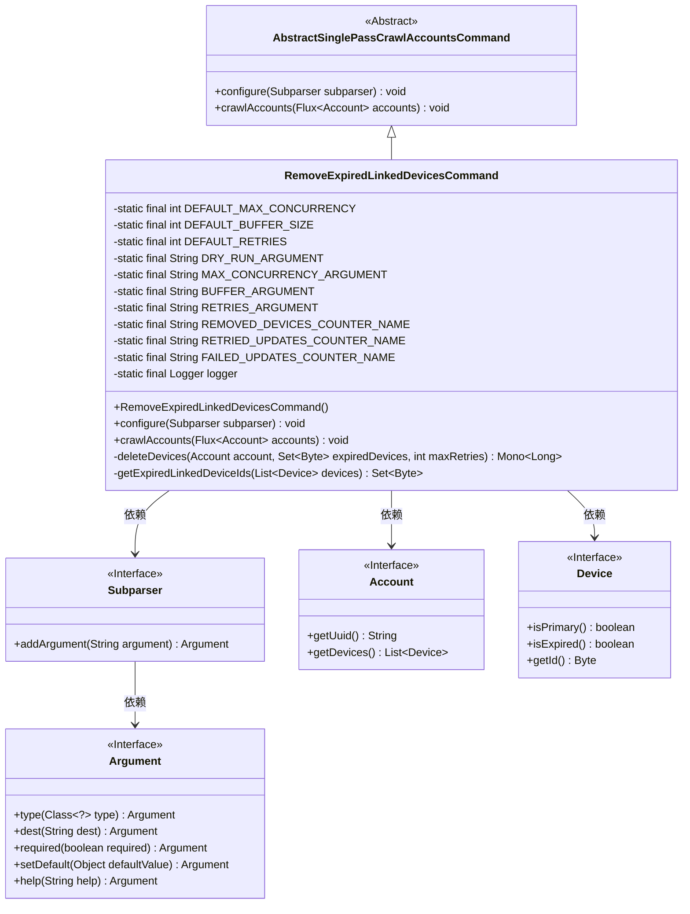

# 基础信息

|      |      |
|------|------|
| 名称 | RemoveExpiredLinkedDevicesCommand |
| 编码语言 | .java |
| 代码路径 | Signal-Server/service/src/main/java/org/whispersystems/textsecuregcm/workers/RemoveExpiredLinkedDevicesCommand.java |
| 包名 | org.whispersystems.textsecuregcm.workers |
| 依赖项 | ['org.whispersystems.textsecuregcm.metrics.MetricsUtil.name', 'com.google.common.annotations.VisibleForTesting', 'io.micrometer.core.instrument.Counter', 'io.micrometer.core.instrument.Metrics', 'java.time.Duration', 'java.util.ArrayList', 'java.util.Collections', 'java.util.List', 'java.util.Set', 'java.util.function.Function', 'java.util.function.Predicate', 'java.util.stream.Collectors', 'net.sourceforge.argparse4j.inf.Subparser', 'org.slf4j.Logger', 'org.slf4j.LoggerFactory', 'org.whispersystems.textsecuregcm.storage.Account', 'org.whispersystems.textsecuregcm.storage.Device', 'reactor.core.publisher.Flux', 'reactor.core.publisher.Mono', 'reactor.util.function.Tuple2', 'reactor.util.function.Tuples', 'reactor.util.retry.Retry'] |
| 概述说明 | 移除过期设备命令类，支持并发、缓冲、重试，含干运行模式。 |

# 说明

该命令类用于移除过期设备，具备并发处理能力，支持缓冲和重试机制配置，同时提供干运行模式，可在不实际执行操作的情况下进行模拟测试。

# 类列表 Class Summary

| 名称   | 类型  | 说明 |
|-------|------|-------------|
| RemoveExpiredLinkedDevicesCommand | class | 移除过期设备命令类，支持并发、缓冲、重试配置，包含干运行模式。 |

## 类 RemoveExpiredLinkedDevicesCommand

|      |      |
|------|------|
| 访问范围 | public |
| 类型 | class |
| 名称 | RemoveExpiredLinkedDevicesCommand |
| 说明 | 移除过期设备命令类，支持并发、缓冲、重试配置，包含干运行模式。 |

### UML类图

**描述：**
`RemoveExpiredLinkedDevicesCommand` 是一个继承自 `AbstractSinglePassCrawlAccountsCommand` 的类，用于移除过期的关联设备。它通过配置命令行参数来控制操作的行为，如并发数、缓冲区大小和重试次数。类中定义了多个静态常量和方法，包括 `configure` 用于配置命令行参数，`crawlAccounts` 用于遍历账户并移除过期设备，`deleteDevices` 用于实际删除设备，`getExpiredLinkedDeviceIds` 用于获取过期设备的ID。该类依赖于 `Subparser`、`Account` 和 `Device` 接口来完成其功能。

### 内部方法调用关系图

```mermaid
graph TD
    A["类RemoveExpiredLinkedDevicesCommand"]
    B["属性: int DEFAULT_MAX_CONCURRENCY"]
    C["属性: int DEFAULT_BUFFER_SIZE"]
    D["属性: int DEFAULT_RETRIES"]
    E["属性: String DRY_RUN_ARGUMENT"]
    F["属性: String MAX_CONCURRENCY_ARGUMENT"]
    G["属性: String BUFFER_ARGUMENT"]
    H["属性: String RETRIES_ARGUMENT"]
    I["属性: String REMOVED_DEVICES_COUNTER_NAME"]
    J["属性: String RETRIED_UPDATES_COUNTER_NAME"]
    K["属性: String FAILED_UPDATES_COUNTER_NAME"]
    L["属性: Logger logger"]
    M["构造方法: RemoveExpiredLinkedDevicesCommand()"]
    N["方法: configure(Subparser subparser)"]
    O["方法: crawlAccounts(Flux<Account> accounts)"]
    P["方法: deleteDevices(Account account, Set<Byte> expiredDevices, int maxRetries)"]
    Q["方法: getExpiredLinkedDeviceIds(List<Device> devices)"]
    R["步骤: 配置命令行参数"]
    S["步骤: 处理账户数据"]
    T["步骤: 删除过期设备"]
    U["步骤: 获取过期设备ID"]

    A --> B
    A --> C
    A --> D
    A --> E
    A --> F
    A --> G
    A --> H
    A --> I
    A --> J
    A --> K
    A --> L
    A --> M
    A --> N
    A --> O
    A --> P
    A --> Q
    N --> R
    O --> S
    P --> T
    Q --> U
```

这段代码定义了一个名为 `RemoveExpiredLinkedDevicesCommand` 的类，用于移除过期的关联设备。代码首先配置了命令行参数，然后处理账户数据，最后删除过期设备。`crawlAccounts` 方法负责处理账户数据流，`deleteDevices` 方法负责删除过期设备，`getExpiredLinkedDeviceIds` 方法用于获取过期设备的ID。整个流程通过Mermaid流程图清晰地展示了类内部的函数调用关系和数据处理步骤。

### 字段列表 Field List

| 名称  | 类型  | 说明 |
|-------|-------|------|
| DEFAULT_MAX_CONCURRENCY = 16 | int | 默认最大并发数为16。 |
| logger = LoggerFactory.getLogger(RemoveExpiredLinkedDevicesCommand.class) | Logger | 定义了一个私有静态日志记录器实例。 |
| DEFAULT_RETRIES = 3 | int | 默认重试次数为3次。 |
| RETRIES_ARGUMENT = "retries" | String | 定义静态常量字符串"retries"。 |
| REMOVED_DEVICES_COUNTER_NAME = name(RemoveExpiredLinkedDevicesCommand.class,      "removedDevices") | String | 移除过期设备命令中用于统计移除设备数量的计数器名称。 |
| DEFAULT_BUFFER_SIZE = 16_384 | int | 定义静态常量默认缓冲区大小为16384。 |
| DRY_RUN_ARGUMENT = "dry-run" | String | 私有静态常量DRY_RUN_ARGUMENT值为"dry-run"。 |
| RETRIED_UPDATES_COUNTER_NAME = name(RemoveExpiredLinkedDevicesCommand.class,      "retries") | String | 定义了一个静态常量，用于记录重试更新次数的计数器名称。 |
| MAX_CONCURRENCY_ARGUMENT = "max-concurrency" | String | 定义了静态常量MAX_CONCURRENCY_ARGUMENT，值为"max-concurrency"。 |
| BUFFER_ARGUMENT = "buffer" | String | 定义私有静态常量BUFFER_ARGUMENT，值为"buffer"。 |
| FAILED_UPDATES_COUNTER_NAME = name(RemoveExpiredLinkedDevicesCommand.class,      "failedUpdates") | String | 私有静态常量记录更新失败次数的计数器名称。 |

### 方法列表 Method List

| 名称  | 类型  | 说明 |
|-------|-------|------|
| getExpiredLinkedDeviceIds | Set<Byte> | 获取过期关联设备ID的静态方法。 |
| deleteDevices | Mono<Long> | 删除过期设备，支持重试，记录错误和重试次数。 |
| configure | void | 配置命令行参数：dry-run、max-concurrency、buffer、retries，均含默认值。 |
| crawlAccounts | void | 爬取账户并删除过期设备，支持并发和重试。 |

