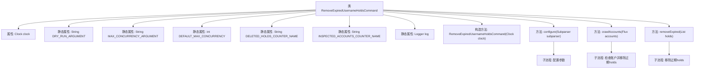
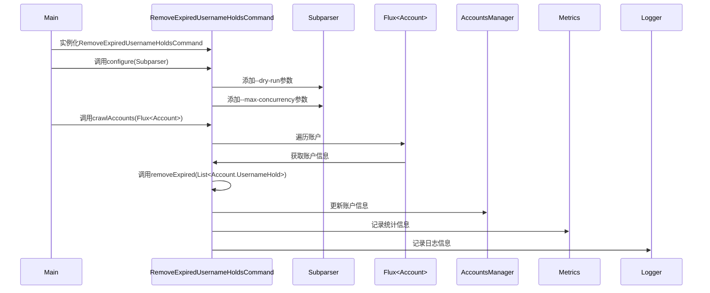

# 基础信息

|      |      |
|------|------|
| 名称 | RemoveExpiredUsernameHoldsCommand |
| 编码语言 | .java |
| 代码路径 | Signal-Server/service/src/main/java/org/whispersystems/textsecuregcm/workers/RemoveExpiredUsernameHoldsCommand.java |
| 包名 | org.whispersystems.textsecuregcm.workers |
| 依赖项 | ['org.whispersystems.textsecuregcm.metrics.MetricsUtil.name', 'com.google.common.annotations.VisibleForTesting', 'io.micrometer.core.instrument.Counter', 'io.micrometer.core.instrument.Metrics', 'java.time.Clock', 'java.time.Duration', 'java.time.Instant', 'java.util.ArrayList', 'java.util.Iterator', 'java.util.List', 'java.util.concurrent.atomic.AtomicLong', 'net.sourceforge.argparse4j.inf.Subparser', 'org.slf4j.Logger', 'org.slf4j.LoggerFactory', 'org.whispersystems.textsecuregcm.storage.Account', 'org.whispersystems.textsecuregcm.storage.AccountsManager', 'org.whispersystems.textsecuregcm.util.Util', 'reactor.core.publisher.Flux', 'reactor.core.publisher.Mono', 'reactor.util.retry.Retry'] |
| 概述说明 | 删除过期用户名命令支持模拟运行和并发控制。 |

# 说明

该命令用于删除过期用户名，并支持模拟运行和并发控制功能。模拟运行允许用户在正式执行前进行测试，确保操作的正确性。并发控制则确保在多用户或高负载情况下，命令能够高效、安全地执行，避免资源冲突或数据不一致。此功能适用于需要定期清理过期用户名的系统，提高系统的维护效率和稳定性。

# 类列表 Class Summary

| 名称   | 类型  | 说明 |
|-------|------|-------------|
| RemoveExpiredUsernameHoldsCommand | class | 删除过期用户名保留命令，支持模拟运行和并发控制。 |

## 类 RemoveExpiredUsernameHoldsCommand

|      |      |
|------|------|
| 访问范围 | public |
| 类型 | class |
| 名称 | RemoveExpiredUsernameHoldsCommand |
| 说明 | 删除过期用户名保留命令，支持模拟运行和并发控制。 |

### UML类图

```mermaid
classDiagram
    class RemoveExpiredUsernameHoldsCommand {
        -Clock clock
        -static String DRY_RUN_ARGUMENT
        -static String MAX_CONCURRENCY_ARGUMENT
        -static int DEFAULT_MAX_CONCURRENCY
        -static String DELETED_HOLDS_COUNTER_NAME
        -static String INSPECTED_ACCOUNTS_COUNTER_NAME
        -static Logger log
        +RemoveExpiredUsernameHoldsCommand(Clock clock)
        +void configure(Subparser subparser)
        +void crawlAccounts(Flux~Account~ accounts)
        +int removeExpired(List~Account.UsernameHold~ holds)
    }

    class AbstractSinglePassCrawlAccountsCommand {
        +void configure(Subparser subparser)
        +void crawlAccounts(Flux~Account~ accounts)
    }

    class Clock {
        <<Interface>>
        +Instant instant()
    }

    class Account {
        +List~UsernameHold~ getUsernameHolds()
        +void setUsernameHolds(List~UsernameHold~ holds)
        +String getUuid()
    }

    class AccountsManager {
        +Mono~Void~ updateAsync(Account account, Consumer~Account~ updater)
    }

    class Counter {
        +void increment(long amount)
    }

    class Metrics {
        +Counter counter(String name, String... tags)
    }

    class Subparser {
        +void addArgument(String argument)
    }

    class Flux~T~ {
        +Flux~R~ flatMap(Function~T, Publisher~R~~ mapper, int concurrency)
        +Mono~Void~ then()
        +void block()
    }

    class Mono~T~ {
        +Mono~R~ retryWhen(Function~Flux~Throwable~, Publisher~?~~ retryFunction)
        +Mono~T~ doOnSuccess(Consumer~T~ consumer)
        +Mono~T~ onErrorResume(Function~Throwable, Publisher~T~~ fallback)
    }

    class Logger {
        +void info(String message)
        +void warn(String message)
    }

    RemoveExpiredUsernameHoldsCommand --> AbstractSinglePassCrawlAccountsCommand : 继承
    RemoveExpiredUsernameHoldsCommand --> Clock : 依赖
    RemoveExpiredUsernameHoldsCommand --> AccountsManager : 依赖
    RemoveExpiredUsernameHoldsCommand --> Counter : 依赖
    RemoveExpiredUsernameHoldsCommand --> Metrics : 依赖
    RemoveExpiredUsernameHoldsCommand --> Subparser : 依赖
    RemoveExpiredUsernameHoldsCommand --> Flux~Account~ : 依赖
    RemoveExpiredUsernameHoldsCommand --> Mono~Void~ : 依赖
    RemoveExpiredUsernameHoldsCommand --> Logger : 依赖
    Account --> AccountsManager : 依赖
    AbstractSinglePassCrawlAccountsCommand --> Subparser : 依赖
```

### 描述
`RemoveExpiredUsernameHoldsCommand` 类继承自 `AbstractSinglePassCrawlAccountsCommand`，用于移除账户中过期的用户名保留。它依赖于 `Clock` 接口来获取当前时间，`AccountsManager` 来更新账户信息，`Counter` 和 `Metrics` 来记录操作统计信息，`Subparser` 来配置命令行参数，`Flux` 和 `Mono` 来处理异步操作，`Logger` 来记录日志。该类的主要功能是通过 `crawlAccounts` 方法遍历账户并移除过期的用户名保留，`removeExpired` 方法用于判断并移除过期的保留。

### 内部方法调用关系图

这段代码定义了一个名为 `RemoveExpiredUsernameHoldsCommand` 的类，用于移除账户中过期的用户名保留记录。该类继承自 `AbstractSinglePassCrawlAccountsCommand`，包含配置参数、遍历账户、移除过期记录等功能。流程图展示了类的结构和方法调用关系，时序图则详细描述了从实例化到执行移除过期记录的整个过程。

### 字段列表 Field List

| 名称  | 类型  | 说明 |
|-------|-------|------|
| DELETED_HOLDS_COUNTER_NAME =      name(RemoveExpiredUsernameHoldsCommand.class, "expiredHolds") | String | 删除过期用户名持有命令的计数器名称。 |
| DRY_RUN_ARGUMENT = "dry-run" | String | 测试可见的静态常量字符串"dry-run" |
| clock | Clock | 私有常量Clock类型变量clock。 |
| DEFAULT_MAX_CONCURRENCY = 16 | int | 默认最大并发数为16。 |
| INSPECTED_ACCOUNTS_COUNTER_NAME =      name(RemoveExpiredUsernameHoldsCommand.class, "inspectedAccounts") | String | 私有静态字符串常量记录检查账户计数器名称。 |
| MAX_CONCURRENCY_ARGUMENT = "max-concurrency" | String | 测试可见的静态常量MAX_CONCURRENCY_ARGUMENT值为"max-concurrency"。 |
| log = LoggerFactory.getLogger(RemoveExpiredUsernameHoldsCommand.class) | Logger | 定义日志记录器，用于记录RemoveExpiredUsernameHoldsCommand类的日志。 |

### 方法列表 Method List

| 名称  | 类型  | 说明 |
|-------|-------|------|
| removeExpired | int | 测试可见方法移除过期账户持有，返回移除数量。 |
| configure | void | 配置子解析器，添加dry-run和max-concurrency参数及其默认值和帮助信息。 |
| crawlAccounts | void | 该方法爬取账户并清理过期用户名保留，支持并发和模拟运行。 |

