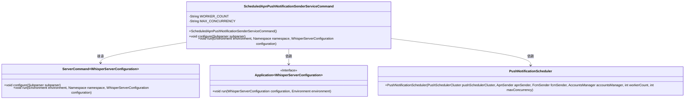

# 基础信息

|      |      |
|------|------|
| 名称 | ScheduledApnPushNotificationSenderServiceCommand |
| 编码语言 | .java |
| 代码路径 | Signal-Server/service/src/main/java/org/whispersystems/textsecuregcm/workers/ScheduledApnPushNotificationSenderServiceCommand.java |
| 包名 | org.whispersystems.textsecuregcm.workers |
| 依赖项 | ['io.dropwizard.core.Application', 'io.dropwizard.core.cli.ServerCommand', 'io.dropwizard.core.server.DefaultServerFactory', 'io.dropwizard.core.setup.Environment', 'io.dropwizard.jetty.HttpsConnectorFactory', 'net.sourceforge.argparse4j.inf.Namespace', 'net.sourceforge.argparse4j.inf.Subparser', 'org.whispersystems.textsecuregcm.WhisperServerConfiguration', 'org.whispersystems.textsecuregcm.metrics.MetricsUtil', 'org.whispersystems.textsecuregcm.push.PushNotificationScheduler', 'org.whispersystems.textsecuregcm.util.logging.UncaughtExceptionHandler'] |
| 概述说明 | ScheduledApnPushNotificationSenderServiceCommand类启动定时APNs推送服务，配置线程和并发数。 |

# 说明

ScheduledApnPushNotificationSenderServiceCommand类的主要功能是启动定时APNs推送通知服务。该服务负责在预定时间发送推送通知，并支持配置工作线程和并发数，以确保高效处理通知发送任务。通过合理设置线程和并发数，可以优化服务性能，满足不同场景下的推送需求。

# 类列表 Class Summary

| 名称   | 类型  | 说明 |
|-------|------|-------------|
| ScheduledApnPushNotificationSenderServiceCommand | class | ScheduledApnPushNotificationSenderServiceCommand类用于启动定时APNs推送通知服务，配置工作线程和并发数。 |

## 类 ScheduledApnPushNotificationSenderServiceCommand

|      |      |
|------|------|
| 访问范围 | public |
| 类型 | class |
| 名称 | ScheduledApnPushNotificationSenderServiceCommand |
| 说明 | ScheduledApnPushNotificationSenderServiceCommand类用于启动定时APNs推送通知服务，配置工作线程和并发数。 |

### UML类图

这段代码定义了一个名为 `ScheduledApnPushNotificationSenderServiceCommand` 的类，它继承自 `ServerCommand` 并实现了 `Application` 接口。该类用于启动一个持久化服务，以发送预定的 APNs 推送通知。它通过配置命令行参数来设置工作线程数量和最大并发操作数，并在运行时初始化 `PushNotificationScheduler` 对象来管理推送通知的调度。代码中还涉及到对服务器配置、环境变量和依赖项的处理，以确保服务的正确运行。

### 内部方法调用关系图

这段代码定义了一个名为 `ScheduledApnPushNotificationSenderServiceCommand` 的类，用于启动一个持续服务来发送预定的APNs推送通知。代码通过构造方法初始化服务，并在 `configure` 方法中配置命令行参数。`run` 方法负责服务的实际运行，包括异常处理、依赖构建、配置注册、连接器设置、调度器初始化和系统资源监控等步骤。

### 字段列表 Field List

| 名称  | 类型  | 说明 |
|-------|-------|------|
| WORKER_COUNT = "workers" | String | 定义私有静态常量WORKER_COUNT，值为"workers"。 |
| MAX_CONCURRENCY = "max_concurrency" | String | 定义私有静态常量MAX_CONCURRENCY，值为"max_concurrency"。 |

### 方法列表 Method List

| 名称  | 类型  | 说明 |
|-------|-------|------|
| configure | void | 配置子解析器，添加必需的工作线程数和可选的并发操作数参数。 |
| run | void | 注册异常处理，配置依赖和指标，设置HTTPS连接，初始化推送调度器并管理生命周期。 |

