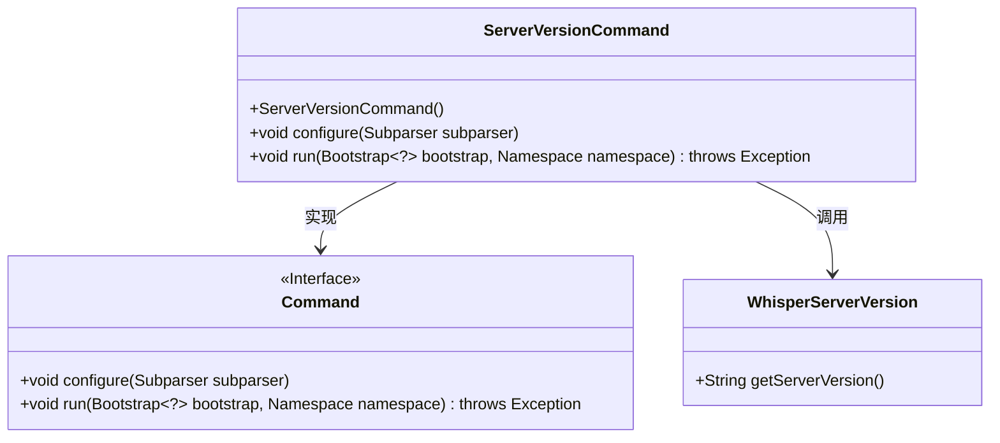
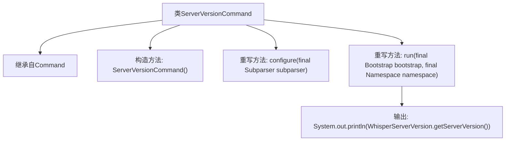

# 基础信息

|      |      |
|------|------|
| 名称 | ServerVersionCommand |
| 编码语言 | .java |
| 代码路径 | Signal-Server/service/src/main/java/org/whispersystems/textsecuregcm/workers/ServerVersionCommand.java |
| 包名 | org.whispersystems.textsecuregcm.workers |
| 依赖项 | ['io.dropwizard.core.cli.Command', 'io.dropwizard.core.setup.Bootstrap', 'net.sourceforge.argparse4j.inf.Namespace', 'net.sourceforge.argparse4j.inf.Subparser', 'org.whispersystems.textsecuregcm.WhisperServerVersion'] |
| 概述说明 | ServerVersionCommand类用于输出服务版本信息。 |

# 说明

ServerVersionCommand类的主要功能是用于输出或打印当前服务的版本信息。通过调用该类，用户可以获取服务的具体版本号或相关版本信息，以便进行版本管理、调试或日志记录等操作。该类通常用于命令行工具或应用程序中，方便用户快速查看服务版本。

# 类列表 Class Summary

| 名称   | 类型  | 说明 |
|-------|------|-------------|
| ServerVersionCommand | class | ServerVersionCommand类用于打印服务版本信息。 |

## 类 ServerVersionCommand

|      |      |
|------|------|
| 访问范围 | public |
| 类型 | class |
| 名称 | ServerVersionCommand |
| 说明 | ServerVersionCommand类用于打印服务版本信息。 |

### UML类图

这段代码描述了一个 `ServerVersionCommand` 类，该类继承自 `Command` 接口，并实现了 `configure` 和 `run` 方法。`ServerVersionCommand` 类通过调用 `WhisperServerVersion` 类的 `getServerVersion` 方法来获取并打印服务器版本信息。`Command` 接口定义了 `configure` 和 `run` 方法，`ServerVersionCommand` 类具体实现了这些方法。

### 内部方法调用关系图

这段代码定义了一个名为 `ServerVersionCommand` 的类，继承自 `Command` 类。该类包含一个构造方法和两个重写方法：`configure` 和 `run`。`configure` 方法用于配置命令解析器，而 `run` 方法则负责执行命令，输出服务器版本信息。流程图中展示了类的继承关系以及方法之间的调用顺序，最终通过 `run` 方法输出服务器版本。

### 字段列表 Field List

| 名称  | 类型  | 说明 |
|-------|-------|------|

### 方法列表 Method List

| 名称  | 类型  | 说明 |
|-------|-------|------|
| configure | void | 该方法用于配置子解析器，无具体实现。 |
| run | void | 重写run方法，输出WhisperServer版本信息。 |

