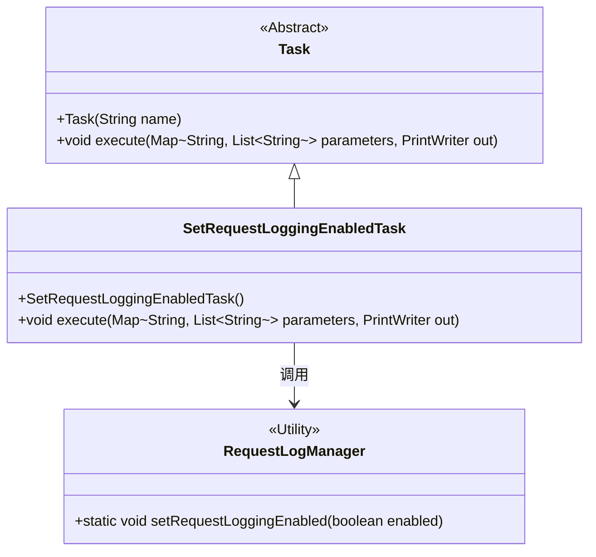
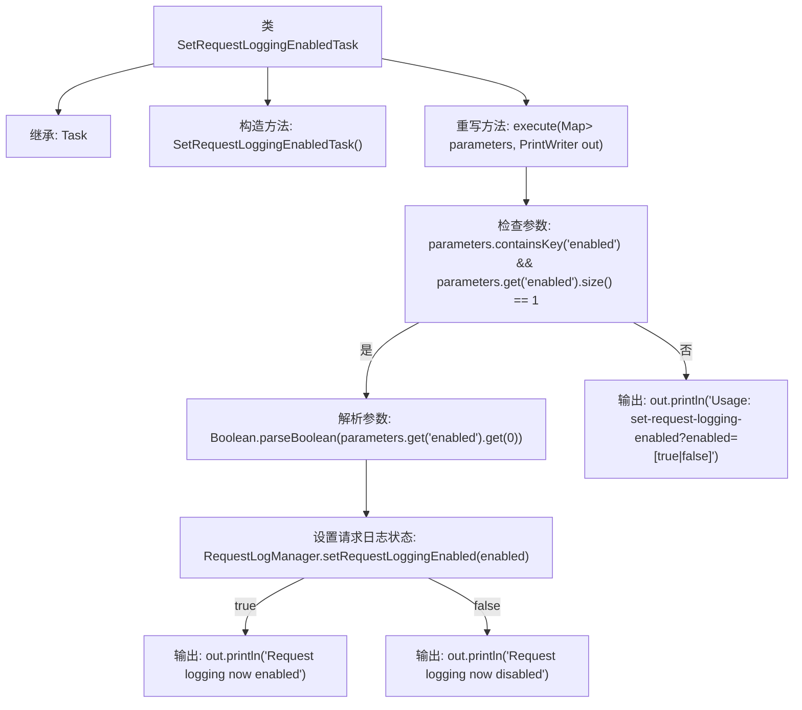

# 基础信息

|      |      |
|------|------|
| 名称 | SetRequestLoggingEnabledTask |
| 编码语言 | .java |
| 代码路径 | Signal-Server/service/src/main/java/org/whispersystems/textsecuregcm/workers/SetRequestLoggingEnabledTask.java |
| 包名 | org.whispersystems.textsecuregcm.workers |
| 依赖项 | ['io.dropwizard.servlets.tasks.Task', 'org.whispersystems.textsecuregcm.util.logging.RequestLogManager', 'java.io.PrintWriter', 'java.util.List', 'java.util.Map'] |
| 概述说明 | SetRequestLoggingEnabledTask类用于更新请求日志启用状态并输出结果。 |

# 说明

SetRequestLoggingEnabledTask类的主要功能是设置请求日志的启用状态。该任务根据传入的参数更新日志的启用状态，并输出相应的结果。通过这个类，用户可以灵活地控制请求日志的记录行为，确保系统日志管理的有效性和可配置性。

# 类列表 Class Summary

| 名称   | 类型  | 说明 |
|-------|------|-------------|
| SetRequestLoggingEnabledTask | class | SetRequestLoggingEnabledTask类用于设置请求日志启用状态，根据参数更新并输出结果。 |

## 类 SetRequestLoggingEnabledTask

|      |      |
|------|------|
| 访问范围 | public |
| 类型 | class |
| 名称 | SetRequestLoggingEnabledTask |
| 说明 | SetRequestLoggingEnabledTask类用于设置请求日志启用状态，根据参数更新并输出结果。 |

### UML类图

这段代码定义了一个 `SetRequestLoggingEnabledTask` 类，继承自 `Task` 类。`SetRequestLoggingEnabledTask` 类的主要功能是根据传入的参数设置请求日志的启用状态，并通过 `PrintWriter` 输出相应的状态信息。`RequestLogManager` 是一个工具类，负责实际设置请求日志的启用状态。代码通过检查参数 `enabled` 的值来调用 `RequestLogManager.setRequestLoggingEnabled` 方法，并根据结果输出日志状态的变化。

### 内部方法调用关系图

这段代码的流程图描述了`SetRequestLoggingEnabledTask`类的执行过程。首先，类继承自`Task`，并通过构造方法初始化任务名称。在`execute`方法中，代码首先检查传入的参数是否包含`enabled`键且其值为单个值。如果满足条件，则解析该值为布尔类型，并调用`RequestLogManager.setRequestLoggingEnabled`方法设置请求日志状态。根据`enabled`的值，输出相应的日志状态信息。如果参数不满足条件，则输出使用说明。

### 字段列表 Field List

| 名称  | 类型  | 说明 |
|-------|-------|------|

### 方法列表 Method List

| 名称  | 类型  | 说明 |
|-------|-------|------|
| execute | void | 方法检查参数并设置请求日志状态，输出相应信息或使用说明。 |

