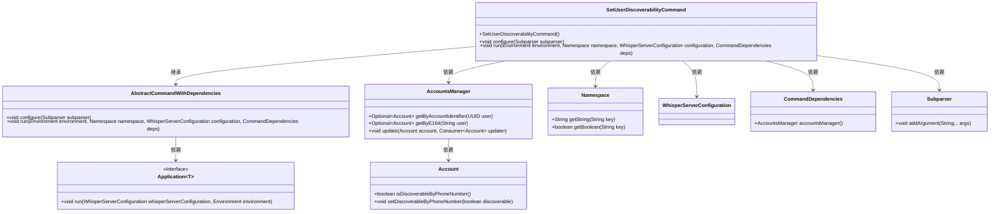
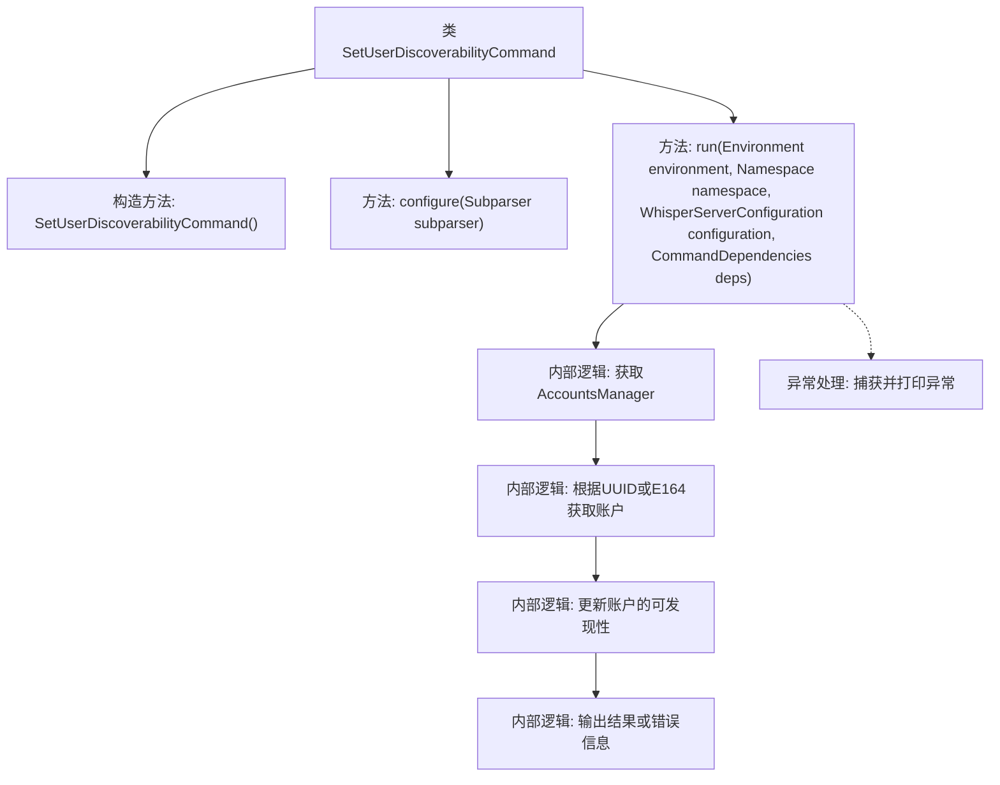

# 基础信息

|      |      |
|------|------|
| 名称 | SetUserDiscoverabilityCommand |
| 编码语言 | .java |
| 代码路径 | Signal-Server/service/src/main/java/org/whispersystems/textsecuregcm/workers/SetUserDiscoverabilityCommand.java |
| 包名 | org.whispersystems.textsecuregcm.workers |
| 依赖项 | ['io.dropwizard.core.Application', 'io.dropwizard.core.setup.Environment', 'java.util.Optional', 'java.util.UUID', 'net.sourceforge.argparse4j.inf.Namespace', 'net.sourceforge.argparse4j.inf.Subparser', 'org.whispersystems.textsecuregcm.WhisperServerConfiguration', 'org.whispersystems.textsecuregcm.storage.Account', 'org.whispersystems.textsecuregcm.storage.AccountsManager'] |
| 概述说明 | SetUserDiscoverabilityCommand用于设置CDS中用户的可发现性，支持UUID或E164标识，并可更新状态。 |

# 说明

SetUserDiscoverabilityCommand是一个用于在CDS（Customer Data Service）中设置用户可发现性的命令。该命令支持通过UUID或E164标识来指定用户，并允许更新用户的可发现状态。通过此命令，可以灵活地控制用户在系统中的可见性，确保用户数据的隐私和可访问性得到有效管理。

# 类列表 Class Summary

| 名称   | 类型  | 说明 |
|-------|------|-------------|
| SetUserDiscoverabilityCommand | class | SetUserDiscoverabilityCommand用于设置用户在CDS中的可发现性，支持UUID或E164用户标识，并可更新其可发现状态。 |

## 类 SetUserDiscoverabilityCommand

|      |      |
|------|------|
| 访问范围 | public |
| 类型 | class |
| 名称 | SetUserDiscoverabilityCommand |
| 说明 | SetUserDiscoverabilityCommand用于设置用户在CDS中的可发现性，支持UUID或E164用户标识，并可更新其可发现状态。 |

### UML类图

这段代码定义了一个名为 `SetUserDiscoverabilityCommand` 的类，它继承自 `AbstractCommandWithDependencies`。该类的主要功能是通过命令行参数设置用户的可发现性状态。代码中使用了 `AccountsManager` 来管理用户账户，并通过 `Namespace` 获取命令行参数。`SetUserDiscoverabilityCommand` 类通过 `run` 方法执行核心逻辑，更新用户的可发现性状态，并在控制台输出结果。

### 内部方法调用关系图

这段代码定义了一个名为 `SetUserDiscoverabilityCommand` 的类，继承自 `AbstractCommandWithDependencies`。该类的主要功能是通过命令行设置用户的可发现性状态。构造方法初始化了命令的基本信息，`configure` 方法定义了命令行参数，`run` 方法则执行核心逻辑，包括获取用户账户、更新可发现性状态以及处理异常情况。代码通过 `AccountsManager` 管理用户账户，并根据用户标识符（UUID 或 E164）查找账户，最终更新并输出结果或错误信息。

### 字段列表 Field List

| 名称  | 类型  | 说明 |
|-------|-------|------|

### 方法列表 Method List

| 名称  | 类型  | 说明 |
|-------|-------|------|
| configure | void | 配置命令行参数，包括必需的用户标识和可发现性状态。 |
| run | void | 根据用户标识更新账户可发现性状态，处理异常并输出结果。 |

