# 基础信息

|      |      |
|------|------|
| 名称 | StartPushNotificationExperimentCommand |
| 编码语言 | .java |
| 代码路径 | Signal-Server/service/src/main/java/org/whispersystems/textsecuregcm/workers/StartPushNotificationExperimentCommand.java |
| 包名 | org.whispersystems.textsecuregcm.workers |
| 依赖项 | ['com.fasterxml.jackson.core.JsonProcessingException', 'com.google.common.annotations.VisibleForTesting', 'io.micrometer.core.instrument.Counter', 'io.micrometer.core.instrument.Metrics', 'net.sourceforge.argparse4j.inf.Subparser', 'org.slf4j.Logger', 'org.slf4j.LoggerFactory', 'org.whispersystems.textsecuregcm.experiment.PushNotificationExperiment', 'org.whispersystems.textsecuregcm.experiment.PushNotificationExperimentSamples', 'org.whispersystems.textsecuregcm.identity.IdentityType', 'org.whispersystems.textsecuregcm.metrics.MetricsUtil', 'org.whispersystems.textsecuregcm.storage.Account', 'org.whispersystems.textsecuregcm.storage.Device', 'reactor.core.publisher.Flux', 'reactor.core.publisher.Mono', 'reactor.util.function.Tuples', 'reactor.util.retry.Retry', 'java.io.UncheckedIOException', 'java.time.Duration', 'java.util.UUID'] |
| 概述说明 | 启动推送通知实验命令类，支持并发控制与模拟运行。 |

# 说明

启动推送通知实验命令类是一个支持并发控制与模拟运行的功能模块。该模块旨在管理和执行推送通知实验，通过并发控制机制确保实验在高负载情况下的稳定性和效率。同时，模拟运行功能允许开发者在实际推送前进行测试和验证，确保推送策略的正确性和有效性。这一设计有助于优化推送通知的流程，提高系统的可靠性和用户体验。

# 类列表 Class Summary

| 名称   | 类型  | 说明 |
|-------|------|-------------|
| StartPushNotificationExperimentCommand | class | 启动推送通知实验命令类，支持并发控制与模拟运行。 |

## 类 StartPushNotificationExperimentCommand

|      |      |
|------|------|
| 访问范围 | public |
| 类型 | class |
| 名称 | StartPushNotificationExperimentCommand |
| 说明 | 启动推送通知实验命令类，支持并发控制与模拟运行。 |

### UML类图

```mermaid
classDiagram
   class AbstractSinglePassCrawlAccountsCommand {
        +configure(Subparser subparser)
        +crawlAccounts(Flux~Account~ accounts)
    }
   class StartPushNotificationExperimentCommand~T~ {
        -PushNotificationExperimentFactory~T~ experimentFactory
        -static int DEFAULT_MAX_CONCURRENCY
        -static String MAX_CONCURRENCY_ARGUMENT
        -static String DRY_RUN_ARGUMENT
        -static Counter DEVICE_INSPECTED_COUNTER
        -static String RECORD_INITIAL_SAMPLE_COUNTER_NAME
        -static String APPLY_TREATMENT_COUNTER_NAME
        -static String DRY_RUN_TAG_NAME
        -static Logger log
        +StartPushNotificationExperimentCommand(String name, String description, PushNotificationExperimentFactory~T~ experimentFactory)
        +configure(Subparser subparser)
        +crawlAccounts(Flux~Account~ accounts)
        -isInExperimentGroup(UUID accountIdentifier, byte deviceId, String experimentName) boolean
    }
   class PushNotificationExperimentFactory~T~ {
        +buildExperiment(CommandDependencies dependencies, Configuration configuration) PushNotificationExperiment~T~
    }
   class PushNotificationExperiment~T~ {
        +getExperimentName() String
        +isDeviceEligible(Account account, Device device) CompletableFuture~Boolean~
        +applyExperimentTreatment(Account account, Device device) CompletableFuture~Void~
        +applyControlTreatment(Account account, Device device) CompletableFuture~Void~
        +getState(Account account, Device device) T
    }
   class PushNotificationExperimentSamples {
        +recordInitialState(UUID accountIdentifier, byte deviceId, String experimentName, boolean inExperimentGroup, T state) CompletableFuture~Boolean~
    }
   class CommandDependencies {
        +PushNotificationExperimentSamples pushNotificationExperimentSamples()
    }
   class Configuration {
        // Configuration details
    }
   class Account {
        +getDevices() Iterable~Device~
        +getIdentifier(IdentityType identityType) UUID
    }
   class Device {
        +getId() byte
    }
   class Subparser {
        +addArgument(String argument) Argument
    }
   class Argument {
        +type(Class~?~ type) Argument
        +dest(String dest) Argument
        +setDefault(Object defaultValue) Argument
        +help(String help) Argument
        +required(boolean required) Argument
    }
   class Flux~T~ {
        +flatMap(Function~? super T, ? extends Publisher~V~~) Flux~V~
        +doOnNext(Consumer~? super T~) Flux~T~
        +then() Mono~Void~
        +block()
    }
   class Mono~T~ {
        +fromFuture(Supplier~CompletableFuture~T~~~) Mono~T~
        +mapNotNull(Function~? super T, ? extends R~) Mono~R~
        +onErrorResume(Function~? super Throwable, ? extends Mono~? extends T~~) Mono~T~
        +doOnSuccess(Consumer~? super T~) Mono~T~
    }
   class CompletableFuture~T~ {
        // CompletableFuture details
    }
   class Metrics {
        +counter(String name) Counter
    }
   class Counter {
        +increment()
    }
   class Logger {
        +info(String message)
        +warn(String message, Throwable throwable)
    }
   class Tuples {
        +of(Object... values) Tuple
    }
   class Tuple {
        +getT1() Object
        +getT2() Object
    }
   class UUID {
        +hashCode() int
    }
   class IdentityType {
        +ACI
    }
   class JsonProcessingException {
        // JsonProcessingException details
    }
   class UncheckedIOException {
        // UncheckedIOException details
    }
   class Retry {
        +backoff(int maxAttempts, Duration firstBackoff) Retry
    }
   class Duration {
        +ofSeconds(long seconds) Duration
    }
   class RetrySignal {
        +failure() Throwable
    }
   AbstractSinglePassCrawlAccountsCommand <|-- StartPushNotificationExperimentCommand~T~
   StartPushNotificationExperimentCommand~T~ --> PushNotificationExperimentFactory~T~ : 依赖
   StartPushNotificationExperimentCommand~T~ --> PushNotificationExperiment~T~ : 依赖
   StartPushNotificationExperimentCommand~T~ --> PushNotificationExperimentSamples : 依赖
   StartPushNotificationExperimentCommand~T~ --> CommandDependencies : 依赖
   StartPushNotificationExperimentCommand~T~ --> Configuration : 依赖
   StartPushNotificationExperimentCommand~T~ --> Account : 依赖
   StartPushNotificationExperimentCommand~T~ --> Device : 依赖
   StartPushNotificationExperimentCommand~T~ --> Subparser : 依赖
   StartPushNotificationExperimentCommand~T~ --> Argument : 依赖
   StartPushNotificationExperimentCommand~T~ --> Flux~Account~ : 依赖
   StartPushNotificationExperimentCommand~T~ --> Mono~Boolean~ : 依赖
   StartPushNotificationExperimentCommand~T~ --> Mono~Void~ : 依赖
   StartPushNotificationExperimentCommand~T~ --> CompletableFuture~Boolean~ : 依赖
   StartPushNotificationExperimentCommand~T~ --> Metrics : 依赖
   StartPushNotificationExperimentCommand~T~ --> Counter : 依赖
   StartPushNotificationExperimentCommand~T~ --> Logger : 依赖
   StartPushNotificationExperimentCommand~T~ --> Tuples : 依赖
   StartPushNotificationExperimentCommand~T~ --> Tuple : 依赖
   StartPushNotificationExperimentCommand~T~ --> UUID : 依赖
   StartPushNotificationExperimentCommand~T~ --> IdentityType : 依赖
   StartPushNotificationExperimentCommand~T~ --> JsonProcessingException : 依赖
   StartPushNotificationExperimentCommand~T~ --> UncheckedIOException : 依赖
   StartPushNotificationExperimentCommand~T~ --> Retry : 依赖
   StartPushNotificationExperimentCommand~T~ --> Duration : 依赖
   StartPushNotificationExperimentCommand~T~ --> RetrySignal : 依赖
```

这段代码定义了一个`StartPushNotificationExperimentCommand`类，继承自`AbstractSinglePassCrawlAccountsCommand`，用于启动推送通知实验。它通过`PushNotificationExperimentFactory`创建实验实例，并使用`crawlAccounts`方法遍历账户和设备，判断设备是否符合实验条件，记录初始样本并应用实验或控制处理。代码中使用了大量的异步操作和错误处理机制，确保实验的稳定性和可扩展性。

### 内部方法调用关系图

```mermaid
graph TD
    A["类StartPushNotificationExperimentCommand<T>"]
    B["属性: PushNotificationExperimentFactory<T> experimentFactory"]
    C["属性: int DEFAULT_MAX_CONCURRENCY"]
    D["属性: String MAX_CONCURRENCY_ARGUMENT"]
    E["属性: String DRY_RUN_ARGUMENT"]
    F["属性: Counter DEVICE_INSPECTED_COUNTER"]
    G["属性: String RECORD_INITIAL_SAMPLE_COUNTER_NAME"]
    H["属性: String APPLY_TREATMENT_COUNTER_NAME"]
    I["属性: String DRY_RUN_TAG_NAME"]
    J["属性: Logger log"]
    K["构造方法: StartPushNotificationExperimentCommand(String name, String description, PushNotificationExperimentFactory<T> experimentFactory)"]
    L["方法: void configure(Subparser subparser)"]
    M["方法: void crawlAccounts(Flux<Account> accounts)"]
    N["方法: boolean isInExperimentGroup(UUID accountIdentifier, byte deviceId, String experimentName)"]
    O["方法: PushNotificationExperiment<T> buildExperiment(CommandDependencies dependencies, Configuration configuration)"]
    P["方法: PushNotificationExperimentSamples pushNotificationExperimentSamples()"]
    Q["方法: Mono<Boolean> recordInitialState(UUID accountIdentifier, byte deviceId, String experimentName, boolean inExperimentGroup, String state)"]
    R["方法: Mono<Void> applyExperimentTreatment(Account account, Device device)"]
    S["方法: Mono<Void> applyControlTreatment(Account account, Device device)"]

    A --> B
    A --> C
    A --> D
    A --> E
    A --> F
    A --> G
    A --> H
    A --> I
    A --> J
    A --> K
    A --> L
    A --> M
    A --> N
    M --> O
    M --> P
    M --> Q
    M --> R
    M --> S
```

这段代码定义了一个名为 `StartPushNotificationExperimentCommand` 的类，该类继承自 `AbstractSinglePassCrawlAccountsCommand`。该类的主要功能是启动推送通知实验，并处理与实验相关的配置、设备检查、初始状态记录以及应用实验或控制治疗。代码中包含了多个属性和方法，用于处理实验的并发性、日志记录、设备检查、状态记录和治疗应用。流程图展示了类的结构及其内部方法的调用关系，帮助理解代码的执行流程。

### 字段列表 Field List

| 名称  | 类型  | 说明 |
|-------|-------|------|
| experimentFactory | PushNotificationExperimentFactory<T> | 私有且不可变的推送通知实验工厂实例。 |
| DEFAULT_MAX_CONCURRENCY = 16 | int | 默认最大并发数设置为16。 |
| log = LoggerFactory.getLogger(StartPushNotificationExperimentCommand.class) | Logger | 初始化日志记录器，用于StartPushNotificationExperimentCommand类。 |
| APPLY_TREATMENT_COUNTER_NAME =      MetricsUtil.name(StartPushNotificationExperimentCommand.class, "applyTreatment") | String | 定义了用于记录处理应用次数的常量名称。 |
| DRY_RUN_ARGUMENT = "dry-run" | String | 用于测试的静态常量，表示"dry-run"参数。 |
| MAX_CONCURRENCY_ARGUMENT = "max-concurrency" | String | 测试可见的静态常量MAX_CONCURRENCY_ARGUMENT值为"max-concurrency"。 |
| DRY_RUN_TAG_NAME = "dryRun" | String | 定义常量字符串变量DRY_RUN_TAG_NAME，值为"dryRun"。 |
| DEVICE_INSPECTED_COUNTER =      Metrics.counter(MetricsUtil.name(StartPushNotificationExperimentCommand.class, "deviceInspected")) | Counter | StartPushNotificationExperimentCommand类中定义了一个静态计数器DEVICE_INSPECTED_COUNTER。 |
| RECORD_INITIAL_SAMPLE_COUNTER_NAME =      MetricsUtil.name(StartPushNotificationExperimentCommand.class, "recordInitialSample") | String | 定义私有静态常量RECORD_INITIAL_SAMPLE_COUNTER_NAME用于记录初始样本计数器。 |

### 方法列表 Method List

| 名称  | 类型  | 说明 |
|-------|-------|------|
| isInExperimentGroup | boolean | 根据账户、设备和实验名称哈希值判断是否在实验组。 |
| configure | void | 配置DynamoDB操作的最大并发数和是否进行空运行。 |
| crawlAccounts | void | 爬取账户设备，进行推送通知实验，记录初始状态并应用处理，支持并发和干运行。 |

