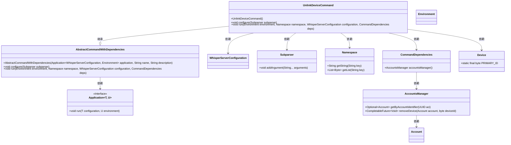
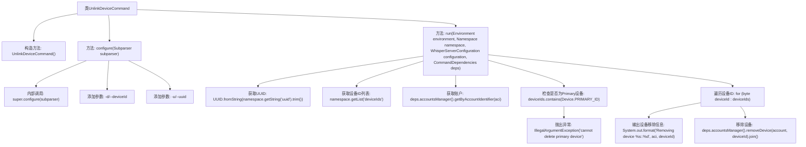

# 基础信息

|      |      |
|------|------|
| 名称 | UnlinkDeviceCommand |
| 编码语言 | .java |
| 代码路径 | Signal-Server/service/src/main/java/org/whispersystems/textsecuregcm/workers/UnlinkDeviceCommand.java |
| 包名 | org.whispersystems.textsecuregcm.workers |
| 依赖项 | ['com.fasterxml.jackson.databind.DeserializationFeature', 'io.dropwizard.core.Application', 'io.dropwizard.core.cli.EnvironmentCommand', 'io.dropwizard.core.setup.Environment', 'java.util.List', 'java.util.UUID', 'net.sourceforge.argparse4j.impl.Arguments', 'net.sourceforge.argparse4j.inf.Namespace', 'net.sourceforge.argparse4j.inf.Subparser', 'org.whispersystems.textsecuregcm.WhisperServerConfiguration', 'org.whispersystems.textsecuregcm.storage.Account', 'org.whispersystems.textsecuregcm.storage.Device'] |
| 概述说明 | UnlinkDeviceCommand类解绑设备并清除消息，需设备ID和账户UUID。 |

# 说明

UnlinkDeviceCommand类的主要功能是解绑设备并清除相关消息。为了执行这一操作，需要提供两个关键参数：设备ID和账户UUID。设备ID用于标识要解绑的具体设备，而账户UUID则用于确认与该设备关联的用户账户。通过这两个参数，该类能够准确地找到并处理需要解绑的设备，同时清除与该设备相关的消息，确保解绑过程彻底且无遗留问题。

# 类列表 Class Summary

| 名称   | 类型  | 说明 |
|-------|------|-------------|
| UnlinkDeviceCommand | class | UnlinkDeviceCommand类用于解绑设备并清除消息，需提供设备ID和账户UUID。 |

## 类 UnlinkDeviceCommand

|      |      |
|------|------|
| 访问范围 | public |
| 类型 | class |
| 名称 | UnlinkDeviceCommand |
| 说明 | UnlinkDeviceCommand类用于解绑设备并清除消息，需提供设备ID和账户UUID。 |

### UML类图

### 描述
`UnlinkDeviceCommand` 类继承自 `AbstractCommandWithDependencies`，用于执行解绑设备的命令。它通过配置命令行参数（如设备ID和账户UUID）来执行解绑操作。该类依赖于 `Subparser`、`Namespace`、`WhisperServerConfiguration` 和 `CommandDependencies` 等类，并通过 `AccountsManager` 类来管理账户和设备。`UnlinkDeviceCommand` 在执行时会检查设备ID，确保不会删除主设备，并逐个移除指定设备。

### 内部方法调用关系图

这段代码描述了一个用于解除设备链接的命令类 `UnlinkDeviceCommand`。它通过命令行参数接收设备ID和账户UUID，检查是否为Primary设备，然后遍历设备ID列表，逐个移除设备并输出移除信息。代码结构清晰，包含了参数配置、异常处理和设备移除的逻辑。

### 字段列表 Field List

| 名称  | 类型  | 说明 |
|-------|-------|------|

### 方法列表 Method List

| 名称  | 类型  | 说明 |
|-------|-------|------|
| configure | void | 配置命令行参数，包含设备ID和账户UUID，均为必填项。 |
| run | void | 从命名空间获取UUID和设备ID，检查账户存在，删除非主设备。 |

