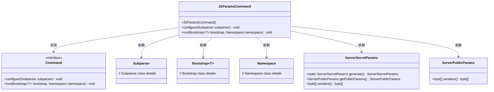
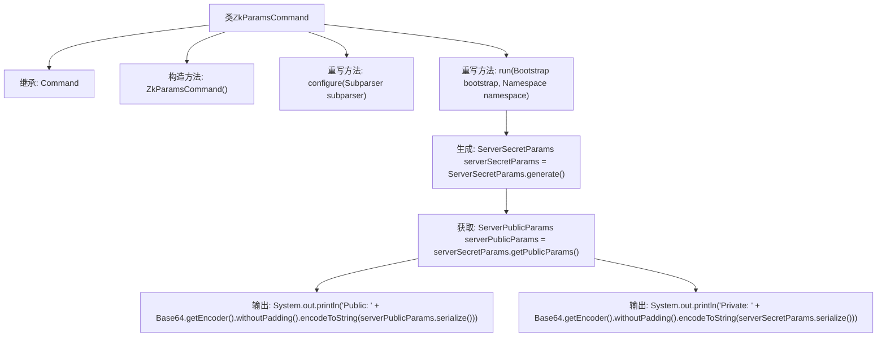

# 基础信息

|      |      |
|------|------|
| 名称 | ZkParamsCommand |
| 编码语言 | .java |
| 代码路径 | Signal-Server/service/src/main/java/org/whispersystems/textsecuregcm/workers/ZkParamsCommand.java |
| 包名 | org.whispersystems.textsecuregcm.workers |
| 依赖项 | ['io.dropwizard.core.cli.Command', 'io.dropwizard.core.setup.Bootstrap', 'java.util.Base64', 'net.sourceforge.argparse4j.inf.Namespace', 'net.sourceforge.argparse4j.inf.Subparser', 'org.signal.libsignal.zkgroup.ServerPublicParams', 'org.signal.libsignal.zkgroup.ServerSecretParams'] |
| 概述说明 | ZkParamsCommand类生成并输出服务器的公钥和私钥。 |

# 说明

ZkParamsCommand类的主要功能是生成并输出服务器的公钥和私钥。该类通过执行特定的命令，能够创建用于加密和解密的密钥对，并将这些密钥输出以供使用。这一过程确保了服务器的安全通信和数据保护。

# 类列表 Class Summary

| 名称   | 类型  | 说明 |
|-------|------|-------------|
| ZkParamsCommand | class | ZkParamsCommand类生成并输出服务器的公钥和私钥。 |

## 类 ZkParamsCommand

|      |      |
|------|------|
| 访问范围 | public |
| 类型 | class |
| 名称 | ZkParamsCommand |
| 说明 | ZkParamsCommand类生成并输出服务器的公钥和私钥。 |

### UML类图

这段代码定义了一个 `ZkParamsCommand` 类，该类继承自 `Command` 接口，并实现了 `configure` 和 `run` 方法。`ZkParamsCommand` 类的主要作用是生成服务器的 ZK 参数（包括公钥和私钥），并将其以 Base64 编码的形式输出。`run` 方法依赖于 `ServerSecretParams` 和 `ServerPublicParams` 类来生成和序列化这些参数。`ZkParamsCommand` 类还依赖于 `Subparser`、`Bootstrap` 和 `Namespace` 类来完成其功能。

### 内部方法调用关系图

这段代码定义了一个名为`ZkParamsCommand`的类，继承自`Command`类。它包含一个构造函数和两个重写方法`configure`和`run`。在`run`方法中，首先生成了一个`ServerSecretParams`对象，然后从中获取`ServerPublicParams`对象，最后将这两个对象的序列化结果分别以Base64编码形式输出。该代码主要用于生成和输出服务器的ZK参数。

### 字段列表 Field List

| 名称  | 类型  | 说明 |
|-------|-------|------|

### 方法列表 Method List

| 名称  | 类型  | 说明 |
|-------|-------|------|
| configure | void | 重写configure方法，用于配置Subparser。 |
| run | void | 生成并输出服务器公钥和私钥的Base64编码。 |

