# 基础信息

|      |      |
|------|------|
| 名称 | whispersystems |
| 编码语言 | .java |
| 代码路径 | Signal-Server/websocket-resources/src/main/java/org/whispersystems |
| 包名 | Signal-Server.websocket-resources.src.main.java.org.whispersystems |
| 概述说明 | WebSocket模块处理通信、认证、会话管理和日志记录，确保消息解析、身份验证和连接稳定性。 |

# 说明

## 概述

该代码模块是一个全面的WebSocket通信管理工具集，涵盖了从消息处理、会话管理、身份验证到日志记录的多个方面。模块通过多个核心类实现了对WebSocket请求和响应消息的高效管理，确保消息的完整性、可追溯性和兼容性。同时，模块还提供了灵活的配置选项、会话管理、身份验证机制以及日志记录功能，确保WebSocket通信的安全性、稳定性和高效性。

## 主要业务场景

1. **WebSocket消息处理**：模块提供了基于Protobuf格式的WebSocket消息封装、解析与创建功能。通过`ProtobufWebSocketRequestMessage`、`ProtobufWebSocketResponseMessage`和`ProtobufWebSocketMessageFactory`等类，开发者可以高效地处理WebSocket请求和响应消息，确保消息的完整性和可追溯性。

2. **WebSocket会话管理**：通过`WebSocketClient`、`WebSocketSessionContext`和`WebSocketResourceProvider`等类，模块提供了对WebSocket会话的全生命周期管理，包括会话的建立、状态维护、事件处理以及会话的关闭。这些功能确保了WebSocket会话的稳定性和可控性。

3. **身份验证与安全控制**：模块通过`WebSocketSecurityContext`、`ReusableAuth`和`WebSocketAuthenticator`等类，提供了完整的身份验证机制，确保WebSocket通信的安全性。同时，模块还支持Principal的注入和认证状态的维护，确保用户身份和会话状态得到有效控制。

4. **WebSocket环境配置**：通过`WebSocketEnvironment`和`WebSocketConfiguration`等类，模块提供了灵活的WebSocket连接配置选项，包括认证机制、日志记录、消息处理工厂等。用户可以根据需求自定义超时设置、连接监听等，确保连接的安全性和稳定性。

5. **日志记录与事件管理**：模块通过`WebsocketEventLayoutFactory`、`WebsocketEventLayout`和`WebsocketRequestLog`等类，提供了完整的WebSocket事件日志记录功能。支持多种日志模式、异步日志记录、日志过滤和扩展记录内容，确保日志输出的统一性、可读性和高效性。

6. **资源提供与工厂管理**：通过`WebSocketResourceProviderFactory`和`WebSocketResourceProvider`等类，模块提供了对WebSocket资源的统一管理，确保WebSocket连接的安全性、认证流程的管理以及会话状态的维护。

这些业务场景共同构成了一个完整的WebSocket通信管理模块，适用于需要高效、安全、可靠地处理WebSocket通信的系统。

### 包内部结构视图

```mermaid
graph TD
    websocket --> WebsocketHeaders.java
    websocket --> messages
    websocket --> configuration
    websocket --> WebSocketClient.java
    websocket --> WebSocketSecurityContext.java
    websocket --> setup
    websocket --> ReusableAuth.java
    websocket --> logging
    websocket --> auth
    websocket --> session
    websocket --> WebSocketResourceProviderFactory.java
    websocket --> WebSocketResourceProvider.java
    messages --> WebSocketRequestMessage.java
    messages --> InvalidMessageException.java
    messages --> WebSocketMessage.java
    messages --> WebSocketMessageFactory.java
    messages --> WebSocketResponseMessage.java
    messages --> protobuf
    protobuf --> ProtobufWebSocketRequestMessage.java
    protobuf --> ProtobufWebSocketMessageFactory.java
    protobuf --> ProtobufWebSocketMessage.java
    protobuf --> ProtobufWebSocketResponseMessage.java
    configuration --> WebSocketConfiguration.java
    setup --> WebSocketConnectListener.java
    setup --> WebSocketEnvironment.java
    logging --> layout
    logging --> WebsocketRequestLoggerFactory.java
    logging --> WebsocketRequestLog.java
    logging --> AsyncWebsocketEventAppenderFactory.java
    logging --> WebsocketEvent.java
    layout --> WebsocketEventLayoutFactory.java
    layout --> converters
    layout --> WebsocketEventLayout.java
    converters --> StatusCodeConverter.java
    converters --> DateConverter.java
    converters --> RequestUrlConverter.java
    converters --> ContentLengthConverter.java
    converters --> NAConverter.java
    converters --> EnsureLineSeparation.java
    converters --> RemoteHostConverter.java
    converters --> RequestHeaderConverter.java
    converters --> WebSocketEventConverter.java
    converters --> LineSeparatorConverter.java
    auth --> ReadOnly.java
    auth --> PrincipalSupplier.java
    auth --> WebSocketAuthenticator.java
    auth --> AuthenticationException.java
    auth --> AuthenticatedWebSocketUpgradeFilter.java
    auth --> Mutable.java
    auth --> WebsocketAuthValueFactoryProvider.java
    session --> ContextPrincipal.java
    session --> WebSocketSessionContextValueFactoryProvider.java
    session --> WebSocketSessionContext.java
    session --> WebSocketSession.java
    session --> WebSocketSessionContainerRequestValueFactory.java
```

该流程图展示了Signal-Server项目中websocket模块的层级结构。从`websocket`根节点出发，分为多个子模块，如`messages`、`configuration`、`logging`等。每个子模块进一步细分为具体的类或文件，如`WebSocketRequestMessage.java`、`WebSocketConfiguration.java`等。整个结构清晰地展示了模块之间的从属关系和文件组织方式。

# 文件列表 File List

| 名称   | 类型  | 说明 |
|-------|------|-------------|
| [websocket](websocket/_module.md) | package | WebSocket模块处理通信、认证、会话管理和日志记录，确保消息解析、身份验证和连接稳定性。 |

