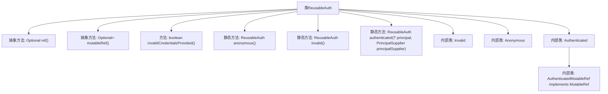

# 基础信息

|      |      |
|------|------|
| 名称 | ReusableAuth |
| 编码语言 | .java |
| 代码路径 | Signal-Server/websocket-resources/src/main/java/org/whispersystems/websocket/ReusableAuth.java |
| 包名 | org.whispersystems.websocket |
| 依赖项 | ['java.security.Principal', 'java.util.Optional', 'java.util.concurrent.atomic.AtomicBoolean', 'org.whispersystems.websocket.auth.PrincipalSupplier'] |
| 概述说明 | ReusableAuth类管理认证，支持获取主体引用，处理匿名和无效认证。 |

# 说明

ReusableAuth类是一个用于管理可重用认证的工具，它提供了获取不可修改和可修改的主体引用的功能。该类还包含了处理匿名认证和无效认证的机制，确保在不同认证场景下能够灵活应对。通过这个类，开发者可以更高效地管理认证信息，提升系统的安全性和可维护性。

# 类列表 Class Summary

| 名称   | 类型  | 说明 |
|-------|------|-------------|
| ReusableAuth | class | ReusableAuth类用于管理可重用认证，支持获取不可修改和可修改的主体引用，并包含匿名和无效认证处理。 |


## 类 ReusableAuth

|      |      |
|------|------|
| 访问范围 | public abstract sealed |
| 类型 | class |
| 名称 | ReusableAuth |
| 说明 | ReusableAuth类用于管理可重用认证，支持获取不可修改和可修改的主体引用，并包含匿名和无效认证处理。 |


### UML类图

```mermaid
classDiagram
    class ReusableAuth~T~ {
        <<abstract>>
        +Optional~T~ ref()
        +Optional~MutableRef~T~~ mutableRef()
        +boolean invalidCredentialsProvided()
        +static ReusableAuth~T~ anonymous()
        +static ReusableAuth~T~ invalid()
        +static ReusableAuth~T~ authenticated(T principal, PrincipalSupplier~T~ principalSupplier)
    }

    class MutableRef~T~ {
        <<Interface>>
        +T ref()
        +void close()
    }

    class Invalid~T~ {
        -static ReusableAuth INVALID_RESULT
        +Optional~T~ ref()
        +Optional~MutableRef~T~~ mutableRef()
    }

    class Anonymous~T~ {
        -static ReusableAuth ANON_RESULT
        +Optional~T~ ref()
        +Optional~MutableRef~T~~ mutableRef()
    }

    class Authenticated~T~ {
        -T basePrincipal
        -AtomicBoolean needRefresh
        -PrincipalSupplier~T~ principalSupplier
        +Optional~T~ ref()
        +Optional~MutableRef~T~~ mutableRef()
        -void maybeRefresh()
        -class AuthenticatedMutableRef {
            -T ref
            +T ref()
            +void close()
        }
    }

    ReusableAuth <|-- Invalid
    ReusableAuth <|-- Anonymous
    ReusableAuth <|-- Authenticated
    Authenticated --> AuthenticatedMutableRef : 包含
    AuthenticatedMutableRef ..|> MutableRef : 实现
```

该代码定义了一个抽象类 `ReusableAuth`，用于处理可重用的认证信息。它包含三个子类：`Invalid`、`Anonymous` 和 `Authenticated`，分别表示无效认证、匿名认证和成功认证。`Authenticated` 类中包含一个内部类 `AuthenticatedMutableRef`，实现了 `MutableRef` 接口，用于处理可修改的认证信息。类图展示了这些类之间的继承和依赖关系，清晰地反映了代码的结构和功能。


### 内部方法调用关系图



**描述：**
这段代码定义了一个抽象类 `ReusableAuth<T extends Principal>`，用于管理可重用的认证信息。类中包含多个抽象方法和静态方法，用于获取不可变或可变的认证引用，并判断认证是否有效。内部类 `Invalid`、`Anonymous` 和 `Authenticated` 分别表示无效、匿名和已认证的状态。`Authenticated` 类中还包含一个内部类 `AuthenticatedMutableRef`，用于管理可变的认证引用，并在修改后标记为需要刷新。

### 字段列表 Field List

| 名称  | 类型  | 说明 |
|-------|-------|------|

### 方法列表 Method List

| 名称  | 类型  | 说明 |
|-------|-------|------|
| authenticated | ReusableAuth<T> | 该方法返回一个认证对象，包含主体和主体供应器。 |
| invalidCredentialsProvided | boolean | 该方法判断提供的凭证是否无效，无效返回true，否则返回false。 |
| mutableRef | Optional<MutableRef<T>> | 抽象方法返回可变的Optional引用。 |
| ref | Optional<T> | 抽象方法返回可选类型T的引用。 |
| invalid | ReusableAuth<T> | 返回无效的ReusableAuth实例。 |
| anonymous | ReusableAuth<T> | 该方法返回一个匿名认证对象ReusableAuth。 |


