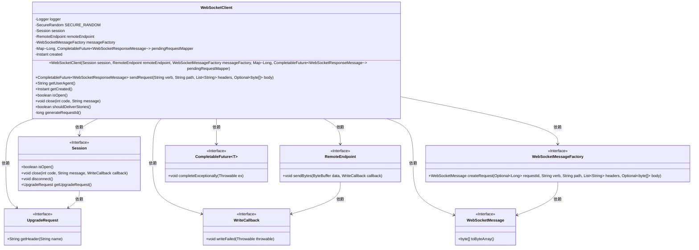

# 基础信息

|      |      |
|------|------|
| 名称 | WebSocketClient |
| 编码语言 | .java |
| 代码路径 | Signal-Server/websocket-resources/src/main/java/org/whispersystems/websocket/WebSocketClient.java |
| 包名 | org.whispersystems.websocket |
| 依赖项 | ['com.google.common.net.HttpHeaders', 'java.nio.ByteBuffer', 'java.security.SecureRandom', 'java.time.Instant', 'java.util.List', 'java.util.Map', 'java.util.Optional', 'java.util.concurrent.CompletableFuture', 'org.eclipse.jetty.websocket.api.RemoteEndpoint', 'org.eclipse.jetty.websocket.api.Session', 'org.eclipse.jetty.websocket.api.WriteCallback', 'org.eclipse.jetty.websocket.api.exceptions.WebSocketException', 'org.slf4j.Logger', 'org.slf4j.LoggerFactory', 'org.whispersystems.websocket.messages.WebSocketMessage', 'org.whispersystems.websocket.messages.WebSocketMessageFactory', 'org.whispersystems.websocket.messages.WebSocketResponseMessage'] |
| 概述说明 | WebSocketClient类管理会话，支持请求、用户代理、状态检查及关闭。 |

# 说明

WebSocketClient类负责管理WebSocket会话，具备多种功能，包括发送请求、获取用户代理信息、检查当前会话状态以及关闭会话。该类提供了一种高效的方式来处理WebSocket通信，确保会话的稳定性和可控性。

# 类列表 Class Summary

| 名称   | 类型  | 说明 |
|-------|------|-------------|
| WebSocketClient | class | WebSocketClient类用于管理WebSocket会话，支持发送请求、获取用户代理、检查会话状态及关闭会话。 |

## 类 WebSocketClient

|      |      |
|------|------|
| 访问范围 | @SuppressWarnings("OptionalUsedAsFieldOrParameterType");public |
| 类型 | class |
| 名称 | WebSocketClient |
| 说明 | WebSocketClient类用于管理WebSocket会话，支持发送请求、获取用户代理、检查会话状态及关闭会话。 |

### UML类图

### 描述
`WebSocketClient` 类用于管理与WebSocket服务器的连接和通信。它依赖于多个接口和类，如 `Session`、`RemoteEndpoint`、`WebSocketMessageFactory` 等，来处理会话管理、消息发送和接收、请求创建等操作。`WebSocketClient` 通过 `sendRequest` 方法发送请求，并返回一个 `CompletableFuture` 对象，用于异步处理响应。此外，它还提供了获取用户代理、检查连接状态、关闭连接等功能。

### 内部方法调用关系图

这段代码定义了一个`WebSocketClient`类，用于管理与WebSocket服务器的连接和通信。类中包含多个属性，如`logger`、`SECURE_RANDOM`、`session`等，以及构造方法和多个公共方法，如`sendRequest`、`getUserAgent`、`close`等。`sendRequest`方法用于发送请求并处理发送失败的情况，`close`方法用于关闭连接并处理关闭失败的情况。类中还包含一个私有方法`generateRequestId`，用于生成唯一的请求ID。

### 字段列表 Field List

| 名称  | 类型  | 说明 |
|-------|-------|------|
| remoteEndpoint | RemoteEndpoint | 私有远程终端对象实例。 |
| logger = LoggerFactory.getLogger(WebSocketClient.class) | Logger | 定义WebSocketClient类的私有静态日志记录器实例。 |
| created | Instant | 私有不可变的创建时间实例。 |
| messageFactory | WebSocketMessageFactory | 私有且不可变的WebSocket消息工厂实例。 |
| SECURE_RANDOM = new SecureRandom() | SecureRandom | 定义了一个私有的静态常量SecureRandom实例。 |
| pendingRequestMapper | Map<Long, CompletableFuture<WebSocketResponseMessage>> | 私有映射存储长整型键和异步WebSocket响应消息的CompletableFuture对象。 |
| session | Session | 私有且不可变的Session对象。 |

### 方法列表 Method List

| 名称  | 类型  | 说明 |
|-------|-------|------|
| getUserAgent | String | 获取用户代理信息的方法。 |
| getCreated | Instant | 获取创建时间的方法。 |
| shouldDeliverStories | boolean | 该方法检查请求头中是否包含接收故事的信号并返回布尔值。 |
| close | void | 该方法关闭会话，处理失败时断开连接并记录日志。 |
| isOpen | boolean | 该方法检查会话是否开启并返回布尔值。 |
| generateRequestId | long | 生成随机长整型请求ID，确保为正数。 |
| sendRequest | CompletableFuture<WebSocketResponseMessage> | 发送WebSocket请求，处理失败并返回异步结果。 |

