# 基础信息

|      |      |
|------|------|
| 名称 | WebSocketResourceProvider |
| 编码语言 | .java |
| 代码路径 | Signal-Server/websocket-resources/src/main/java/org/whispersystems/websocket/WebSocketResourceProvider.java |
| 包名 | org.whispersystems.websocket |
| 依赖项 | ['com.google.common.annotations.VisibleForTesting', 'com.google.common.net.HttpHeaders', 'com.google.protobuf.UninitializedMessageException', 'jakarta.ws.rs.core.MultivaluedMap', 'jakarta.ws.rs.core.Response', 'java.io.ByteArrayInputStream', 'java.io.ByteArrayOutputStream', 'java.io.IOException', 'java.net.URI', 'java.nio.ByteBuffer', 'java.security.Principal', 'java.time.Duration', 'java.util.HashMap', 'java.util.LinkedList', 'java.util.List', 'java.util.Map', 'java.util.Optional', 'java.util.Set', 'java.util.concurrent.CompletableFuture', 'java.util.concurrent.ConcurrentHashMap', 'org.eclipse.jetty.websocket.api.RemoteEndpoint', 'org.eclipse.jetty.websocket.api.Session', 'org.eclipse.jetty.websocket.api.WebSocketListener', 'org.eclipse.jetty.websocket.api.WriteCallback', 'org.eclipse.jetty.websocket.api.exceptions.MessageTooLargeException', 'org.glassfish.jersey.internal.MapPropertiesDelegate', 'org.glassfish.jersey.server.ApplicationHandler', 'org.glassfish.jersey.server.ContainerRequest', 'org.glassfish.jersey.server.ContainerResponse', 'org.slf4j.Logger', 'org.slf4j.LoggerFactory', 'org.whispersystems.websocket.logging.WebsocketRequestLog', 'org.whispersystems.websocket.messages.InvalidMessageException', 'org.whispersystems.websocket.messages.WebSocketMessage', 'org.whispersystems.websocket.messages.WebSocketMessageFactory', 'org.whispersystems.websocket.messages.WebSocketRequestMessage', 'org.whispersystems.websocket.messages.WebSocketResponseMessage', 'org.whispersystems.websocket.session.ContextPrincipal', 'org.whispersystems.websocket.session.WebSocketSessionContext', 'org.whispersystems.websocket.setup.WebSocketConnectListener'] |
| 概述说明 | WebSocket类处理连接、错误、消息和关闭事件，管理请求响应。 |

# 说明

WebSocket资源提供者类负责处理与WebSocket相关的各类事件，包括连接建立、错误处理、消息接收和连接关闭等。该类还负责管理请求和响应的流程，确保通信的稳定性和可靠性。通过全面的事件管理和请求响应机制，该类为WebSocket通信提供了核心支持，确保系统能够高效处理WebSocket相关的操作。

# 类列表 Class Summary

| 名称   | 类型  | 说明 |
|-------|------|-------------|
| WebSocketResourceProvider | class | WebSocket资源提供者类，处理连接、错误、消息和关闭事件，管理请求和响应。 |

## 类 WebSocketResourceProvider

|      |      |
|------|------|
| 访问范围 | @SuppressWarnings("OptionalUsedAsFieldOrParameterType");public |
| 类型 | class |
| 名称 | WebSocketResourceProvider |
| 说明 | WebSocket资源提供者类，处理连接、错误、消息和关闭事件，管理请求和响应。 |

### UML类图

```mermaid
classDiagram
    class WebSocketResourceProvider~T~ {
        +static final IOException CONNECTION_CLOSED_EXCEPTION
        -static final Logger logger
        -Map~Long, CompletableFuture~WebSocketResponseMessage~~ requestMap
        -ReusableAuth~T~ reusableAuth
        -WebSocketMessageFactory messageFactory
        -Optional~WebSocketConnectListener~ connectListener
        -ApplicationHandler jerseyHandler
        -WebsocketRequestLog requestLog
        -Duration idleTimeout
        -String remoteAddress
        -String remoteAddressPropertyName
        -Session session
        -RemoteEndpoint remoteEndpoint
        -WebSocketSessionContext context
        -static final Set~String~ EXCLUDED_UPGRADE_REQUEST_HEADERS
        +WebSocketResourceProvider(String remoteAddress, String remoteAddressPropertyName, ApplicationHandler jerseyHandler, WebsocketRequestLog requestLog, ReusableAuth~T~ authenticated, WebSocketMessageFactory messageFactory, Optional~WebSocketConnectListener~ connectListener, Duration idleTimeout)
        +void onWebSocketConnect(Session session)
        +void onWebSocketError(Throwable cause)
        +void onWebSocketBinary(byte[] payload, int offset, int length)
        +void onWebSocketClose(int statusCode, String reason)
        +void onWebSocketText(String message)
        +static final String REUSABLE_AUTH_PROPERTY
        +static final String RESOLVED_PRINCIPAL_PROPERTY
        -void handleRequest(WebSocketRequestMessage requestMessage)
        +static Map~String, List~String~~ getCombinedHeaders(Map~String, List~String~~ upgradeRequestHeaders, Map~String, String~ requestMessageHeaders)
        +static boolean shouldIncludeUpgradeRequestHeader(String header)
        +static boolean shouldIncludeRequestMessageHeader(String header)
        -void handleResponse(WebSocketResponseMessage responseMessage)
        -void close(Session session, int status, String message)
        -void sendResponse(WebSocketRequestMessage requestMessage, ContainerResponse response, ByteArrayOutputStream responseBody) throws IOException
        -void sendErrorResponse(WebSocketRequestMessage requestMessage, Response error) throws IOException
        -WebSocketSessionContext getContext()
        +static List~String~ getHeaderList(MultivaluedMap~String, String~ headerMap)
    }

    class WebSocketListener {
        <<Interface>>
        +void onWebSocketConnect(Session session)
        +void onWebSocketError(Throwable cause)
        +void onWebSocketBinary(byte[] payload, int offset, int length)
        +void onWebSocketClose(int statusCode, String reason)
        +void onWebSocketText(String message)
    }

    class WebSocketMessageFactory {
        <<Interface>>
        +WebSocketMessage parseMessage(byte[] payload, int offset, int length)
        +WebSocketMessage createResponse(long requestId, int status, String reasonPhrase, List~String~ headers, Optional~byte[]~ body)
    }

    class ReusableAuth~T~ {
        +Optional~T~ ref()
    }

    class WebSocketSessionContext {
        +void setAuthenticated(T authenticated)
        +void notifyClosed(int statusCode, String reason)
    }

    class WebSocketClient {
        +WebSocketClient(Session session, RemoteEndpoint remoteEndpoint, WebSocketMessageFactory messageFactory, Map~Long, CompletableFuture~WebSocketResponseMessage~~ requestMap)
    }

    class WebSocketConnectListener {
        <<Interface>>
        +void onWebSocketConnect(WebSocketSessionContext context)
    }

    WebSocketResourceProvider --> WebSocketListener : 实现
    WebSocketResourceProvider --> WebSocketMessageFactory : 依赖
    WebSocketResourceProvider --> ReusableAuth : 依赖
    WebSocketResourceProvider --> WebSocketSessionContext : 依赖
    WebSocketResourceProvider --> WebSocketClient : 依赖
    WebSocketResourceProvider --> WebSocketConnectListener : 依赖
```

### 描述
`WebSocketResourceProvider` 是一个泛型类，实现了 `WebSocketListener` 接口，用于处理 WebSocket 连接的生命周期事件。它依赖于 `WebSocketMessageFactory` 来解析和创建消息，使用 `ReusableAuth` 进行身份验证，并通过 `WebSocketSessionContext` 管理会话上下文。该类还处理 WebSocket 的二进制和文本消息，并在连接关闭时清理未完成的请求。`WebSocketConnectListener` 用于在连接建立时执行自定义逻辑。

### 内部方法调用关系图

```mermaid
graph TD
    A["类WebSocketResourceProvider<T extends Principal>"]
    B["属性: Map<Long, CompletableFuture<WebSocketResponseMessage>> requestMap"]
    C["属性: ReusableAuth<T> reusableAuth"]
    D["属性: WebSocketMessageFactory messageFactory"]
    E["属性: Optional<WebSocketConnectListener> connectListener"]
    F["属性: ApplicationHandler jerseyHandler"]
    G["属性: WebsocketRequestLog requestLog"]
    H["属性: Duration idleTimeout"]
    I["属性: String remoteAddress"]
    J["属性: String remoteAddressPropertyName"]
    K["属性: Session session"]
    L["属性: RemoteEndpoint remoteEndpoint"]
    M["属性: WebSocketSessionContext context"]
    N["构造方法: WebSocketResourceProvider"]
    O["方法: void onWebSocketConnect(Session session)"]
    P["方法: void onWebSocketError(Throwable cause)"]
    Q["方法: void onWebSocketBinary(byte[] payload, int offset, int length)"]
    R["方法: void onWebSocketClose(int statusCode, String reason)"]
    S["方法: void onWebSocketText(String message)"]
    T["方法: void handleRequest(WebSocketRequestMessage requestMessage)"]
    U["方法: void handleResponse(WebSocketResponseMessage responseMessage)"]
    V["方法: void close(Session session, int status, String message)"]
    W["方法: void sendResponse(WebSocketRequestMessage requestMessage, ContainerResponse response, ByteArrayOutputStream responseBody)"]
    X["方法: void sendErrorResponse(WebSocketRequestMessage requestMessage, Response error)"]
    Y["方法: static Map<String, List<String>> getCombinedHeaders(Map<String, List<String>> upgradeRequestHeaders, Map<String, String> requestMessageHeaders)"]
    Z["方法: static boolean shouldIncludeUpgradeRequestHeader(String header)"]
    AA["方法: static boolean shouldIncludeRequestMessageHeader(String header)"]
    AB["方法: static List<String> getHeaderList(MultivaluedMap<String, String> headerMap)"]
    AC["方法: WebSocketSessionContext getContext()"]

    A --> B
    A --> C
    A --> D
    A --> E
    A --> F
    A --> G
    A --> H
    A --> I
    A --> J
    A --> K
    A --> L
    A --> M
    A --> N
    A --> O
    A --> P
    A --> Q
    A --> R
    A --> S
    A --> T
    A --> U
    A --> V
    A --> W
    A --> X
    A --> Y
    A --> Z
    A --> AA
    A --> AB
    A --> AC
```

这段代码定义了一个 `WebSocketResourceProvider` 类，用于处理 WebSocket 连接、消息传递和错误处理。它包含多个方法，如 `onWebSocketConnect` 用于处理连接建立，`onWebSocketBinary` 用于处理二进制消息，`onWebSocketError` 用于处理错误，`onWebSocketClose` 用于处理连接关闭等。此外，它还提供了处理请求和响应的方法，如 `handleRequest` 和 `handleResponse`，以及一些辅助方法用于处理请求头、发送响应和错误响应等。整体流程涉及 WebSocket 连接的建立、消息处理、错误处理和连接关闭等步骤。

### 字段列表 Field List

| 名称  | 类型  | 说明 |
|-------|-------|------|
| messageFactory | WebSocketMessageFactory | 私有WebSocket消息工厂实例。 |
| context | WebSocketSessionContext | 私有WebSocket会话上下文变量声明。 |
| remoteAddress | String | 私有字符串变量remoteAddress，用于存储远程地址。 |
| REUSABLE_AUTH_PROPERTY = WebSocketResourceProvider.class.getName() + ".reusableAuth" | String | WebSocketResourceProvider类中定义了一个可重用认证属性。 |
| CONNECTION_CLOSED_EXCEPTION = new IOException("Connection closed!") | IOException | 定义了一个表示连接关闭的IO异常常量。 |
| jerseyHandler | ApplicationHandler | 私有且不可变的ApplicationHandler实例jerseyHandler。 |
| remoteEndpoint | RemoteEndpoint | 声明一个私有RemoteEndpoint类型的remoteEndpoint变量。 |
| idleTimeout | Duration | 私有最终变量，用于设置空闲超时时间。 |
| reusableAuth | ReusableAuth<T> | 私有且不可变的ReusableAuth对象，泛型为T。 |
| requestLog | WebsocketRequestLog | 私有且不可变的Websocket请求日志实例。 |
| RESOLVED_PRINCIPAL_PROPERTY = WebSocketResourceProvider.class.getName() + ".resolvedPrincipal" | String | WebSocketResourceProvider类中定义了一个静态常量RESOLVED_PRINCIPAL_PROPERTY。 |
| logger = LoggerFactory.getLogger(WebSocketResourceProvider.class) | Logger | WebSocketResourceProvider类中声明了一个私有的静态Logger实例。 |
| remoteAddressPropertyName | String | 定义私有不可变字符串变量remoteAddressPropertyName。 |
| connectListener | Optional<WebSocketConnectListener> | 私有不可变的WebSocket连接监听器可选变量。 |
| requestMap = new ConcurrentHashMap<>() | Map<Long, CompletableFuture<WebSocketResponseMessage>> | 使用ConcurrentHashMap存储WebSocket请求的CompletableFuture对象。 |
| EXCLUDED_UPGRADE_REQUEST_HEADERS = Set.of("connection", "upgrade") | Set<String> | 定义排除的升级请求头集合，包含"connection"和"upgrade"。 |
| session | Session | 定义了一个私有会话对象。 |

### 方法列表 Method List

| 名称  | 类型  | 说明 |
|-------|-------|------|
| close | void | 关闭会话并设置状态和消息。 |
| shouldIncludeUpgradeRequestHeader | boolean | 测试方法检查请求头是否应包含升级信息。 |
| getContext | WebSocketSessionContext | 测试可见方法返回WebSocket会话上下文。 |
| onWebSocketText | void | 重写WebSocket文本接收方法，记录调试信息。 |
| onWebSocketClose | void | WebSocket关闭时通知上下文并处理未完成请求。 |
| handleResponse | void | 处理WebSocket响应，移除请求映射并完成Future。 |
| sendErrorResponse | void | 发送错误响应至WebSocket客户端，包含请求ID和错误状态。 |
| getCombinedHeaders | Map<String, List<String>> | 合并请求头，过滤并整合升级请求头和信息请求头。 |
| onWebSocketError | void | WebSocket错误处理，根据异常类型设置关闭代码和消息，并关闭会话。 |
| getHeaderList | List<String> | 测试可见方法，将多值头映射转换为键值对列表。 |
| handleRequest | void | 处理WebSocket请求，构建容器请求，发送响应并记录日志。 |
| shouldIncludeRequestMessageHeader | boolean | 测试方法检查请求头是否包含特定消息头。 |
| sendResponse | void | 发送WebSocket响应，包含请求ID、状态、头信息和响应体。 |
| onWebSocketBinary | void | 处理WebSocket二进制消息，解析并处理请求或响应，异常时关闭会话。 |
| onWebSocketConnect | void | WebSocket连接时初始化会话、远程端点、上下文，设置认证和超时，并触发连接监听器。 |

