# 基础信息

|      |      |
|------|------|
| 名称 | WebSocketResourceProviderFactory |
| 编码语言 | .java |
| 代码路径 | Signal-Server/websocket-resources/src/main/java/org/whispersystems/websocket/WebSocketResourceProviderFactory.java |
| 包名 | org.whispersystems.websocket |
| 依赖项 | ['java.util.Optional.ofNullable', 'io.dropwizard.jersey.jackson.JacksonMessageBodyProvider', 'jakarta.ws.rs.InternalServerErrorException', 'java.io.IOException', 'java.security.Principal', 'java.util.Map', 'java.util.Optional', 'org.apache.commons.lang3.StringUtils', 'org.eclipse.jetty.websocket.server.JettyServerUpgradeRequest', 'org.eclipse.jetty.websocket.server.JettyServerUpgradeResponse', 'org.eclipse.jetty.websocket.server.JettyWebSocketCreator', 'org.eclipse.jetty.websocket.server.JettyWebSocketServlet', 'org.eclipse.jetty.websocket.server.JettyWebSocketServletFactory', 'org.glassfish.jersey.CommonProperties', 'org.glassfish.jersey.server.ApplicationHandler', 'org.slf4j.Logger', 'org.slf4j.LoggerFactory', 'org.whispersystems.websocket.auth.AuthenticationException', 'org.whispersystems.websocket.auth.WebSocketAuthenticator', 'org.whispersystems.websocket.auth.WebsocketAuthValueFactoryProvider', 'org.whispersystems.websocket.configuration.WebSocketConfiguration', 'org.whispersystems.websocket.session.WebSocketSessionContextValueFactoryProvider', 'org.whispersystems.websocket.setup.WebSocketEnvironment'] |
| 概述说明 | WebSocket工厂类负责认证、配置和会话管理。 |

# 说明

WebSocket资源提供工厂类主要负责处理认证、配置和会话管理。它确保WebSocket连接的安全性，管理用户认证流程，配置相关参数，并维护会话状态，以支持稳定可靠的WebSocket通信。

# 类列表 Class Summary

| 名称   | 类型  | 说明 |
|-------|------|-------------|
| WebSocketResourceProviderFactory | class | WebSocket资源提供工厂类，处理认证、配置和会话管理。 |

## 类 WebSocketResourceProviderFactory

|      |      |
|------|------|
| 访问范围 | public |
| 类型 | class |
| 名称 | WebSocketResourceProviderFactory |
| 说明 | WebSocket资源提供工厂类，处理认证、配置和会话管理。 |

### UML类图

```mermaid
classDiagram
    class WebSocketResourceProviderFactory~T~ {
        -Logger logger
        -WebSocketEnvironment~T~ environment
        -ApplicationHandler jerseyApplicationHandler
        -WebSocketConfiguration configuration
        -String remoteAddressPropertyName
        +WebSocketResourceProviderFactory(WebSocketEnvironment~T~ environment, Class~T~ principalClass, WebSocketConfiguration configuration, String remoteAddressPropertyName)
        +Object createWebSocket(JettyServerUpgradeRequest request, JettyServerUpgradeResponse response)
        +void configure(JettyWebSocketServletFactory factory)
        -String getRemoteAddress(JettyServerUpgradeRequest request)
    }
    class WebSocketEnvironment~T~ {
        <<Interface>>
        +WebSocketAuthenticator~T~ getAuthenticator()
        +AuthenticatedWebSocketUpgradeFilter getAuthenticatedWebSocketUpgradeFilter()
        +RequestLog getRequestLog()
        +MessageFactory getMessageFactory()
        +ConnectListener getConnectListener()
        +long getIdleTimeout()
        +ObjectMapper getObjectMapper()
        +Jersey jersey()
    }
    class ApplicationHandler {
        +ApplicationHandler(Jersey jersey)
    }
    class WebSocketConfiguration {
        +int getMaxBinaryMessageSize()
        +int getMaxTextMessageSize()
    }
    class JettyWebSocketServlet {
        <<Interface>>
        +void configure(JettyWebSocketServletFactory factory)
    }
    class JettyWebSocketCreator {
        <<Interface>>
        +Object createWebSocket(JettyServerUpgradeRequest request, JettyServerUpgradeResponse response)
    }
    class JettyServerUpgradeRequest {
        +HttpServletRequest getHttpServletRequest()
    }
    class JettyServerUpgradeResponse {
        +void sendForbidden(String message)
        +void sendError(int statusCode, String message)
    }
    class JettyWebSocketServletFactory {
        +void setCreator(JettyWebSocketCreator creator)
        +void setMaxBinaryMessageSize(int size)
        +void setMaxTextMessageSize(int size)
    }
    class WebSocketResourceProvider~T~ {
        +WebSocketResourceProvider(String remoteAddress, String remoteAddressPropertyName, ApplicationHandler jerseyApplicationHandler, RequestLog requestLog, ReusableAuth~T~ authenticated, MessageFactory messageFactory, Optional~ConnectListener~ connectListener, long idleTimeout)
    }
    class ReusableAuth~T~ {
        +boolean invalidCredentialsProvided()
        +static ReusableAuth~T~ anonymous()
    }
    class WebSocketAuthenticator~T~ {
        <<Interface>>
        +ReusableAuth~T~ authenticate(JettyServerUpgradeRequest request)
    }
    class AuthenticatedWebSocketUpgradeFilter {
        <<Interface>>
        +void handleAuthentication(ReusableAuth~T~ authenticated, JettyServerUpgradeRequest request, JettyServerUpgradeResponse response)
    }
    class Jersey {
        +void register(Object binder)
        +void addProperties(Map~String, Object~ properties)
    }
    class WebSocketSessionContextValueFactoryProvider.Binder {
        +WebSocketSessionContextValueFactoryProvider.Binder()
    }
    class WebsocketAuthValueFactoryProvider.Binder~T~ {
        +WebsocketAuthValueFactoryProvider.Binder(Class~T~ principalClass)
    }
    class JacksonMessageBodyProvider {
        +JacksonMessageBodyProvider(ObjectMapper objectMapper)
    }
    class RequestLog {
        <<Interface>>
    }
    class MessageFactory {
        <<Interface>>
    }
    class ConnectListener {
        <<Interface>>
    }
    class ObjectMapper {
        <<Interface>>
    }
    class HttpServletRequest {
        <<Interface>>
        +Object getAttribute(String name)
    }
    class InternalServerErrorException {
        +InternalServerErrorException()
    }
    WebSocketResourceProviderFactory~T~ --> WebSocketEnvironment~T~ : 依赖
    WebSocketResourceProviderFactory~T~ --> ApplicationHandler : 依赖
    WebSocketResourceProviderFactory~T~ --> WebSocketConfiguration : 依赖
    WebSocketResourceProviderFactory~T~ --> JettyWebSocketServlet : 实现
    WebSocketResourceProviderFactory~T~ --> JettyWebSocketCreator : 实现
    WebSocketResourceProviderFactory~T~ --> JettyServerUpgradeRequest : 依赖
    WebSocketResourceProviderFactory~T~ --> JettyServerUpgradeResponse : 依赖
    WebSocketResourceProviderFactory~T~ --> JettyWebSocketServletFactory : 依赖
    WebSocketResourceProviderFactory~T~ --> WebSocketResourceProvider~T~ : 创建
    WebSocketResourceProviderFactory~T~ --> ReusableAuth~T~ : 依赖
    WebSocketResourceProviderFactory~T~ --> WebSocketAuthenticator~T~ : 依赖
    WebSocketResourceProviderFactory~T~ --> AuthenticatedWebSocketUpgradeFilter : 依赖
    WebSocketResourceProviderFactory~T~ --> Jersey : 依赖
    WebSocketResourceProviderFactory~T~ --> WebSocketSessionContextValueFactoryProvider.Binder : 依赖
    WebSocketResourceProviderFactory~T~ --> WebsocketAuthValueFactoryProvider.Binder~T~ : 依赖
    WebSocketResourceProviderFactory~T~ --> JacksonMessageBodyProvider : 依赖
    WebSocketResourceProviderFactory~T~ --> RequestLog : 依赖
    WebSocketResourceProviderFactory~T~ --> MessageFactory : 依赖
    WebSocketResourceProviderFactory~T~ --> ConnectListener : 依赖
    WebSocketResourceProviderFactory~T~ --> ObjectMapper : 依赖
    WebSocketResourceProviderFactory~T~ --> HttpServletRequest : 依赖
    WebSocketResourceProviderFactory~T~ --> InternalServerErrorException : 依赖
```

**描述：**
`WebSocketResourceProviderFactory` 是一个泛型类，继承自 `JettyWebSocketServlet` 并实现 `JettyWebSocketCreator` 接口。它负责创建和管理 WebSocket 资源提供者，处理认证、配置和请求升级等逻辑。该类依赖于多个外部组件，如 `WebSocketEnvironment`、`ApplicationHandler` 和 `WebSocketConfiguration`，并通过 `JettyWebSocketServletFactory` 配置 WebSocket 工厂。它还处理了认证失败和远程地址获取等边缘情况。

### 内部方法调用关系图

```mermaid
graph TD
    A["类WebSocketResourceProviderFactory<T extends Principal>"]
    B["属性: Logger logger"]
    C["属性: WebSocketEnvironment<T> environment"]
    D["属性: ApplicationHandler jerseyApplicationHandler"]
    E["属性: WebSocketConfiguration configuration"]
    F["属性: String remoteAddressPropertyName"]
    G["构造方法: WebSocketResourceProviderFactory(WebSocketEnvironment<T> environment, Class<T> principalClass, WebSocketConfiguration configuration, String remoteAddressPropertyName)"]
    H["方法: Object createWebSocket(JettyServerUpgradeRequest request, JettyServerUpgradeResponse response)"]
    I["方法: void configure(JettyWebSocketServletFactory factory)"]
    J["方法: String getRemoteAddress(JettyServerUpgradeRequest request)"]
    K["内部调用: environment.jersey().register(...)"]
    L["内部调用: environment.jersey().addProperties(...)"]
    M["内部调用: new ApplicationHandler(environment.jersey())"]
    N["内部调用: Optional.ofNullable(environment.getAuthenticator())"]
    O["内部调用: authenticator.get().authenticate(request)"]
    P["内部调用: response.sendForbidden('Unauthorized')"]
    Q["内部调用: Optional.ofNullable(environment.getAuthenticatedWebSocketUpgradeFilter()).ifPresent(...)"]
    R["内部调用: new WebSocketResourceProvider<>(...)"]
    S["内部调用: logger.warn('Authentication failure', e)"]
    T["内部调用: response.sendError(500, 'Failure')"]
    U["内部调用: factory.setCreator(this)"]
    V["内部调用: factory.setMaxBinaryMessageSize(configuration.getMaxBinaryMessageSize())"]
    W["内部调用: factory.setMaxTextMessageSize(configuration.getMaxTextMessageSize())"]
    X["内部调用: request.getHttpServletRequest().getAttribute(remoteAddressPropertyName)"]
    Y["内部调用: logger.error('Remote address property is not present')"]
    Z["内部调用: throw new InternalServerErrorException()"]

    A --> B
    A --> C
    A --> D
    A --> E
    A --> F
    A --> G
    A --> H
    A --> I
    A --> J
    G --> K
    G --> L
    G --> M
    H --> N
    N --> O
    O --> P
    H --> Q
    H --> R
    H --> S
    S --> T
    I --> U
    I --> V
    I --> W
    J --> X
    X --> Y
    Y --> Z
```

该流程图展示了`WebSocketResourceProviderFactory`类的结构和内部方法调用关系。类包含多个属性和方法，构造方法初始化环境并注册相关组件，`createWebSocket`方法处理WebSocket的创建和认证，`configure`方法配置WebSocket工厂，`getRemoteAddress`方法获取远程地址并进行验证。每个方法内部的调用关系清晰展示了逻辑流程。

### 字段列表 Field List

| 名称  | 类型  | 说明 |
|-------|-------|------|
| configuration | WebSocketConfiguration | 私有且不可变的WebSocket配置对象。 |
| logger = LoggerFactory.getLogger(WebSocketResourceProviderFactory.class) | Logger | WebSocket资源提供工厂类中定义了一个静态的日志记录器。 |
| remoteAddressPropertyName | String | 定义私有常量字符串变量remoteAddressPropertyName。 |
| jerseyApplicationHandler | ApplicationHandler | 私有且不可变的ApplicationHandler类型变量jerseyApplicationHandler。 |
| environment | WebSocketEnvironment<T> | 私有WebSocket环境变量，类型为WebSocketEnvironment<T>。 |

### 方法列表 Method List

| 名称  | 类型  | 说明 |
|-------|-------|------|
| configure | void | 配置Jetty WebSocket工厂，设置创建者和消息大小限制。 |
| getRemoteAddress | String | 从Jetty请求中获取远程地址，若为空则报错。 |
| createWebSocket | Object | 创建WebSocket时进行身份验证，失败返回错误，成功则返回WebSocket资源提供者。 |

