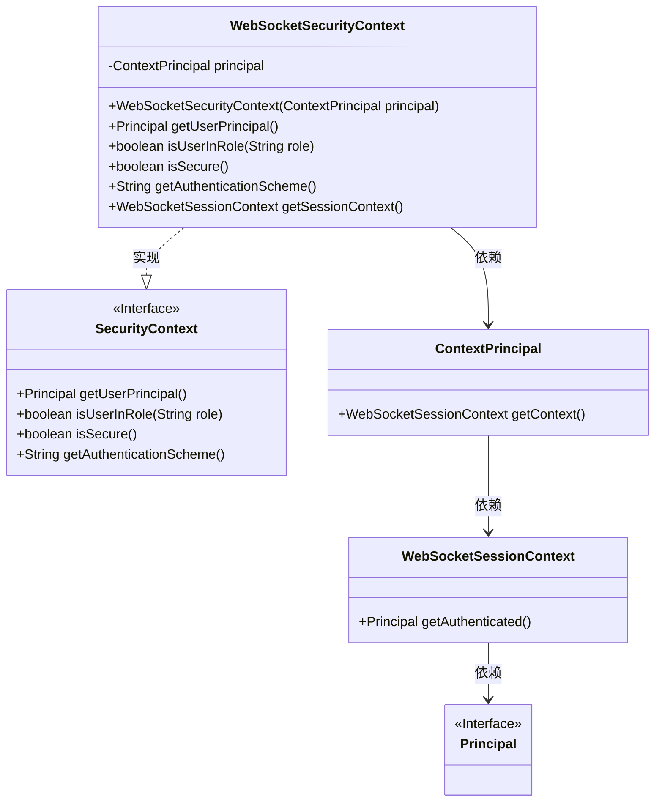
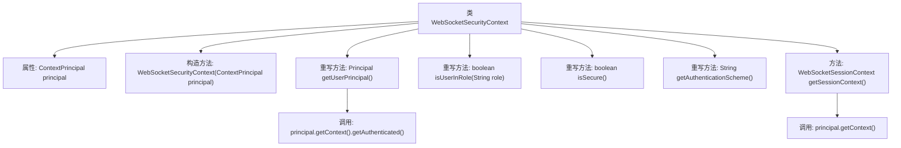

# 基础信息

|      |      |
|------|------|
| 名称 | WebSocketSecurityContext |
| 编码语言 | .java |
| 代码路径 | Signal-Server/websocket-resources/src/main/java/org/whispersystems/websocket/WebSocketSecurityContext.java |
| 包名 | org.whispersystems.websocket |
| 依赖项 | ['jakarta.ws.rs.core.SecurityContext', 'java.security.Principal', 'org.whispersystems.websocket.session.ContextPrincipal', 'org.whispersystems.websocket.session.WebSocketSessionContext'] |
| 概述说明 | WebSocketSecurityContext实现用户认证和会话管理。 |

# 说明

WebSocketSecurityContext实现了SecurityContext接口，负责管理用户认证和会话上下文。它确保在WebSocket通信中，用户身份和会话状态得到有效维护和安全控制。

# 类列表 Class Summary

| 名称   | 类型  | 说明 |
|-------|------|-------------|
| WebSocketSecurityContext | class | WebSocketSecurityContext实现SecurityContext，管理用户认证和会话上下文。 |

## 类 WebSocketSecurityContext

|      |      |
|------|------|
| 访问范围 | public |
| 类型 | class |
| 名称 | WebSocketSecurityContext |
| 说明 | WebSocketSecurityContext实现SecurityContext，管理用户认证和会话上下文。 |

### UML类图

这段代码描述了一个 `WebSocketSecurityContext` 类，它实现了 `SecurityContext` 接口。`WebSocketSecurityContext` 通过 `ContextPrincipal` 类获取用户身份验证信息，并提供了获取用户主体、判断用户角色、判断安全性和获取认证方案的方法。`ContextPrincipal` 类进一步依赖于 `WebSocketSessionContext` 类来获取已认证的用户主体。整体结构展示了类之间的依赖关系和接口的实现关系。

### 内部方法调用关系图

这段代码定义了一个名为`WebSocketSecurityContext`的类，实现了`SecurityContext`接口。该类包含一个`ContextPrincipal`类型的属性`principal`，并通过构造方法进行初始化。类中重写了`getUserPrincipal`、`isUserInRole`、`isSecure`和`getAuthenticationScheme`方法，分别用于获取用户主体、检查用户角色、判断安全性和获取认证方案。此外，类中还定义了一个`getSessionContext`方法，用于获取会话上下文。流程图中清晰地展示了类的结构和方法之间的调用关系。

### 字段列表 Field List

| 名称  | 类型  | 说明 |
|-------|-------|------|
| principal | ContextPrincipal | 定义私有不可变上下文主体变量principal。 |

### 方法列表 Method List

| 名称  | 类型  | 说明 |
|-------|-------|------|
| isSecure | boolean | 检查principal是否为空，返回布尔值表示安全性。 |
| getUserPrincipal | Principal | 该方法返回当前认证用户的主体对象。 |
| isUserInRole | boolean | 该方法始终返回false，表示用户不在指定角色中。 |
| getAuthenticationScheme | String | 重写getAuthenticationScheme方法，返回null。 |
| getSessionContext | WebSocketSessionContext | 获取WebSocket会话上下文。 |

