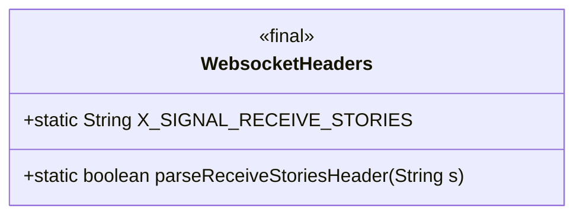
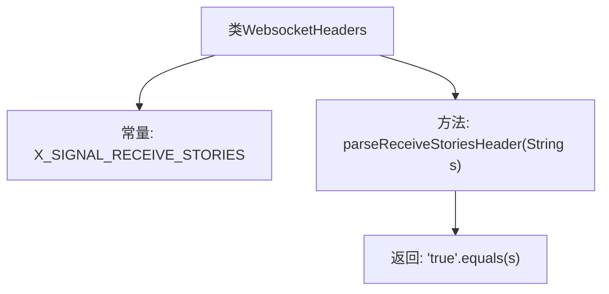

# 基础信息

|      |      |
|------|------|
| 名称 | WebsocketHeaders |
| 编码语言 | .java |
| 代码路径 | Signal-Server/websocket-resources/src/main/java/org/whispersystems/websocket/WebsocketHeaders.java |
| 包名 | org.whispersystems.websocket |
| 依赖项 | [] |
| 概述说明 | WebsocketHeaders类负责解析故事信号头。 |

# 说明

WebsocketHeaders类主要负责处理与接收故事信号相关的头信息，并提供了相应的解析方法。该类专注于解析和管理WebSocket通信中的头数据，确保信号能够被正确识别和处理。通过这一功能，系统能够有效地处理和响应来自WebSocket的特定信号。

# 类列表 Class Summary

| 名称   | 类型  | 说明 |
|-------|------|-------------|
| WebsocketHeaders | class | WebsocketHeaders类包含接收故事信号头及其解析方法。 |

## 类 WebsocketHeaders

|      |      |
|------|------|
| 访问范围 | public |
| 类型 | class |
| 名称 | WebsocketHeaders |
| 说明 | WebsocketHeaders类包含接收故事信号头及其解析方法。 |

### UML类图

这段代码定义了一个名为 `WebsocketHeaders` 的类，其中包含一个静态常量 `X_SIGNAL_RECEIVE_STORIES` 和一个静态方法 `parseReceiveStoriesHeader`。`X_SIGNAL_RECEIVE_STORIES` 是一个字符串常量，用于表示WebSocket头部的特定字段。`parseReceiveStoriesHeader` 方法用于解析传入的字符串参数，判断其是否等于 `"true"`，并返回相应的布尔值。该类主要用于处理WebSocket消息头部的特定逻辑。

### 内部方法调用关系图

这段代码定义了一个名为 `WebsocketHeaders` 的类，其中包含一个常量 `X_SIGNAL_RECEIVE_STORIES` 和一个静态方法 `parseReceiveStoriesHeader`。方法 `parseReceiveStoriesHeader` 接收一个字符串参数 `s`，并返回 `"true".equals(s)` 的结果，即判断传入的字符串是否等于 `"true"`。流程图清晰地展示了类的结构和方法的调用关系。

### 字段列表 Field List

| 名称  | 类型  | 说明 |
|-------|-------|------|
| X_SIGNAL_RECEIVE_STORIES = "X-Signal-Receive-Stories" | String | 常量X_SIGNAL_RECEIVE_STORIES用于接收故事信号。 |

### 方法列表 Method List

| 名称  | 类型  | 说明 |
|-------|-------|------|
| parseReceiveStoriesHeader | boolean | 该方法检查字符串s是否等于"true"，返回布尔值。 |

