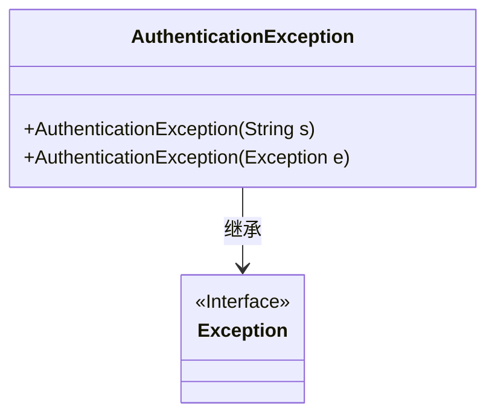
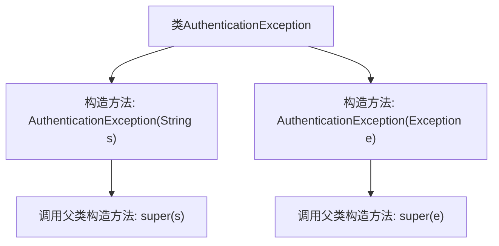

# 基础信息

|      |      |
|------|------|
| 名称 | AuthenticationException |
| 编码语言 | .java |
| 代码路径 | Signal-Server/websocket-resources/src/main/java/org/whispersystems/websocket/auth/AuthenticationException.java |
| 包名 | org.whispersystems.websocket.auth |
| 依赖项 | [] |
| 概述说明 | AuthenticationException继承Exception，提供字符串和异常处理的构造函数。 |

# 说明

AuthenticationException继承自Exception类，提供了两种构造函数来处理不同的异常情况。第一种构造函数接受一个字符串参数，用于描述异常的具体信息。第二种构造函数接受一个异常对象作为参数，允许将其他异常封装到AuthenticationException中。这两种构造函数使得开发者能够灵活地处理与身份验证相关的异常，并能够根据需要传递详细的错误信息或捕获的异常。

# 类列表 Class Summary

| 名称   | 类型  | 说明 |
|-------|------|-------------|
| AuthenticationException | class | AuthenticationException继承Exception，提供两种构造函数处理字符串和异常。 |

## 类 AuthenticationException

|      |      |
|------|------|
| 访问范围 | public |
| 类型 | class |
| 名称 | AuthenticationException |
| 说明 | AuthenticationException继承Exception，提供两种构造函数处理字符串和异常。 |

### UML类图

这段代码定义了一个名为 `AuthenticationException` 的类，它继承自 `Exception` 类。`AuthenticationException` 类有两个构造函数：一个接受 `String` 类型的参数，另一个接受 `Exception` 类型的参数。这两个构造函数都调用了父类 `Exception` 的构造函数。`AuthenticationException` 类用于处理认证过程中可能出现的异常情况，提供了两种不同的异常构造方式，便于在抛出异常时传递具体的错误信息或捕获的异常对象。

### 内部方法调用关系图

这段代码定义了一个名为`AuthenticationException`的异常类，它继承自`Exception`类。该类包含两个构造方法：一个接受`String`类型的参数，另一个接受`Exception`类型的参数。每个构造方法都调用了父类的相应构造方法，以便初始化异常对象。这个类的主要作用是封装与身份验证相关的异常信息，以便在程序中更清晰地处理这些异常情况。

### 字段列表 Field List

| 名称  | 类型  | 说明 |
|-------|-------|------|

### 方法列表 Method List

| 名称  | 类型  | 说明 |
|-------|-------|------|

