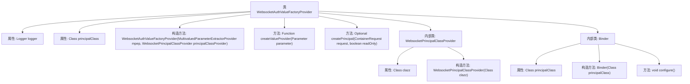

# 基础信息

|      |      |
|------|------|
| 名称 | WebsocketAuthValueFactoryProvider |
| 编码语言 | .java |
| 代码路径 | Signal-Server/websocket-resources/src/main/java/org/whispersystems/websocket/auth/WebsocketAuthValueFactoryProvider.java |
| 包名 | org.whispersystems.websocket.auth |
| 依赖项 | ['io.dropwizard.auth.Auth', 'jakarta.inject.Inject', 'jakarta.inject.Singleton', 'jakarta.ws.rs.WebApplicationException', 'java.lang.reflect.ParameterizedType', 'java.security.Principal', 'java.util.Optional', 'java.util.function.Function', 'javax.annotation.Nullable', 'org.glassfish.jersey.internal.inject.AbstractBinder', 'org.glassfish.jersey.server.ContainerRequest', 'org.glassfish.jersey.server.internal.inject.AbstractValueParamProvider', 'org.glassfish.jersey.server.internal.inject.MultivaluedParameterExtractorProvider', 'org.glassfish.jersey.server.model.Parameter', 'org.glassfish.jersey.server.spi.internal.ValueParamProvider', 'org.slf4j.Logger', 'org.slf4j.LoggerFactory', 'org.whispersystems.websocket.ReusableAuth', 'org.whispersystems.websocket.WebSocketResourceProvider'] |
| 概述说明 | WebsocketAuthValueFactoryProvider类处理WebSocket认证，支持Principal注入和读写模式。 |

# 说明

WebsocketAuthValueFactoryProvider类专门用于处理WebSocket认证，其主要功能是提供Principal注入支持，能够适应只读和可写两种模式。

# 类列表 Class Summary

| 名称   | 类型  | 说明 |
|-------|------|-------------|
| WebsocketAuthValueFactoryProvider | class | WebsocketAuthValueFactoryProvider类用于处理WebSocket认证，提供Principal注入功能，支持只读和可写模式。 |


## 类 WebsocketAuthValueFactoryProvider

|      |      |
|------|------|
| 访问范围 | @Singleton;public |
| 类型 | class |
| 名称 | WebsocketAuthValueFactoryProvider |
| 说明 | WebsocketAuthValueFactoryProvider类用于处理WebSocket认证，提供Principal注入功能，支持只读和可写模式。 |


### UML类图

```mermaid
classDiagram
    class WebsocketAuthValueFactoryProvider~T~ {
        -Logger logger
        -Class~T~ principalClass
        +WebsocketAuthValueFactoryProvider(MultivaluedParameterExtractorProvider mpep, WebsocketPrincipalClassProvider~T~ principalClassProvider)
        +Function~ContainerRequest, ?~ createValueProvider(Parameter parameter)
        -Optional~? extends Principal~ createPrincipal(ContainerRequest request, boolean readOnly)
    }

    class WebsocketPrincipalClassProvider~T~ {
        -Class~T~ clazz
        +WebsocketPrincipalClassProvider(Class~T~ clazz)
    }

    class Binder~T~ {
        -Class~T~ principalClass
        +Binder(Class~T~ principalClass)
        +void configure()
    }

    WebsocketAuthValueFactoryProvider --> WebsocketPrincipalClassProvider : 依赖
    Binder --> WebsocketPrincipalClassProvider : 依赖
    Binder --> WebsocketAuthValueFactoryProvider : 依赖

    <<Interface>> ValueParamProvider
    WebsocketAuthValueFactoryProvider ..|> ValueParamProvider : 实现
```

这段代码展示了一个用于WebSocket认证的值工厂提供者类 `WebsocketAuthValueFactoryProvider`，它继承自 `AbstractValueParamProvider`，并实现了 `ValueParamProvider` 接口。该类通过 `WebsocketPrincipalClassProvider` 获取 `Principal` 类的类型，并在 `createValueProvider` 方法中根据参数类型创建相应的认证提供者。`Binder` 类用于依赖注入，绑定 `WebsocketPrincipalClassProvider` 和 `WebsocketAuthValueFactoryProvider`。整体设计用于处理WebSocket请求中的认证逻辑，确保请求的安全性和正确性。


### 内部方法调用关系图



该流程图展示了`WebsocketAuthValueFactoryProvider`类的结构及其内部类`WebsocketPrincipalClassProvider`和`Binder`的关系。`WebsocketAuthValueFactoryProvider`类包含日志记录器、主要类属性、构造方法和两个关键方法`createValueProvider`和`createPrincipal`。内部类`WebsocketPrincipalClassProvider`用于提供主要类的实例，而`Binder`类用于配置依赖注入。流程图清晰地展示了类与内部类之间的层次关系和属性、方法的调用路径。

### 字段列表 Field List

| 名称  | 类型  | 说明 |
|-------|-------|------|
| principalClass | Class<T> | 私有成员变量，存储泛型类T的Class对象。 |
| logger = LoggerFactory.getLogger(WebsocketAuthValueFactoryProvider.class) | Logger | WebsocketAuthValueFactoryProvider类中定义了一个私有的静态Logger实例。 |

### 方法列表 Method List

| 名称  | 类型  | 说明 |
|-------|-------|------|
| createPrincipal | Optional<? extends Principal> | 根据请求创建Principal，检查可重用认证属性，返回只读或可变引用。 |
| createValueProvider | Function<ContainerRequest, ?> | 根据参数类型创建身份验证提供者，处理只读和可选类型，否则抛出异常。 |


