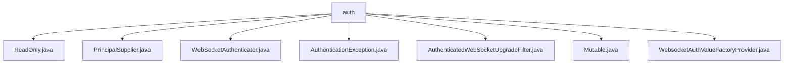

# 基础信息

|      |      |
|------|------|
| 名称 | auth |
| 编码语言 | .java |
| 代码路径 | Signal-Server/websocket-resources/src/main/java/org/whispersystems/websocket/auth |
| 包名 | Signal-Server.websocket-resources.src.main.java.org.whispersystems.websocket.auth |
| 概述说明 | WebSocket认证类处理身份验证异常和Principal注入，支持只读和可写模式。 |

# 说明

## 概述

该代码模块主要围绕WebSocket的身份验证机制展开，提供了多种工具和类来处理WebSocket连接中的认证流程。模块中包含多个类，分别负责不同的功能，如异常处理、Principal的注入、认证过滤器等。通过这些类的协作，模块能够灵活地处理WebSocket连接中的身份验证需求，并支持只读和可写两种模式。

## 主要业务场景

1. **身份验证异常处理**：`AuthenticationException`类用于处理与身份验证相关的异常情况。它提供了两种构造函数，允许开发者传递详细的错误信息或捕获其他异常，从而灵活地处理认证过程中可能出现的错误。

2. **Principal注入支持**：`WebsocketAuthValueFactoryProvider`类专门用于处理WebSocket认证中的Principal注入，支持只读和可写两种模式。这使得模块能够适应不同的业务需求，确保在认证过程中正确地注入Principal对象。

3. **WebSocket认证过滤器**：`AuthenticatedWebSocketUpgradeFilter`类（尽管具体内容未提供，但从名称推断）可能负责在WebSocket升级过程中进行身份验证，确保只有经过认证的连接才能成功升级为WebSocket连接。

4. **认证接口与实现**：`WebSocketAuthenticator`类（尽管具体内容未提供，但从名称推断）可能定义了WebSocket认证的核心逻辑，负责验证连接的身份信息，并根据验证结果决定是否允许连接继续。

5. **只读与可变标记**：`ReadOnly`和`Mutable`类（尽管具体内容未提供，但从名称推断）可能用于标记某些对象或操作是只读的还是可变的，从而在认证过程中提供额外的控制。

通过这些功能，该模块能够为WebSocket连接提供一套完整的身份验证解决方案，确保连接的安全性和可靠性。

### 包内部结构视图

该流程图展示了`Signal-Server`项目中`websocket-resources`模块下的`auth`文件夹及其包含的所有文件。`auth`文件夹作为根节点，包含了多个与WebSocket认证相关的Java文件，如`ReadOnly.java`、`PrincipalSupplier.java`等。这些文件直接隶属于`auth`文件夹，展示了该模块的核心认证功能。

# 文件列表 File List

| 名称   | 类型  | 说明 |
|-------|------|-------------|
| [WebsocketAuthValueFactoryProvider.java](WebsocketAuthValueFactoryProvider.md) | file | WebsocketAuthValueFactoryProvider类处理WebSocket认证，支持Principal注入和读写模式。 |
| [Mutable.java](Mutable.md) | file | 信息为空，无法生成概要描述。 |
| [WebSocketAuthenticator.java](WebSocketAuthenticator.md) | file | 信息为空，无法生成概要描述。 |
| [PrincipalSupplier.java](PrincipalSupplier.md) | file | 内容为空，无法生成概要描述。 |
| [AuthenticatedWebSocketUpgradeFilter.java](AuthenticatedWebSocketUpgradeFilter.md) | file | 无内容提供，无法生成概要描述。 |
| [AuthenticationException.java](AuthenticationException.md) | file | AuthenticationException继承Exception，提供字符串和异常处理的构造函数。 |
| [ReadOnly.java](ReadOnly.md) | file | 输入内容为空，请提供具体信息以便生成概要描述。 |

