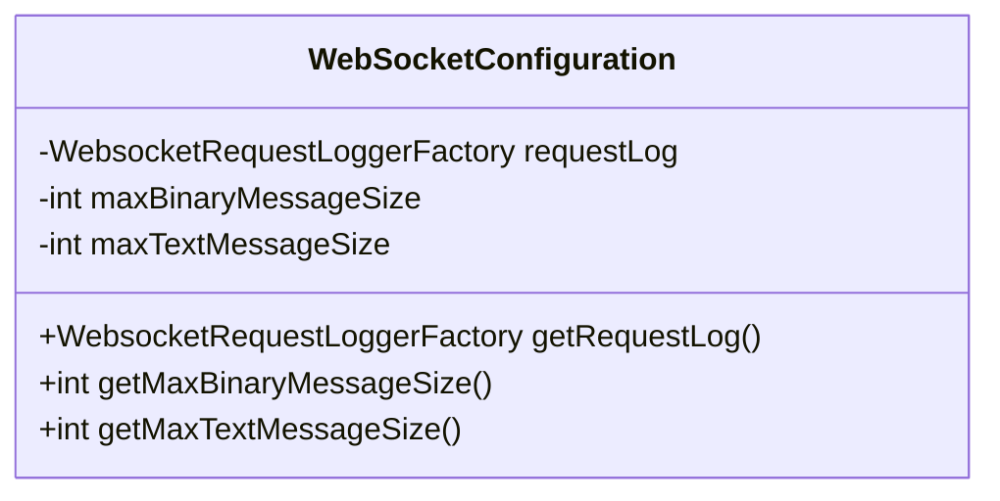
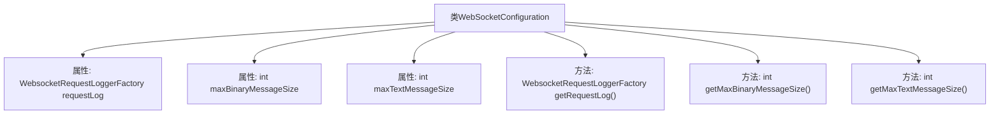

# 基础信息

|      |      |
|------|------|
| 名称 | WebSocketConfiguration |
| 编码语言 | .java |
| 代码路径 | Signal-Server/websocket-resources/src/main/java/org/whispersystems/websocket/configuration/WebSocketConfiguration.java |
| 包名 | org.whispersystems.websocket.configuration |
| 依赖项 | ['com.fasterxml.jackson.annotation.JsonProperty', 'jakarta.validation.Valid', 'jakarta.validation.constraints.Max', 'jakarta.validation.constraints.Min', 'jakarta.validation.constraints.NotNull', 'org.whispersystems.websocket.logging.WebsocketRequestLoggerFactory'] |
| 概述说明 | WebSocket配置类包含请求日志工厂和消息大小限制。 |

# 说明

WebSocket配置类主要用于管理和配置WebSocket的相关参数，包含请求日志工厂和消息大小限制两个关键功能。请求日志工厂用于记录和处理WebSocket请求的日志信息，便于监控和调试。消息大小限制则用于控制WebSocket传输消息的最大尺寸，确保系统性能和稳定性。

# 类列表 Class Summary

| 名称   | 类型  | 说明 |
|-------|------|-------------|
| WebSocketConfiguration | class | WebSocket配置类，包含请求日志工厂和消息大小限制。 |

## 类 WebSocketConfiguration

|      |      |
|------|------|
| 访问范围 | public |
| 类型 | class |
| 名称 | WebSocketConfiguration |
| 说明 | WebSocket配置类，包含请求日志工厂和消息大小限制。 |

### UML类图

这段代码定义了一个 `WebSocketConfiguration` 类，用于配置 WebSocket 的相关参数。类中包含三个私有成员变量：`requestLog`、`maxBinaryMessageSize` 和 `maxTextMessageSize`，分别用于记录请求日志、设置二进制消息的最大大小和文本消息的最大大小。类提供了三个公有方法，用于获取这些配置值。代码通过注解对变量进行了校验和序列化配置，确保其值在合理范围内。

### 内部方法调用关系图

这段代码定义了一个名为 `WebSocketConfiguration` 的类，主要用于配置 WebSocket 的相关参数。类中包含三个属性：`requestLog` 用于记录 WebSocket 请求日志，`maxBinaryMessageSize` 和 `maxTextMessageSize` 分别用于设置二进制消息和文本消息的最大大小。每个属性都有相应的 getter 方法，用于获取属性的值。代码通过注解对属性进行了验证和约束，确保它们的值在合理范围内。

### 字段列表 Field List

| 名称  | 类型  | 说明 |
|-------|-------|------|
| maxBinaryMessageSize = 512 * 1024 | int | 最大二进制消息大小设为512KB，上限10MB。 |
| requestLog = new WebsocketRequestLoggerFactory() | WebsocketRequestLoggerFactory | Websocket请求日志工厂实例化并标注为非空和有效。 |
| maxTextMessageSize = 512 * 1024 | int | 最大文本消息大小范围为512KB至10MB。 |

### 方法列表 Method List

| 名称  | 类型  | 说明 |
|-------|-------|------|
| getMaxTextMessageSize | int | 获取最大文本消息大小的方法。 |
| getMaxBinaryMessageSize | int | 获取最大二进制消息大小的方法。 |
| getRequestLog | WebsocketRequestLoggerFactory | 获取Websocket请求日志工厂实例的方法。 |

