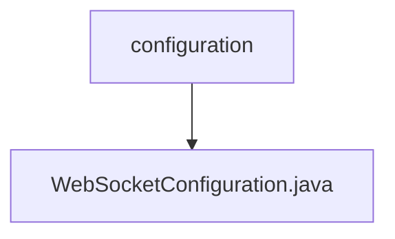

# 基础信息

|      |      |
|------|------|
| 名称 | configuration |
| 编码语言 | .java |
| 代码路径 | Signal-Server/websocket-resources/src/main/java/org/whispersystems/websocket/configuration |
| 包名 | Signal-Server.websocket-resources.src.main.java.org.whispersystems.websocket.configuration |
| 概述说明 | WebSocket配置类包含请求日志工厂和消息大小限制。 |

# 说明

WebSocket配置类主要用于管理和配置WebSocket的相关参数，包含请求日志工厂和消息大小限制两个关键功能。请求日志工厂用于记录和处理WebSocket请求的日志信息，便于监控和调试。消息大小限制则用于控制WebSocket传输消息的最大尺寸，确保系统性能和稳定性。

### 包内部结构视图

该流程图展示了Signal-Server项目中WebSocket配置模块的层级关系。`configuration`文件夹下包含一个名为`WebSocketConfiguration.java`的配置文件。这种结构清晰地反映了配置文件的组织方式，便于开发人员快速定位和管理相关资源。

# 文件列表 File List

| 名称   | 类型  | 说明 |
|-------|------|-------------|
| [WebSocketConfiguration.java](WebSocketConfiguration.md) | file | WebSocket配置类包含请求日志工厂和消息大小限制。 |

