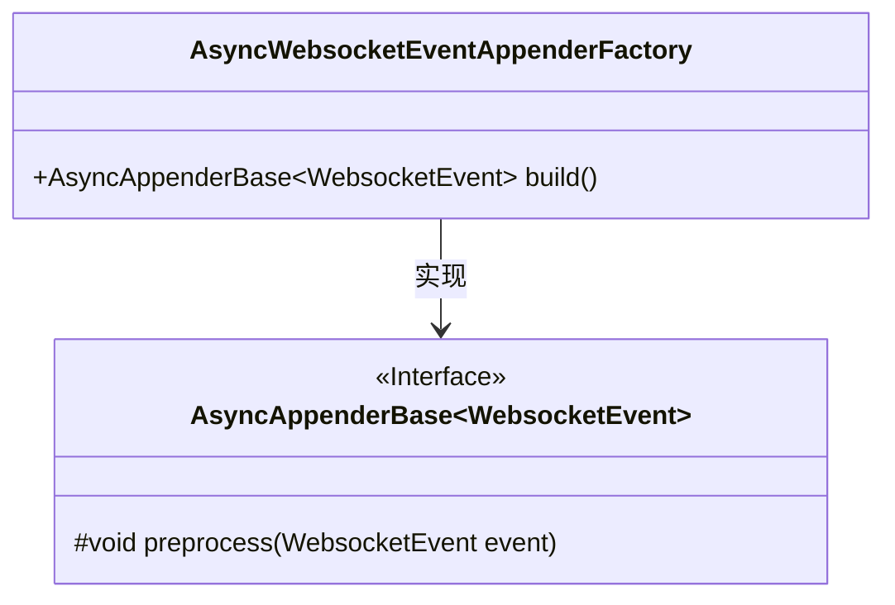
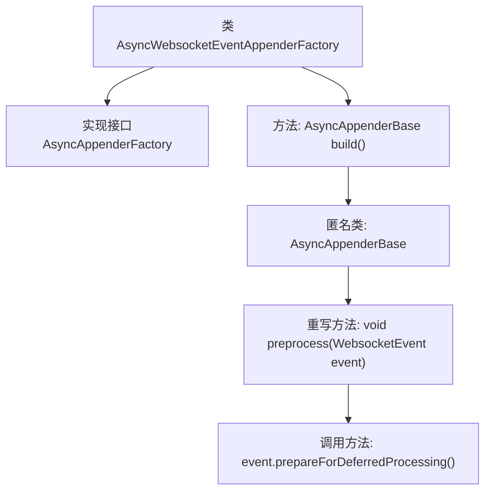

# 基础信息

|      |      |
|------|------|
| 名称 | AsyncWebsocketEventAppenderFactory |
| 编码语言 | .java |
| 代码路径 | Signal-Server/websocket-resources/src/main/java/org/whispersystems/websocket/logging/AsyncWebsocketEventAppenderFactory.java |
| 包名 | org.whispersystems.websocket.logging |
| 依赖项 | ['ch.qos.logback.core.AsyncAppenderBase', 'io.dropwizard.logging.common.async.AsyncAppenderFactory'] |
| 概述说明 | AsyncWebsocketEventAppenderFactory实现接口，构建实例并预处理WebsocketEvent。 |

# 说明

AsyncWebsocketEventAppenderFactory实现了AsyncAppenderFactory接口，其主要功能是构建AsyncAppenderBase实例，并对WebsocketEvent进行预处理。该工厂类通过实现接口方法，确保能够创建并初始化AsyncAppenderBase对象，同时处理与WebsocketEvent相关的数据，以便在异步日志记录过程中正确使用这些事件。

# 类列表 Class Summary

| 名称   | 类型  | 说明 |
|-------|------|-------------|
| AsyncWebsocketEventAppenderFactory | class | AsyncWebsocketEventAppenderFactory实现AsyncAppenderFactory接口，构建AsyncAppenderBase实例并预处理WebsocketEvent。 |

## 类 AsyncWebsocketEventAppenderFactory

|      |      |
|------|------|
| 访问范围 | public |
| 类型 | class |
| 名称 | AsyncWebsocketEventAppenderFactory |
| 说明 | AsyncWebsocketEventAppenderFactory实现AsyncAppenderFactory接口，构建AsyncAppenderBase实例并预处理WebsocketEvent。 |

### UML类图

这段代码定义了一个 `AsyncWebsocketEventAppenderFactory` 类，它实现了 `AsyncAppenderFactory<WebsocketEvent>` 接口。`AsyncWebsocketEventAppenderFactory` 类的 `build` 方法返回一个 `AsyncAppenderBase<WebsocketEvent>` 的匿名子类，该子类重写了 `preprocess` 方法，用于预处理 `WebsocketEvent` 对象。类图中展示了 `AsyncWebsocketEventAppenderFactory` 与 `AsyncAppenderBase` 之间的实现关系，并明确了 `AsyncAppenderBase` 是一个接口，包含一个受保护的 `preprocess` 方法。

### 内部方法调用关系图

这段代码定义了一个名为 `AsyncWebsocketEventAppenderFactory` 的类，它实现了 `AsyncAppenderFactory<WebsocketEvent>` 接口。该类包含一个 `build()` 方法，返回一个 `AsyncAppenderBase<WebsocketEvent>` 的匿名子类。在这个匿名子类中，重写了 `preprocess(WebsocketEvent event)` 方法，并在其中调用了 `event.prepareForDeferredProcessing()` 方法。流程图清晰地展示了类与方法的层级关系以及方法之间的调用顺序。

### 字段列表 Field List

| 名称  | 类型  | 说明 |
|-------|-------|------|

### 方法列表 Method List

| 名称  | 类型  | 说明 |
|-------|-------|------|
| build | AsyncAppenderBase<WebsocketEvent> | 构建异步追加器，预处理WebsocketEvent。 |

