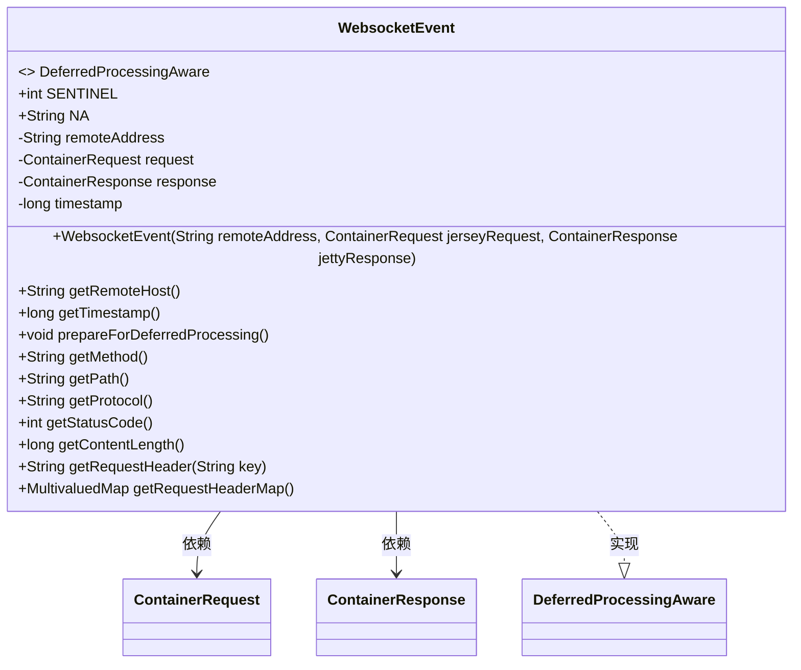

# 基础信息

|      |      |
|------|------|
| 名称 | WebsocketEvent |
| 编码语言 | .java |
| 代码路径 | Signal-Server/websocket-resources/src/main/java/org/whispersystems/websocket/logging/WebsocketEvent.java |
| 包名 | org.whispersystems.websocket.logging |
| 依赖项 | ['ch.qos.logback.core.spi.DeferredProcessingAware', 'jakarta.ws.rs.core.MultivaluedMap', 'java.util.List', 'org.glassfish.jersey.server.ContainerRequest', 'org.glassfish.jersey.server.ContainerResponse'] |
| 概述说明 | WebsocketEvent类记录远程地址、请求、响应和时间戳，提供获取请求方法、路径、协议、状态码、内容长度和请求头的方法。 |

# 说明

WebsocketEvent类用于记录与WebSocket通信相关的详细信息，包括远程地址、请求、响应以及时间戳。该类提供了一系列方法，用于获取请求的具体信息，如请求方法、路径、协议、状态码、内容长度以及请求头。通过这些方法，开发者可以方便地访问和分析WebSocket通信中的关键数据，从而更好地监控和调试网络交互。

# 类列表 Class Summary

| 名称   | 类型  | 说明 |
|-------|------|-------------|
| WebsocketEvent | class | WebsocketEvent类记录远程地址、请求、响应和时间戳，提供获取请求方法、路径、协议、状态码、内容长度和请求头的方法。 |

## 类 WebsocketEvent

|      |      |
|------|------|
| 访问范围 | public |
| 类型 | class |
| 名称 | WebsocketEvent |
| 说明 | WebsocketEvent类记录远程地址、请求、响应和时间戳，提供获取请求方法、路径、协议、状态码、内容长度和请求头的方法。 |

### UML类图

这段代码定义了一个 `WebsocketEvent` 类，该类实现了 `DeferredProcessingAware` 接口。`WebsocketEvent` 类用于封装与 WebSocket 事件相关的信息，包括远程地址、请求、响应和时间戳等。类中提供了多个方法来获取请求的详细信息，如请求方法、路径、协议、状态码、内容长度以及请求头等。`ContainerRequest` 和 `ContainerResponse` 是 `WebsocketEvent` 类的依赖项，分别用于处理请求和响应的详细信息。

### 内部方法调用关系图

```mermaid
graph TD
    A["类WebsocketEvent"]
    B["常量: int SENTINEL = -1"]
    C["常量: String NA = '-'"]
    D["属性: String remoteAddress"]
    E["属性: ContainerRequest request"]
    F["属性: ContainerResponse response"]
    G["属性: long timestamp"]
    H["构造方法: WebsocketEvent(String remoteAddress, ContainerRequest jerseyRequest, ContainerResponse jettyResponse)"]
    I["方法: String getRemoteHost()"]
    J["方法: long getTimestamp()"]
    K["重写方法: void prepareForDeferredProcessing()"]
    L["方法: String getMethod()"]
    M["方法: String getPath()"]
    N["方法: String getProtocol()"]
    O["方法: int getStatusCode()"]
    P["方法: long getContentLength()"]
    Q["方法: String getRequestHeader(String key)"]
    R["方法: MultivaluedMap<String, String> getRequestHeaderMap()"]

    A --> B
    A --> C
    A --> D
    A --> E
    A --> F
    A --> G
    A --> H
    A --> I
    A --> J
    A --> K
    A --> L
    A --> M
    A --> N
    A --> O
    A --> P
    A --> Q
    A --> R
```

这段代码定义了一个名为`WebsocketEvent`的类，该类实现了`DeferredProcessingAware`接口。类中包含了一些常量、属性、构造方法以及多个用于获取请求和响应信息的方法。构造方法用于初始化类的属性，其他方法则用于获取远程地址、时间戳、请求方法、路径、协议、状态码、内容长度以及请求头等信息。流程图展示了类中各部分的关系和调用顺序。

### 字段列表 Field List

| 名称  | 类型  | 说明 |
|-------|-------|------|
| SENTINEL = -1 | int | 定义了一个静态常量SENTINEL，值为-1。 |
| request | ContainerRequest | 私有且不可变的容器请求对象。 |
| remoteAddress | String | 私有字符串变量remoteAddress用于存储远程地址。 |
| NA       = "-" | String | 定义常量NA为"-"，表示缺失值。 |
| timestamp | long | 声明一个私有不可变的长整型时间戳变量。 |
| response | ContainerResponse | 私有且不可变的容器响应对象。 |

### 方法列表 Method List

| 名称  | 类型  | 说明 |
|-------|-------|------|
| getStatusCode | int | 获取响应状态码的方法。 |
| getTimestamp | long | 获取时间戳的方法。 |
| getContentLength | long | 获取响应内容长度的方法。 |
| getProtocol | String | 该方法返回字符串"WS"，表示协议类型。 |
| getMethod | String | 获取请求方法的Java代码片段。 |
| getRequestHeaderMap | MultivaluedMap<String, String> | 获取请求头信息的MultivaluedMap。 |
| prepareForDeferredProcessing | void | 重写prepareForDeferredProcessing方法，内容为空。 |
| getPath | String | 获取请求路径，结合基础URI和当前路径。 |
| getRequestHeader | String | 获取请求头中指定键的首个值，若无则返回NA。 |
| getRemoteHost | String | 获取远程主机地址的方法。 |

