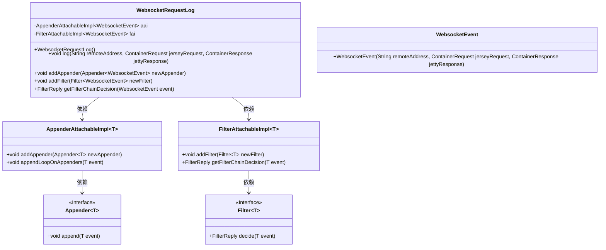
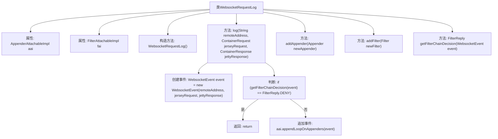

# 基础信息

|      |      |
|------|------|
| 名称 | WebsocketRequestLog |
| 编码语言 | .java |
| 代码路径 | Signal-Server/websocket-resources/src/main/java/org/whispersystems/websocket/logging/WebsocketRequestLog.java |
| 包名 | org.whispersystems.websocket.logging |
| 依赖项 | ['org.glassfish.jersey.server.ContainerRequest', 'org.glassfish.jersey.server.ContainerResponse', 'ch.qos.logback.core.Appender', 'ch.qos.logback.core.filter.Filter', 'ch.qos.logback.core.spi.AppenderAttachableImpl', 'ch.qos.logback.core.spi.FilterAttachableImpl', 'ch.qos.logback.core.spi.FilterReply'] |
| 概述说明 | WebsocketRequestLog类记录Websocket事件，支持过滤器和追加器功能。 |

# 说明

WebsocketRequestLog类用于记录Websocket事件，具备添加过滤器和追加器的功能，以便对事件进行筛选和扩展记录内容。

# 类列表 Class Summary

| 名称   | 类型  | 说明 |
|-------|------|-------------|
| WebsocketRequestLog | class | WebsocketRequestLog类记录Websocket事件，支持添加过滤器和追加器。 |

## 类 WebsocketRequestLog

|      |      |
|------|------|
| 访问范围 | public |
| 类型 | class |
| 名称 | WebsocketRequestLog |
| 说明 | WebsocketRequestLog类记录Websocket事件，支持添加过滤器和追加器。 |

### UML类图

**描述：**
`WebsocketRequestLog` 类用于记录WebSocket请求日志，包含添加日志附加器（Appender）和过滤器（Filter）的功能。它依赖于 `AppenderAttachableImpl` 和 `FilterAttachableImpl` 来管理日志附加器和过滤器。`AppenderAttachableImpl` 和 `FilterAttachableImpl` 分别实现了对 `Appender` 和 `Filter` 接口的管理。`WebsocketEvent` 类用于封装WebSocket事件的相关信息。

### 内部方法调用关系图

这段代码描述了一个`WebsocketRequestLog`类，主要用于记录WebSocket请求的日志。它包含两个核心属性`aai`和`fai`，分别用于处理日志追加和过滤。`log`方法用于创建日志事件并根据过滤链决定是否记录日志。`addAppender`和`addFilter`方法分别用于添加日志追加器和过滤器。`getFilterChainDecision`方法用于获取过滤链的决策结果。

### 字段列表 Field List

| 名称  | 类型  | 说明 |
|-------|-------|------|
| aai = new AppenderAttachableImpl<>() | AppenderAttachableImpl<WebsocketEvent> | 私有变量aai初始化为WebsocketEvent类型的AppenderAttachableImpl实例。 |
| fai = new FilterAttachableImpl<>() | FilterAttachableImpl<WebsocketEvent> | 私有成员fai初始化为FilterAttachableImpl泛型类实例。 |

### 方法列表 Method List

| 名称  | 类型  | 说明 |
|-------|-------|------|
| getFilterChainDecision | FilterReply | 方法获取WebsocketEvent的过滤链决策。 |
| addFilter | void | 方法addFilter用于添加WebsocketEvent类型的新过滤器。 |
| log | void | 记录WebSocket事件，根据过滤链决定是否拒绝，否则追加到日志。 |
| addAppender | void | 为WebsocketEvent添加新的Appender。 |

