# 基础信息

|      |      |
|------|------|
| 名称 | WebsocketRequestLoggerFactory |
| 编码语言 | .java |
| 代码路径 | Signal-Server/websocket-resources/src/main/java/org/whispersystems/websocket/logging/WebsocketRequestLoggerFactory.java |
| 包名 | org.whispersystems.websocket.logging |
| 依赖项 | ['ch.qos.logback.classic.Logger', 'ch.qos.logback.classic.LoggerContext', 'com.google.common.annotations.VisibleForTesting', 'io.dropwizard.logging.common.AppenderFactory', 'io.dropwizard.logging.common.ConsoleAppenderFactory', 'io.dropwizard.logging.common.async.AsyncAppenderFactory', 'io.dropwizard.logging.common.filter.LevelFilterFactory', 'io.dropwizard.logging.common.filter.NullLevelFilterFactory', 'io.dropwizard.logging.common.layout.LayoutFactory', 'jakarta.validation.Valid', 'jakarta.validation.constraints.NotNull', 'java.util.Collections', 'java.util.List', 'org.slf4j.LoggerFactory', 'org.whispersystems.websocket.logging.layout.WebsocketEventLayoutFactory'] |
| 概述说明 | WebsocketRequestLoggerFactory类提供日志输出、过滤器和异步处理功能。 |

# 说明

WebsocketRequestLoggerFactory类专门用于构建Websocket请求日志，提供日志输出、过滤器和异步处理等功能，确保日志记录的高效性和灵活性。

# 类列表 Class Summary

| 名称   | 类型  | 说明 |
|-------|------|-------------|
| WebsocketRequestLoggerFactory | class | WebsocketRequestLoggerFactory类用于构建Websocket请求日志，包含日志输出、过滤器和异步处理等功能。 |

## 类 WebsocketRequestLoggerFactory

|      |      |
|------|------|
| 访问范围 | public |
| 类型 | class |
| 名称 | WebsocketRequestLoggerFactory |
| 说明 | WebsocketRequestLoggerFactory类用于构建Websocket请求日志，包含日志输出、过滤器和异步处理等功能。 |

### UML类图

```mermaid
classDiagram
    class WebsocketRequestLoggerFactory {
        +List~AppenderFactory~WebsocketEvent~~ appenders
        +WebsocketRequestLog build(String name)
    }
    class Logger {
        +void setAdditive(boolean additive)
    }
    class LoggerContext {
    }
    class WebsocketRequestLog {
        +void addAppender(Appender~WebsocketEvent~ appender)
    }
    class LevelFilterFactory~T~ {
    }
    class NullLevelFilterFactory~T~ {
    }
    class AsyncAppenderFactory~T~ {
    }
    class AsyncWebsocketEventAppenderFactory {
    }
    class LayoutFactory~T~ {
    }
    class WebsocketEventLayoutFactory {
    }
    class AppenderFactory~T~ {
        +Appender~T~ build(LoggerContext context, String name, LayoutFactory~T~ layoutFactory, LevelFilterFactory~T~ levelFilterFactory, AsyncAppenderFactory~T~ asyncAppenderFactory)
    }
    class ConsoleAppenderFactory~T~ {
    }

    WebsocketRequestLoggerFactory --> Logger : 依赖
    WebsocketRequestLoggerFactory --> LoggerContext : 依赖
    WebsocketRequestLoggerFactory --> WebsocketRequestLog : 依赖
    WebsocketRequestLoggerFactory --> LevelFilterFactory~WebsocketEvent~ : 依赖
    WebsocketRequestLoggerFactory --> NullLevelFilterFactory~WebsocketEvent~ : 依赖
    WebsocketRequestLoggerFactory --> AsyncAppenderFactory~WebsocketEvent~ : 依赖
    WebsocketRequestLoggerFactory --> AsyncWebsocketEventAppenderFactory : 依赖
    WebsocketRequestLoggerFactory --> LayoutFactory~WebsocketEvent~ : 依赖
    WebsocketRequestLoggerFactory --> WebsocketEventLayoutFactory : 依赖
    WebsocketRequestLoggerFactory --> AppenderFactory~WebsocketEvent~ : 依赖
    WebsocketRequestLoggerFactory --> ConsoleAppenderFactory~WebsocketEvent~ : 依赖
    WebsocketRequestLog --> Appender~WebsocketEvent~ : 依赖
```

类图描述：  
`WebsocketRequestLoggerFactory` 是一个工厂类，用于构建 `WebsocketRequestLog` 对象。它依赖于多个工厂类（如 `LevelFilterFactory`、`AsyncAppenderFactory`、`LayoutFactory` 等）来创建日志记录器所需的组件。`WebsocketRequestLog` 类负责管理日志输出，并通过 `addAppender` 方法添加日志输出器。整个设计通过工厂模式解耦了日志记录器的创建过程，使得日志记录器的配置更加灵活和可扩展。

### 内部方法调用关系图

这段代码定义了一个`WebsocketRequestLoggerFactory`类，用于构建`WebsocketRequestLog`对象。代码首先初始化了一个日志记录器（Logger），并设置其属性，然后创建了多个工厂类实例（如`LevelFilterFactory`、`AsyncAppenderFactory`、`LayoutFactory`），最后遍历`appenders`列表，将每个`AppenderFactory`构建的Appender添加到`WebsocketRequestLog`中，最终返回该日志对象。整个过程展示了如何通过工厂模式构建复杂的日志记录器。

### 字段列表 Field List

| 名称  | 类型  | 说明 |
|-------|-------|------|
| appenders = Collections.singletonList(new ConsoleAppenderFactory<>()) | List<AppenderFactory<WebsocketEvent>> | 公开测试可见的Websocket事件附加器列表，默认为控制台附加器。 |

### 方法列表 Method List

| 名称  | 类型  | 说明 |
|-------|-------|------|
| build | WebsocketRequestLog | 构建Websocket请求日志，配置日志器、过滤器、异步追加器和布局工厂，并添加输出追加器。 |

