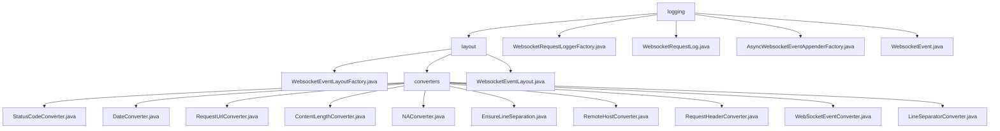

# 基础信息

|      |      |
|------|------|
| 名称 | logging |
| 编码语言 | .java |
| 代码路径 | Signal-Server/websocket-resources/src/main/java/org/whispersystems/websocket/logging |
| 包名 | Signal-Server.websocket-resources.src.main.java.org.whispersystems.websocket.logging |
| 概述说明 | WebSocket事件日志记录模块，支持CLF和COMBINED格式，提供状态码、日期、URL等转换器，确保日志一致性和可读性。 |

# 说明

## 概述

该代码模块是一个专门用于处理WebSocket事件的日志记录和转换的工具集。其核心功能是通过`WebsocketEventLayoutFactory`构建`WebsocketEventLayout`，确保WebSocket事件的日志记录过程符合标准，并提供统一的布局结构。`WebsocketEventLayout`继承自`PatternLayoutBase`，支持CLF和COMBINED两种日志模式，并通过默认转换器实现日志格式的转换，确保日志输出的统一性和可读性。模块中的多个转换器类（如`StatusCodeConverter`、`DateConverter`等）分别负责处理WebSocket事件的不同属性，确保日志记录的一致性和可读性。此外，模块还提供了异步日志记录、日志过滤和扩展记录内容的功能，确保日志记录的高效性和灵活性。

## 主要业务场景

1. **日志布局构建**：`WebsocketEventLayoutFactory`通过实现`LayoutFactory`接口，构建`WebsocketEventLayout`，确保日志记录的布局结构符合标准。
2. **日志格式定义**：`WebsocketEventLayout`类支持CLF和COMBINED两种日志模式，并通过默认转换器实现日志格式的转换，满足不同日志需求场景。
3. **状态码处理**：`StatusCodeConverter`类根据事件的状态码进行处理，符合特定条件时返回"NA"，否则将状态码转换为字符串形式返回。
4. **日期格式化**：`DateConverter`类负责初始化日期格式并处理时区信息，确保时间戳以统一的日期格式呈现。
5. **请求URL生成**：`RequestUrlConverter`类将事件方法、路径和协议进行拼接，生成最终的请求URL。
6. **内容长度处理**：`ContentLengthConverter`类根据事件内容的长度返回相应的字符串，提供灵活且准确的响应处理。
7. **特殊事件处理**：`NAConverter`类在特定场景下返回`WebsocketEvent.NA`，用于处理无法识别或无需处理的事件。
8. **事件分行展示**：`EnsureLineSeparation`类确保WebSocket事件在显示时能够分行呈现，提升事件信息的可读性。
9. **远程主机信息提取**：`RemoteHostConverter`类提取和转换WebSocket事件中与远程主机相关的信息。
10. **请求头转换**：`RequestHeaderConverter`类将请求头中的键值对进行转换，支持指定特定键或默认转换所有键。
11. **行分隔符处理**：`LineSeparatorConverter`类返回常量`LINE_SEPARATOR`，用于处理与行分隔符相关的逻辑。
12. **异步日志记录**：`AsyncWebsocketEventAppenderFactory`通过实现`AsyncAppenderFactory`接口，构建`AsyncAppenderBase`实例，并对WebSocket事件进行预处理，确保异步日志记录的正确性。
13. **日志输出与过滤**：`WebsocketRequestLoggerFactory`提供日志输出、过滤器和异步处理等功能，确保日志记录的高效性和灵活性。
14. **事件记录与扩展**：`WebsocketRequestLog`类用于记录WebSocket事件，具备添加过滤器和追加器的功能，以便对事件进行筛选和扩展记录内容。
15. **事件信息管理**：`WebsocketEvent`类用于记录与WebSocket通信相关的详细信息，包括远程地址、请求、响应以及时间戳，提供了一系列方法用于获取和分析关键数据。

这些业务场景共同构成了一个完整的WebSocket事件日志记录和转换系统，确保在不同情况下能够提供一致、准确且易于理解的日志信息。

### 包内部结构视图

该流程图展示了Signal-Server项目中`websocket-resources`模块下的日志相关文件与目录的层级关系。`logging`目录包含多个日志相关的类和工厂类，`layout`目录下则包含了日志布局相关的类和`converters`目录，`converters`目录中则包含了多种日志格式转换器。

# 文件列表 File List

| 名称   | 类型  | 说明 |
|-------|------|-------------|
| [WebsocketRequestLoggerFactory.java](WebsocketRequestLoggerFactory.md) | file | WebsocketRequestLoggerFactory类提供日志输出、过滤器和异步处理功能。 |
| [WebsocketRequestLog.java](WebsocketRequestLog.md) | file | WebsocketRequestLog类记录Websocket事件，支持过滤器和追加器功能。 |
| [WebsocketEvent.java](WebsocketEvent.md) | file | WebsocketEvent类记录远程地址、请求、响应和时间戳，提供获取请求方法、路径、协议、状态码、内容长度和请求头的方法。 |
| [AsyncWebsocketEventAppenderFactory.java](AsyncWebsocketEventAppenderFactory.md) | file | AsyncWebsocketEventAppenderFactory实现接口，构建实例并预处理WebsocketEvent。 |
| [layout](layout/_module.md) | package | WebsocketEventLayoutFactory实现LayoutFactory接口，构建WebsocketEventLayout，确保日志格式统一，提升系统可维护性和扩展性。 |

