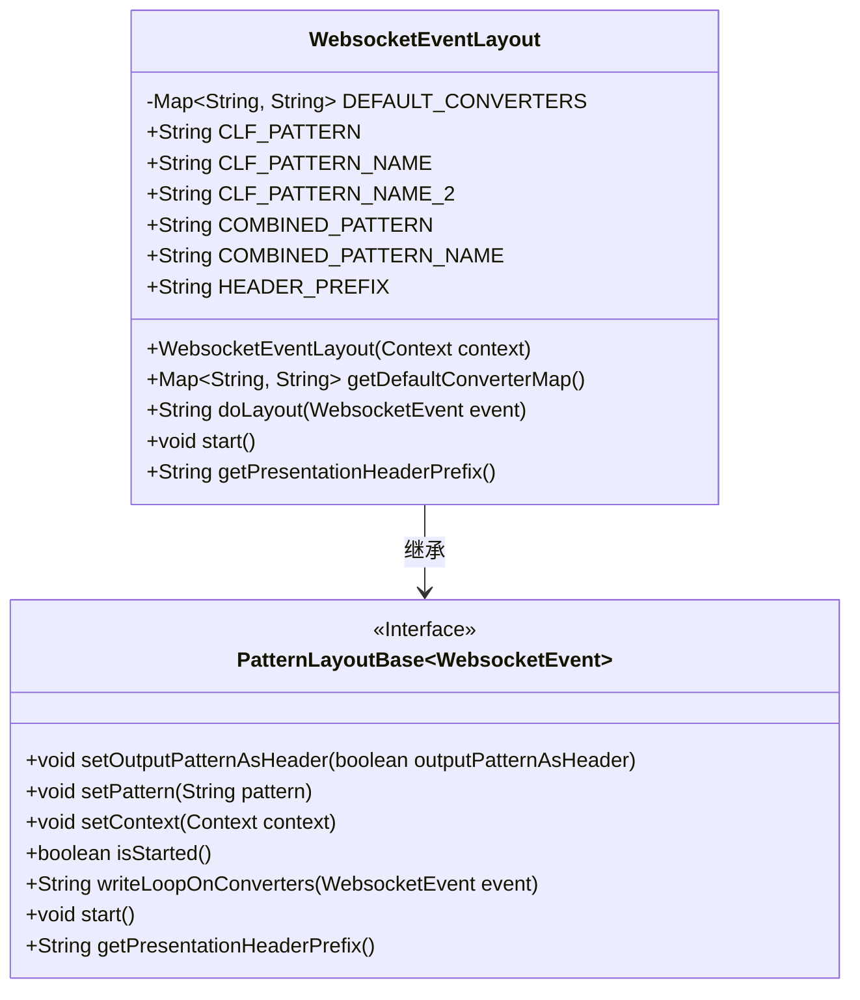

# 基础信息

|      |      |
|------|------|
| 名称 | WebsocketEventLayout |
| 编码语言 | .java |
| 代码路径 | Signal-Server/websocket-resources/src/main/java/org/whispersystems/websocket/logging/layout/WebsocketEventLayout.java |
| 包名 | org.whispersystems.websocket.logging.layout |
| 依赖项 | ['ch.qos.logback.core.Context', 'ch.qos.logback.core.pattern.PatternLayoutBase', 'org.whispersystems.websocket.logging.WebsocketEvent', 'org.whispersystems.websocket.logging.layout.converters.ContentLengthConverter', 'org.whispersystems.websocket.logging.layout.converters.DateConverter', 'org.whispersystems.websocket.logging.layout.converters.EnsureLineSeparation', 'org.whispersystems.websocket.logging.layout.converters.NAConverter', 'org.whispersystems.websocket.logging.layout.converters.RemoteHostConverter', 'org.whispersystems.websocket.logging.layout.converters.RequestHeaderConverter', 'org.whispersystems.websocket.logging.layout.converters.RequestUrlConverter', 'org.whispersystems.websocket.logging.layout.converters.StatusCodeConverter', 'java.util.HashMap', 'java.util.Map'] |
| 概述说明 | WebsocketEventLayout类继承PatternLayoutBase，定义日志格式，支持CLF和COMBINED模式。 |

# 说明

WebsocketEventLayout类继承自PatternLayoutBase，专门用于定义日志格式。该类支持两种日志模式：CLF和COMBINED。它通过默认转换器实现日志格式的转换，确保日志输出的统一性和可读性。这一设计使得日志记录更加灵活和标准化，适用于不同的日志需求场景。

# 类列表 Class Summary

| 名称   | 类型  | 说明 |
|-------|------|-------------|
| WebsocketEventLayout | class | WebsocketEventLayout类继承PatternLayoutBase，定义日志格式和默认转换器，支持CLF和COMBINED模式。 |

## 类 WebsocketEventLayout

|      |      |
|------|------|
| 访问范围 | public |
| 类型 | class |
| 名称 | WebsocketEventLayout |
| 说明 | WebsocketEventLayout类继承PatternLayoutBase，定义日志格式和默认转换器，支持CLF和COMBINED模式。 |

### UML类图

**描述**：`WebsocketEventLayout` 类继承自 `PatternLayoutBase<WebsocketEvent>`，用于处理WebSocket事件的日志布局。该类包含默认的转换器映射、日志模式常量以及相关方法。通过 `start()` 方法根据模式名称设置相应的日志模式，`doLayout()` 方法负责生成日志内容。`getDefaultConverterMap()` 返回默认的转换器映射，`getPresentationHeaderPrefix()` 提供日志头前缀。

### 内部方法调用关系图

```mermaid
graph TD
    A["类WebsocketEventLayout"]
    B["静态属性: Map<String, String> DEFAULT_CONVERTERS"]
    C["静态属性: String CLF_PATTERN"]
    D["静态属性: String CLF_PATTERN_NAME"]
    E["静态属性: String CLF_PATTERN_NAME_2"]
    F["静态属性: String COMBINED_PATTERN"]
    G["静态属性: String COMBINED_PATTERN_NAME"]
    H["静态属性: String HEADER_PREFIX"]
    I["构造方法: WebsocketEventLayout(Context context)"]
    J["方法: Map<String, String> getDefaultConverterMap()"]
    K["方法: String doLayout(WebsocketEvent event)"]
    L["方法: void start()"]
    M["方法: String getPresentationHeaderPrefix()"]

    A --> B
    A --> C
    A --> D
    A --> E
    A --> F
    A --> G
    A --> H
    A --> I
    A --> J
    A --> K
    A --> L
    A --> M
```

这段代码定义了一个名为`WebsocketEventLayout`的类，继承自`PatternLayoutBase<WebsocketEvent>`。该类主要用于处理WebSocket事件的日志布局，包含了一系列静态属性、构造方法和重写的方法。静态属性`DEFAULT_CONVERTERS`定义了一组默认的转换器，构造方法`WebsocketEventLayout`初始化了布局模式和上下文，并设置了行分隔处理器。重写的方法`getDefaultConverterMap`返回默认的转换器映射，`doLayout`方法负责处理事件并返回格式化后的字符串，`start`方法根据模式名称设置相应的布局模式，`getPresentationHeaderPrefix`方法返回日志头的前缀。

### 字段列表 Field List

| 名称  | 类型  | 说明 |
|-------|-------|------|
| HEADER_PREFIX = "#logback.access pattern: " | String | HEADER_PREFIX定义为日志访问模式前缀。 |
| DEFAULT_CONVERTERS = new HashMap<>() {{    put("h", RemoteHostConverter.class.getName());    put("l", NAConverter.class.getName());    put("u", NAConverter.class.getName());    put("t", DateConverter.class.getName());    put("r", RequestUrlConverter.class.getName());    put("s", StatusCodeConverter.class.getName());    put("b", ContentLengthConverter.class.getName());    put("i", RequestHeaderConverter.class.getName());  }} | Map<String, String> | 定义默认转换器映射，包含多种类型转换器类名。 |
| CLF_PATTERN_NAME_2 = "clf" | String | 定义常量CLF_PATTERN_NAME_2，值为"clf"。 |
| COMBINED_PATTERN = "%h %l %u [%t] \"%r\" %s %b \"%i{Referer}\" \"%i{User-Agent}\"" | String | 日志格式模板：包含IP、用户、请求、状态、大小、Referer和User-Agent。 |
| COMBINED_PATTERN_NAME = "combined" | String | 定义了一个公共静态常量字符串，名称为"combined"。 |
| CLF_PATTERN_NAME = "common" | String | 定义静态常量CLF_PATTERN_NAME，值为"common"。 |
| CLF_PATTERN = "%h %l %u [%t] \"%r\" %s %b" | String | CLF_PATTERN定义日志格式，包含主机、用户、时间、请求、状态和字节数。 |

### 方法列表 Method List

| 名称  | 类型  | 说明 |
|-------|-------|------|
| getDefaultConverterMap | Map<String, String> | 重写方法返回默认转换器映射。 |
| getPresentationHeaderPrefix | String | 重写方法返回预设的头部前缀。 |
| doLayout | String | 重写doLayout方法，检查启动状态后执行事件转换。 |
| start | void | 重写start方法，根据模式名称设置对应模式，最后调用父类start方法。 |

