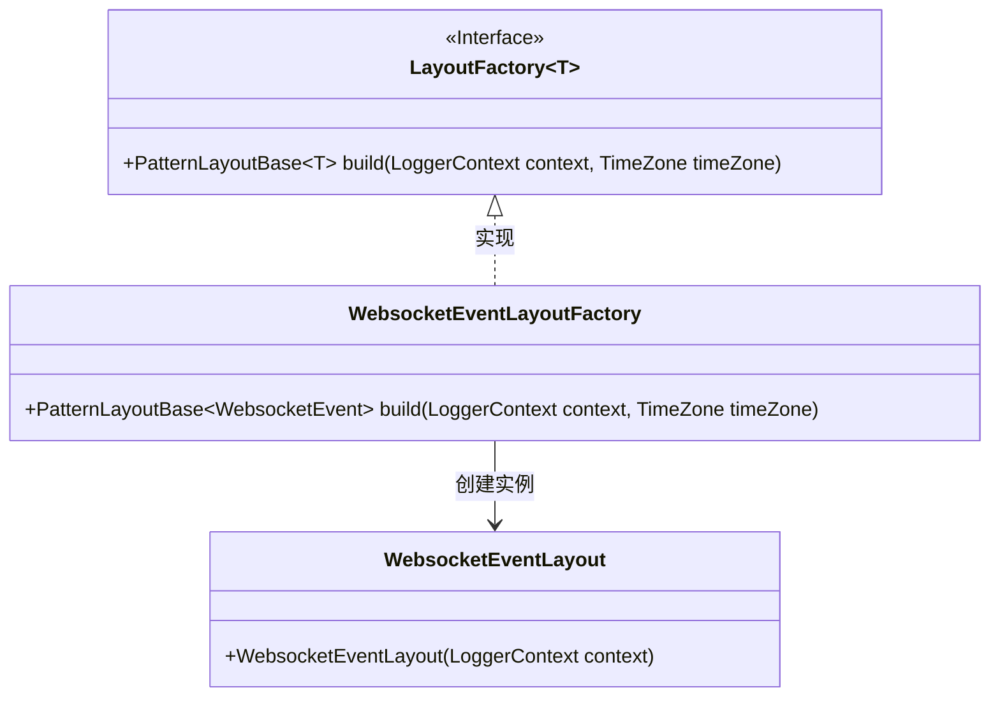
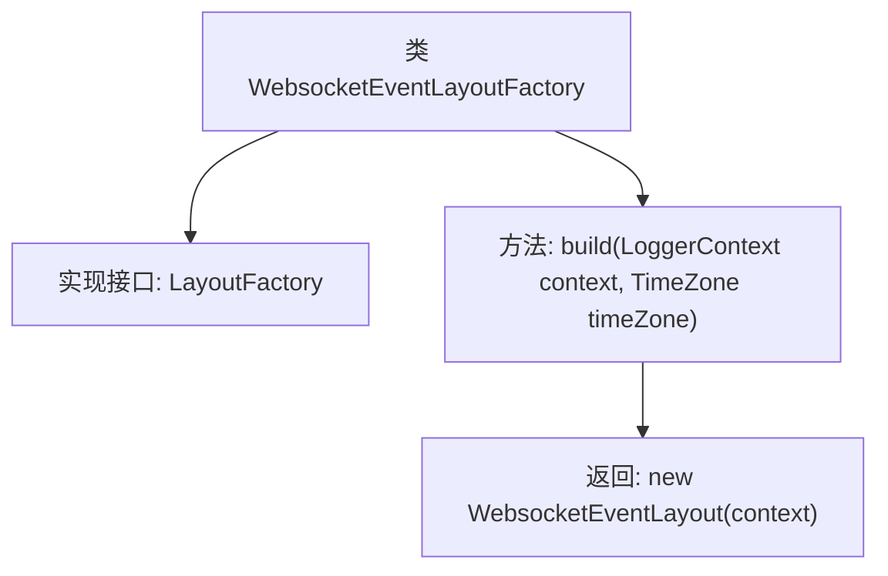

# 基础信息

|      |      |
|------|------|
| 名称 | WebsocketEventLayoutFactory |
| 编码语言 | .java |
| 代码路径 | Signal-Server/websocket-resources/src/main/java/org/whispersystems/websocket/logging/layout/WebsocketEventLayoutFactory.java |
| 包名 | org.whispersystems.websocket.logging.layout |
| 依赖项 | ['ch.qos.logback.classic.LoggerContext', 'ch.qos.logback.core.pattern.PatternLayoutBase', 'io.dropwizard.logging.common.layout.LayoutFactory', 'org.whispersystems.websocket.logging.WebsocketEvent', 'java.util.TimeZone'] |
| 概述说明 | WebsocketEventLayoutFactory实现LayoutFactory接口，用于构建WebsocketEventLayout。 |

# 说明

WebsocketEventLayoutFactory实现了LayoutFactory接口，其主要功能是构建WebsocketEventLayout。该工厂类通过遵循接口规范，确保了WebsocketEventLayout的创建过程符合标准，从而为Websocket事件提供统一的布局结构。这一设计有助于简化Websocket事件的处理流程，并提升系统的可维护性和扩展性。

# 类列表 Class Summary

| 名称   | 类型  | 说明 |
|-------|------|-------------|
| WebsocketEventLayoutFactory | class | WebsocketEventLayoutFactory实现LayoutFactory接口，构建WebsocketEventLayout。 |

## 类 WebsocketEventLayoutFactory

|      |      |
|------|------|
| 访问范围 | public |
| 类型 | class |
| 名称 | WebsocketEventLayoutFactory |
| 说明 | WebsocketEventLayoutFactory实现LayoutFactory接口，构建WebsocketEventLayout。 |

### UML类图

**描述：**  
`WebsocketEventLayoutFactory` 类实现了 `LayoutFactory<WebsocketEvent>` 接口，并提供了 `build` 方法，该方法返回一个 `WebsocketEventLayout` 实例。`WebsocketEventLayout` 是 `PatternLayoutBase<WebsocketEvent>` 的具体实现类，用于处理 `WebsocketEvent` 类型的事件。类图展示了接口与实现类之间的层级关系，以及 `WebsocketEventLayoutFactory` 如何依赖 `WebsocketEventLayout` 来创建布局实例。

### 内部方法调用关系图

这段代码描述了一个名为`WebsocketEventLayoutFactory`的类，该类实现了`LayoutFactory<WebsocketEvent>`接口。类中包含一个`build`方法，该方法接收`LoggerContext`和`TimeZone`作为参数，并返回一个`WebsocketEventLayout`的实例。流程图展示了类的结构及其方法调用关系，清晰地反映了类的功能和逻辑流程。

### 字段列表 Field List

| 名称  | 类型  | 说明 |
|-------|-------|------|

### 方法列表 Method List

| 名称  | 类型  | 说明 |
|-------|-------|------|
| build | PatternLayoutBase<WebsocketEvent> | 重写方法，返回WebsocketEventLayout实例。 |

