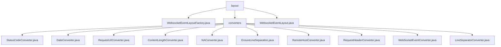

# 基础信息

|      |      |
|------|------|
| 名称 | layout |
| 编码语言 | .java |
| 代码路径 | Signal-Server/websocket-resources/src/main/java/org/whispersystems/websocket/logging/layout |
| 包名 | Signal-Server.websocket-resources.src.main.java.org.whispersystems.websocket.logging.layout |
| 概述说明 | WebsocketEventLayoutFactory实现LayoutFactory接口，构建WebsocketEventLayout，确保日志格式统一，提升系统可维护性和扩展性。 |

# 说明

## 概述
该代码模块是一个用于处理WebSocket事件的日志记录和转换的工具集。模块的核心功能是通过`WebsocketEventLayoutFactory`构建`WebsocketEventLayout`，确保WebSocket事件的日志记录过程符合标准，并提供统一的布局结构。`WebsocketEventLayout`类继承自`PatternLayoutBase`，支持两种日志模式（CLF和COMBINED），并通过默认转换器实现日志格式的转换，确保日志输出的统一性和可读性。此外，模块中的多个转换器类（如`StatusCodeConverter`、`DateConverter`等）分别负责处理WebSocket事件的不同属性，确保日志记录的一致性和可读性。

## 主要业务场景
1. **日志布局构建**：`WebsocketEventLayoutFactory`通过实现`LayoutFactory`接口，构建`WebsocketEventLayout`，确保日志记录的布局结构符合标准。
2. **日志格式定义**：`WebsocketEventLayout`类支持CLF和COMBINED两种日志模式，并通过默认转换器实现日志格式的转换，满足不同日志需求场景。
3. **状态码处理**：`StatusCodeConverter`类根据事件的状态码进行处理，符合特定条件时返回"NA"，否则将状态码转换为字符串形式返回。
4. **日期格式化**：`DateConverter`类负责初始化日期格式并处理时区信息，确保时间戳以统一的日期格式呈现。
5. **请求URL生成**：`RequestUrlConverter`类将事件方法、路径和协议进行拼接，生成最终的请求URL。
6. **内容长度处理**：`ContentLengthConverter`类根据事件内容的长度返回相应的字符串，提供灵活且准确的响应处理。
7. **特殊事件处理**：`NAConverter`类在特定场景下返回`WebsocketEvent.NA`，用于处理无法识别或无需处理的事件。
8. **事件分行展示**：`EnsureLineSeparation`类确保WebSocket事件在显示时能够分行呈现，提升事件信息的可读性。
9. **远程主机信息提取**：`RemoteHostConverter`类提取和转换WebSocket事件中与远程主机相关的信息。
10. **请求头转换**：`RequestHeaderConverter`类将请求头中的键值对进行转换，支持指定特定键或默认转换所有键。
11. **行分隔符处理**：`LineSeparatorConverter`类返回常量`LINE_SEPARATOR`，用于处理与行分隔符相关的逻辑。

这些业务场景共同构成了一个完整的WebSocket事件日志记录和转换系统，确保在不同情况下能够提供一致、准确且易于理解的日志信息。

### 包内部结构视图

该流程图展示了`Signal-Server`项目中`websocket-resources`模块下的`layout`文件夹及其子文件夹`converters`的文件结构。`layout`文件夹包含`WebsocketEventLayoutFactory.java`和`WebsocketEventLayout.java`文件，而`converters`文件夹下则包含了多个转换器类文件，如`StatusCodeConverter.java`、`DateConverter.java`等。这些文件共同构成了WebSocket日志记录功能的核心部分。

# 文件列表 File List

| 名称   | 类型  | 说明 |
|-------|------|-------------|
| [WebsocketEventLayoutFactory.java](WebsocketEventLayoutFactory.md) | file | WebsocketEventLayoutFactory实现LayoutFactory接口，用于构建WebsocketEventLayout。 |
| [WebsocketEventLayout.java](WebsocketEventLayout.md) | file | WebsocketEventLayout类继承PatternLayoutBase，定义日志格式，支持CLF和COMBINED模式。 |
| [converters](converters/_module.md) | package | StatusCodeConverter处理状态码，DateConverter格式化时间戳，RequestUrlConverter生成请求URL，ContentLengthConverter处理内容长度，NAConverter返回未定义事件，EnsureLineSeparation分行显示事件，RemoteHostConverter提取远程主机信息，RequestHeaderConverter转换请求头，WebSocketEventConverter管理上下文，LineSeparatorConverter处理行分隔符。 |

