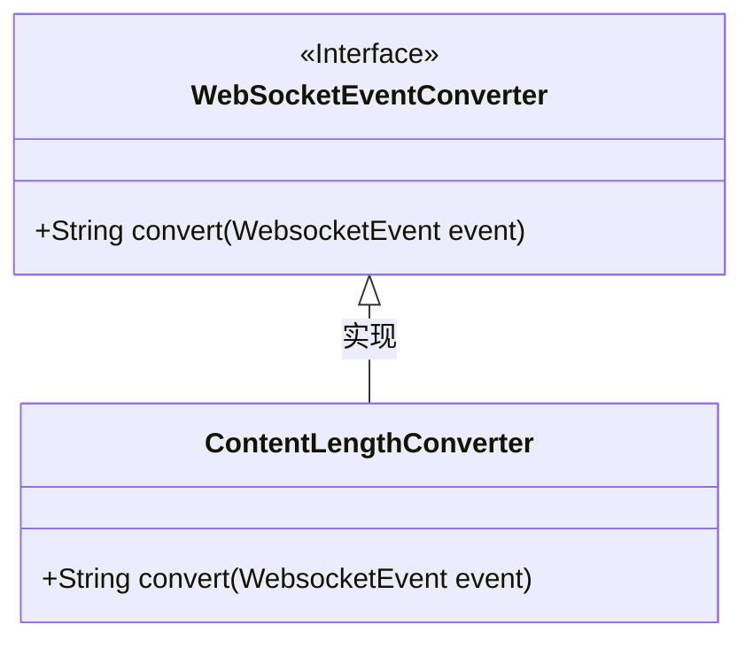
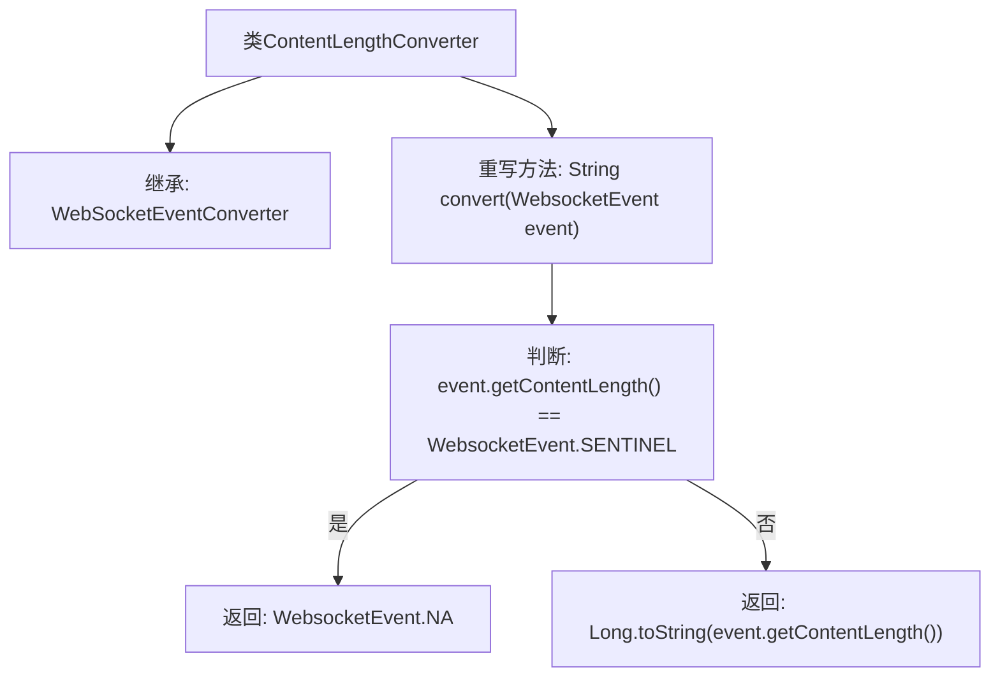

# 基础信息

|      |      |
|------|------|
| 名称 | ContentLengthConverter |
| 编码语言 | .java |
| 代码路径 | Signal-Server/websocket-resources/src/main/java/org/whispersystems/websocket/logging/layout/converters/ContentLengthConverter.java |
| 包名 | org.whispersystems.websocket.logging.layout.converters |
| 依赖项 | ['org.whispersystems.websocket.logging.WebsocketEvent'] |
| 概述说明 | ContentLengthConverter继承WebSocketEventConverter，按事件长度返回字符串。 |

# 说明

ContentLengthConverter类继承自WebSocketEventConverter，其主要功能是根据事件内容的长度返回相应的字符串。该类的设计旨在处理WebSocket事件，通过分析事件内容的长度，动态生成并返回适合的字符串结果。这一机制有助于在不同长度的内容场景下，提供灵活且准确的响应处理。

# 类列表 Class Summary

| 名称   | 类型  | 说明 |
|-------|------|-------------|
| ContentLengthConverter | class | ContentLengthConverter类继承WebSocketEventConverter，根据事件内容长度返回相应字符串。 |

## 类 ContentLengthConverter

|      |      |
|------|------|
| 访问范围 | public |
| 类型 | class |
| 名称 | ContentLengthConverter |
| 说明 | ContentLengthConverter类继承WebSocketEventConverter，根据事件内容长度返回相应字符串。 |

### UML类图

这段代码定义了一个 `ContentLengthConverter` 类，它继承自 `WebSocketEventConverter` 接口。`ContentLengthConverter` 类实现了 `convert` 方法，该方法根据 `WebsocketEvent` 对象的 `contentLength` 属性值返回相应的字符串。如果 `contentLength` 等于 `WebsocketEvent.SENTINEL`，则返回 `WebsocketEvent.NA`，否则返回 `contentLength` 的字符串表示。类图展示了 `ContentLengthConverter` 类与 `WebSocketEventConverter` 接口之间的实现关系。

### 内部方法调用关系图

这段代码定义了一个名为`ContentLengthConverter`的类，它继承自`WebSocketEventConverter`。该类重写了`convert`方法，该方法接收一个`WebsocketEvent`对象作为参数。在`convert`方法中，首先判断`event.getContentLength()`是否等于`WebsocketEvent.SENTINEL`，如果相等则返回`WebsocketEvent.NA`，否则返回`event.getContentLength()`的字符串表示形式。流程图清晰地展示了类的继承关系和方法的逻辑流程。

### 字段列表 Field List

| 名称  | 类型  | 说明 |
|-------|-------|------|

### 方法列表 Method List

| 名称  | 类型  | 说明 |
|-------|-------|------|
| convert | String | 方法convert检查事件内容长度，若为标记值则返回NA，否则返回长度字符串。 |

