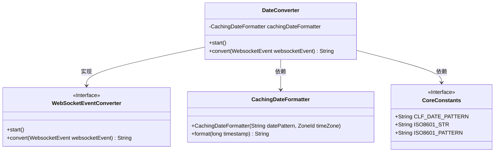
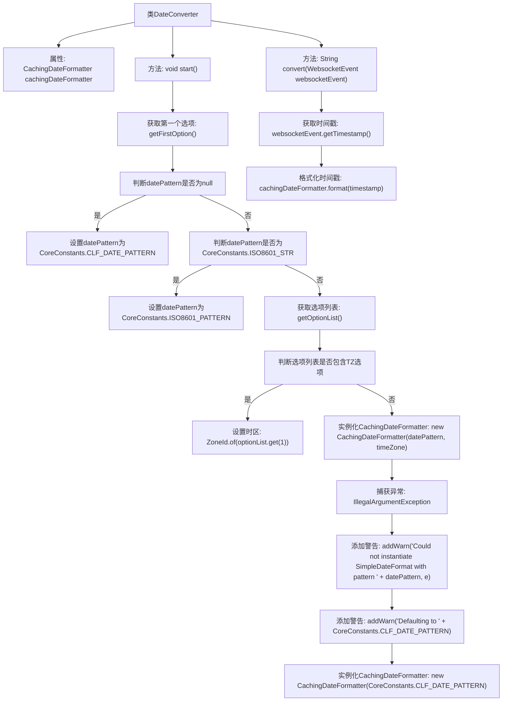

# 基础信息

|      |      |
|------|------|
| 名称 | DateConverter |
| 编码语言 | .java |
| 代码路径 | Signal-Server/websocket-resources/src/main/java/org/whispersystems/websocket/logging/layout/converters/DateConverter.java |
| 包名 | org.whispersystems.websocket.logging.layout.converters |
| 依赖项 | ['ch.qos.logback.core.CoreConstants', 'ch.qos.logback.core.util.CachingDateFormatter', 'java.time.ZoneId', 'java.util.List', 'java.util.Optional', 'org.whispersystems.websocket.logging.WebsocketEvent'] |
| 概述说明 | DateConverter继承WebSocketEventConverter，初始化日期格式，处理时区并格式化时间戳。 |

# 说明

DateConverter类继承自WebSocketEventConverter，主要负责初始化日期格式并处理时区信息。该类的主要功能是格式化WebSocket事件中的时间戳，确保时间戳以统一的日期格式呈现，并正确处理时区差异，以便在不同时区下保持一致的时间显示。

# 类列表 Class Summary

| 名称   | 类型  | 说明 |
|-------|------|-------------|
| DateConverter | class | DateConverter类继承WebSocketEventConverter，初始化日期格式并处理时区，格式化WebSocket事件时间戳。 |

## 类 DateConverter

|      |      |
|------|------|
| 访问范围 | public |
| 类型 | class |
| 名称 | DateConverter |
| 说明 | DateConverter类继承WebSocketEventConverter，初始化日期格式并处理时区，格式化WebSocket事件时间戳。 |

### UML类图

这段代码描述了一个 `DateConverter` 类，它继承自 `WebSocketEventConverter` 接口，并实现了 `start` 和 `convert` 方法。`DateConverter` 类通过 `CachingDateFormatter` 来处理日期格式化，并依赖于 `CoreConstants` 接口中的常量。`start` 方法根据传入的日期模式和时区初始化 `CachingDateFormatter`，而 `convert` 方法则使用 `CachingDateFormatter` 将 `WebsocketEvent` 的时间戳格式化为字符串。

### 内部方法调用关系图

这段代码定义了一个`DateConverter`类，用于将`WebsocketEvent`中的时间戳转换为特定格式的日期字符串。`start`方法负责初始化日期格式化器，根据传入的选项设置日期格式和时区，若初始化失败则使用默认格式。`convert`方法则使用已初始化的格式化器将时间戳转换为日期字符串。

### 字段列表 Field List

| 名称  | 类型  | 说明 |
|-------|-------|------|
| cachingDateFormatter = null | CachingDateFormatter | 私有缓存日期格式化器变量未初始化。 |

### 方法列表 Method List

| 名称  | 类型  | 说明 |
|-------|-------|------|
| convert | String | 重写convert方法，将WebsocketEvent时间戳格式化后返回。 |
| start | void | 启动时设置日期格式，处理时区选项，初始化缓存日期格式化器。 |

