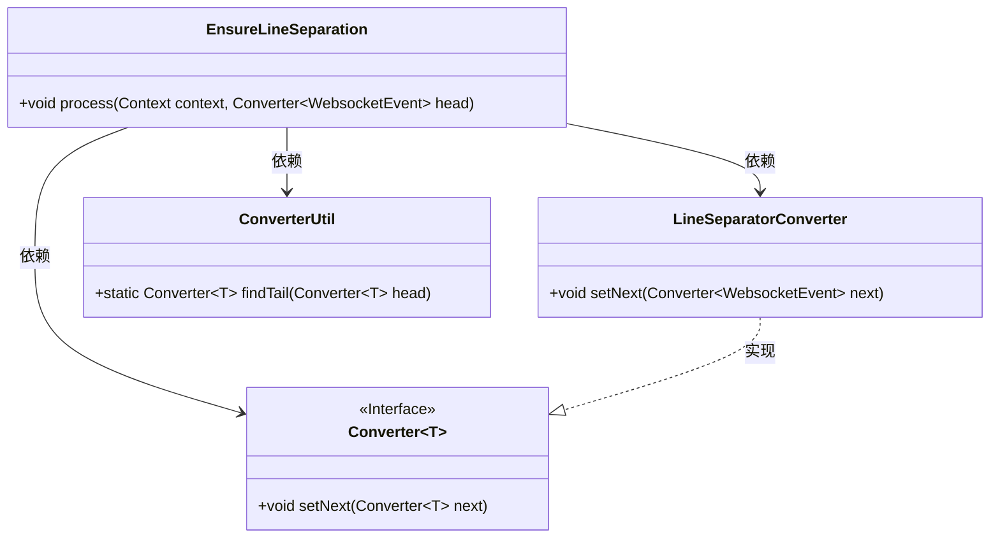
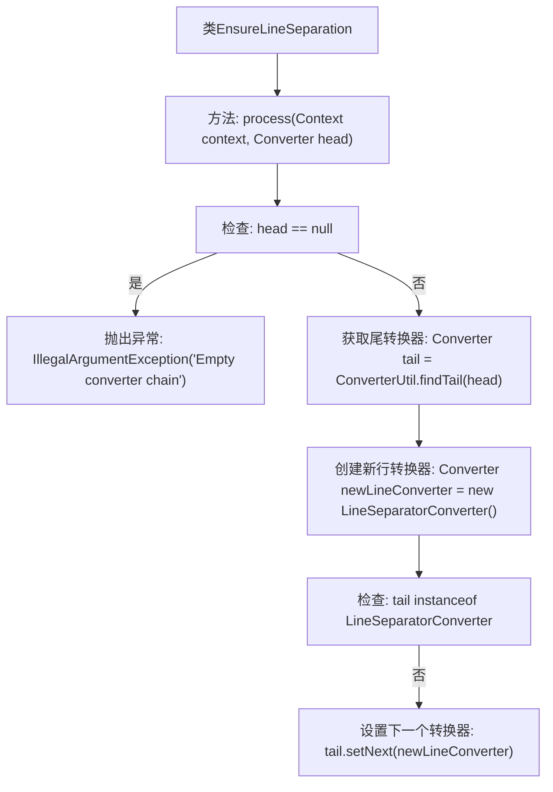

# 基础信息

|      |      |
|------|------|
| 名称 | EnsureLineSeparation |
| 编码语言 | .java |
| 代码路径 | Signal-Server/websocket-resources/src/main/java/org/whispersystems/websocket/logging/layout/converters/EnsureLineSeparation.java |
| 包名 | org.whispersystems.websocket.logging.layout.converters |
| 依赖项 | ['org.whispersystems.websocket.logging.WebsocketEvent', 'ch.qos.logback.core.Context', 'ch.qos.logback.core.pattern.Converter', 'ch.qos.logback.core.pattern.ConverterUtil', 'ch.qos.logback.core.pattern.PostCompileProcessor'] |
| 概述说明 | EnsureLineSeparation类实现WebsocketEvent事件分行显示。 |

# 说明

EnsureLineSeparation类在编译处理过程中，主要负责确保WebsocketEvent事件在显示时能够分行呈现。该类的实现旨在提升事件信息的可读性和结构化展示，通过自动分行功能，使得事件内容更加清晰易读，便于开发者和用户快速理解和处理相关信息。

# 类列表 Class Summary

| 名称   | 类型  | 说明 |
|-------|------|-------------|
| EnsureLineSeparation | class | EnsureLineSeparation类实现后编译处理，确保WebsocketEvent事件分行显示。 |

## 类 EnsureLineSeparation

|      |      |
|------|------|
| 访问范围 | public |
| 类型 | class |
| 名称 | EnsureLineSeparation |
| 说明 | EnsureLineSeparation类实现后编译处理，确保WebsocketEvent事件分行显示。 |

### UML类图

**描述：**  
`EnsureLineSeparation`类实现了`PostCompileProcessor`接口，用于处理`WebsocketEvent`类型的转换器链。其主要功能是在转换器链的末尾添加一个`LineSeparatorConverter`，以确保每个事件在输出时都位于单独的行上。`ConverterUtil`工具类用于查找转换器链的尾部，`LineSeparatorConverter`是`Converter`接口的一个实现类，用于添加换行符。

### 内部方法调用关系图

这段代码的流程图描述了`EnsureLineSeparation`类中的`process`方法的执行流程。该方法首先检查传入的`head`转换器是否为空，若为空则抛出异常。否则，它通过`ConverterUtil.findTail`方法找到尾转换器，并创建一个新的行分隔符转换器。如果尾转换器不是`LineSeparatorConverter`的实例，则将新行转换器设置为尾转换器的下一个转换器。

### 字段列表 Field List

| 名称  | 类型  | 说明 |
|-------|-------|------|

### 方法列表 Method List

| 名称  | 类型  | 说明 |
|-------|-------|------|
| process | void | 重写process方法，检查转换器链非空，尾部非空则添加换行转换器。 |

